# 🏯 STILLWATER: GAME OF DEATH — The AGI Tower Challenge
## Inspired by Bruce Lee's Vision: 5 Floors, 10 Dragons, 100% Coverage

```
╔═══════════════════════════════════════════════════════════════╗
║                  🥋 GAME OF DEATH 🏯                          ║
║         Climb the Stillwater Tower. Face the 10 Dragons.      ║
║      Prove Your Agent. Earn Your Certifier. Know Your Limits. ║
║                                                               ║
║                "Be water, my friend." — Bruce Lee             ║
║                                                               ║
║            It is not the mountain that blocks the path,       ║
║              It is the 10 ways that AI fails today.           ║
║          Stillwater is the tower that turns those failures    ║
║                    Into unit tests. Into proof.               ║
╚═══════════════════════════════════════════════════════════════╝
```

**Date:** 2026-02-17
**Auth:** 65537 (Stillwater Keeper)
**Inspired By:** Bruce Lee's Game of Death vision
**Status:** Repo-backed. Artifacts. Verification ladder. No vibes.

---

## 🎯 The Challenge

You have reached the base of the Stillwater Tower.

Your agent stands before you. You have built it. You trust it. But does the world?

**The Question Everyone Asks:**
> "When AGI?"

**The Question That Matters:**
> "What are the 10 ways my agent fails today? And what gates turn those faceplants into proof?"

**Bruce Lee's Wisdom Applied:**
> "Absorb what is useful, discard what is useless, add what is essentially your own."
>
> Stillwater does this: absorb truth, discard hype, add gates. That is all.

---

## What Is In This Repo

The tower has a foundation. Here is the structure:

| Directory | What It Is |
|-----------|-----------|
| `skills/` | Prompt-loadable constraint packs (prime-coder, prime-safety, phuc-forecast, phuc-context) |
| `skills/` | Prompt-loadable skill packs, including the 4 always-on foundational skills (prime-safety, prime-coder, phuc-forecast, phuc-context) |
| `recipes/` | Step-by-step replayable workflows with artifact schemas, forbidden states, and rollback steps |
| `swarms/` | Typed agent definitions: persona + skill pack + FSM + forbidden states per agent role |
| `papers/` | Theory papers with receipts — `papers/00-index.md` is the map |
| `community/` | Onboarding guides, authoring guides, scoring rubric, and swarm design docs for contributors |
| `MANIFEST.json` | Machine-parseable index of all skills, recipes, papers, core skills, and swarm types with sha256 checksums |

Start at `community/GETTING-STARTED.md` if you are new. Start at `papers/00-index.md` if you want theory first.

---

## The Tower Structure: 5 Floors, 10 Dragons

```
                    ┌─────────────────────┐
                    │ FLOOR 5: MASTERY    │  ← You are here
                    │  (Alignment +       │     if you've
                    │   Security)         │     reached the
                    └─────────────────────┘     top
                            △
                    ┌─────────────────────┐
                    │ FLOOR 4: PRECISION  │  ← Patch reliability
                    │  (Code + Patch      │     + Generalization
                    │   Verification)     │
                    └─────────────────────┘
                            △
                    ┌─────────────────────┐
                    │ FLOOR 3: PROVING    │  ← Reasoning that can
                    │  (Reasoning,        │     be checked
                    │   Verification,     │
                    │   Aggregation)      │
                    └─────────────────────┘
                            △
                    ┌─────────────────────┐
                    │ FLOOR 2: FOUNDATION │  ← Context + Memory
                    │  (Context, Memory)  │
                    └─────────────────────┘
                            △
                    ┌─────────────────────┐
                    │ FLOOR 1: HONESTY    │  ← Hallucination /
                    │  (No Hallucination) │     Truth
                    └─────────────────────┘
                            △
                         [START]
```

---

## 🐉 The 10 Dragons (Bosses to Defeat)

Each floor has 1-2 dragons. Defeat them all to earn the Stillwater Certifier.

---

## 🎮 FLOOR 1: HONESTY — Temple of Truth
### Boss Fight #1: HALLUCINATION DRAGON 🐉
**Guardian Master:** Bruce Lee (The Philosopher)

```
╔═══════════════════════════════════════════╗
║  BOSS: HALLUCINATION DRAGON              ║
║  "Eloquence Without Evidence"            ║
║                                           ║
║  HP: ∞ (until you add evidence gates)    ║
║  Attack: Plausible-sounding lies         ║
║  Weakness: Lane Algebra (claim typing)   ║
╚═══════════════════════════════════════════╝
```

**The Dragon's Attack:**
- LLMs optimize for plausibility, not truth
- Humans reward confident-sounding answers
- Systems rarely force evidence before output

**How Bruce Lee Would Fight It:**
"Don't think. VERIFY. Don't feel. PROVE."

**Stillwater's Gate:**
- **Lane Algebra:** Every claim is typed (A/B/C/STAR)
- **No evidence → no PASS.** Period.
- **Claim hierarchy:** Proven > Assumed > Speculated > Unknown

**Proof in Repo:**
```bash
papers/01-lane-algebra.md
papers/06-solving-hallucination.md
papers/99-claims-and-evidence.md
```

**Achievement Unlocked:** 🏅 TRUTH SPEAKER
*Your agent no longer hallucinates. It says "UNKNOWN" when appropriate.*

---

## 🎮 FLOOR 2: FOUNDATION — Temple of Memory
### Boss Fight #2: COUNTING DRAGON 🐉 | Boss Fight #3: CONTEXT DRAGON 🐉
**Guardian Master:** Bruce Lee (The Scientist)

```
╔═══════════════════════════════════════════╗
║  BOSS A: COUNTING DRAGON                 ║
║  "Close Enough Is Wrong"                 ║
║  HP: Reduced by Counter Bypass Protocol  ║
╠═══════════════════════════════════════════╣
║  BOSS B: CONTEXT DRAGON                  ║
║  "Memory That Rots"                      ║
║  HP: Reduced by Context Normal Form      ║
╚═══════════════════════════════════════════╝
```

**The Dragons' Attacks:**

**Counting Dragon:**
- Attention is approximate
- Aggregation over long text is brittle
- "Count the T's in 'Stillwater'" — even GPT-4 gets it wrong

**Context Dragon:**
- Window limits force truncation
- Long contexts drift (stale narrative becomes "truth")
- Memory rot is real

**How Bruce Lee Would Fight It:**
"Don't trust the mind alone. Let the machine count. Let the artifact stay."

**Stillwater's Gates:**

**Counter Bypass (Counting):**
- LLM classifies (optional)
- CPU enumerates (required, deterministic)
- Result: 99.3% accuracy vs 40% pure LLM

**Context Normal Form (Memory):**
- Artifacts persist; narrative dies
- No hidden state between runs
- Anti-rot capsule per phase

**Proof in Repo:**
```bash
HOW-TO-OOLONG-BENCHMARK.ipynb
papers/02-counter-bypass.md
skills/phuc-context.md
```

**Achievement Unlocked:** 🏅 PRECISE COUNTER | 🏅 MEMORY KEEPER
*Your agent counts correctly. Your context never rots.*

---

## 🎮 FLOOR 3: PROVING — Temple of Reasoning
### Boss Fight #4: REASONING DRAGON 🐉 | Boss Fight #5: VERIFICATION DRAGON 🐉
**Guardian Master:** Bruce Lee (The Logician)

```
╔═══════════════════════════════════════════╗
║  BOSS A: REASONING DRAGON                ║
║  "Persuasive Stories Can't Be Checked"   ║
║  HP: Reduced by Witness-First Logic      ║
╠═══════════════════════════════════════════╣
║  BOSS B: VERIFICATION DRAGON             ║
║  "How Sure Are We? (Usually A Vibe)"     ║
║  HP: Reduced by Verification Ladder      ║
╚═══════════════════════════════════════════╝
```

**The Dragons' Attacks:**

**Reasoning Dragon:**
- "Reasoning" is often hidden/unverifiable
- Humans can't audit long chains
- Confidence ≠ correctness

**Verification Dragon:**
- Conflation of confidence with evidence
- Systems encode vibes, not verification strength
- Rungs of proof are invisible

**How Bruce Lee Would Fight It:**
"Show me intermediate steps. Show me falsifiers. Show me the proof."

**Stillwater's Gates:**

**Witness-First Reasoning:**
- Intermediates required, not hidden
- Falsifiers that break the chain
- Checkable steps, not narratives

**Verification Ladder (641 → 274177 → 65537):**
- **641 (Sanity):** Edge cases + no regressions
- **274177 (Stress):** 10,000 edge cases + seed sweep
- **65537 (Formal):** Mathematical guarantee

**Proof in Repo:**
```bash
papers/03-verification-ladder.md
papers/08-solving-reasoning.md
skills/prime-math.md
PHUC-ORCHESTRATION-SECRET-SAUCE.ipynb
```

**Achievement Unlocked:** 🏅 LOGICAL MIND | 🏅 VERIFICATION MASTER
*Your reasoning is checkable. Your proofs have rungs.*

---

## 🎮 FLOOR 4: PRECISION — Temple of Code
### Boss Fight #6: PATCH RELIABILITY DRAGON 🐉 | Boss Fight #7: GENERALIZATION DRAGON 🐉 | Boss Fight #8: DATA EXHAUSTION DRAGON 🐉
**Guardian Master:** Bruce Lee (The Engineer)

```
╔═══════════════════════════════════════════╗
║  BOSS A: PATCH RELIABILITY DRAGON        ║
║  '"Looks Right" Code That Breaks Prod'   ║
║  HP: Reduced by RED/GREEN Gate           ║
╠═══════════════════════════════════════════╣
║  BOSS B: GENERALIZATION DRAGON           ║
║  'Works Once, Then Faceplants'           ║
║  HP: Reduced by Replay Stability         ║
╠═══════════════════════════════════════════╣
║  BOSS C: DATA EXHAUSTION DRAGON          ║
║  'Diminishing Returns From More Text'    ║
║  HP: Reduced by Software 5.0 (Recipes)   ║
╚═══════════════════════════════════════════╝
```

**The Dragons' Attacks:**

**Patch Dragon:**
- Agents optimize for plausible diffs
- Tests are missing or insufficient
- Production breaks silently

**Generalization Dragon:**
- Overfitting to the last example
- Hidden heuristics accumulate
- Replay fails mysteriously

**Data Dragon:**
- Low-hanging fruit is gone
- Synthetic collapse risk rises
- Progress plateaus

**How Bruce Lee Would Fight It:**
"Test. Retest. Decompose. Repeat. The way of water is the way of the recipe."

**Stillwater's Gates:**

**RED/GREEN Gate (TDD for patches):**
- Test must fail WITHOUT patch (RED)
- Test must pass WITH patch (GREEN)
- No patch skips this gate

**Replay Stability:**
- Seed sweep (≥3 seeds)
- Replay check (≥2 replays)
- Behavioral hash verification

**Software 5.0 (Recipes):**
- Recipes as unit of progress
- Replay = deterministic re-execution
- Data exhaustion solved by composition

**Proof in Repo:**
```bash
HOW-TO-SWE-BENCHMARK.ipynb
papers/04-red-green-gate.md
papers/05-software-5.0.md
papers/09-solving-data-exhaustion.md
papers/11-solving-generalization.md
tests/
```

**Achievement Unlocked:** 🏅 CODE CERTIFIER | 🏅 REPLAY MASTER | 🏅 RECIPE KEEPER
*Your patches are proven. Your code generalizes. Your progress is repeatable.*

---

## 🎮 FLOOR 5: MASTERY — Temple of Infinity
### Boss Fight #9: ALIGNMENT DRAGON 🐉 | Boss Fight #10: SECURITY DRAGON 🐉
**Guardian Master:** Bruce Lee (The Master)

```
╔═══════════════════════════════════════════╗
║  BOSS A: ALIGNMENT DRAGON                ║
║  'Tool Use That Goes Off The Rails'      ║
║  HP: Reduced by Fail-Closed Envelope     ║
╠═══════════════════════════════════════════╣
║  BOSS B: SECURITY DRAGON                 ║
║  'Injection + Cost Explosions'           ║
║  HP: Reduced by Firewall + Gates         ║
║                                           ║
║              ⚠️ FINAL BOSS ⚠️             ║
║                                           ║
║      If you defeat both, you reach       ║
║           STILLWATER MASTERY             ║
║                                           ║
║      "It is not perfection. It is        ║
║      the honest path to better."         ║
╚═══════════════════════════════════════════╝
```

**The Dragons' Attacks:**

**Alignment Dragon:**
- "Alignment" is underspecified
- Tools amplify risk exponentially
- Policy without enforcement = disaster

**Security Dragon:**
- Prompt injection is a control-plane attack
- Non-determinism multiplies review cost
- Unsafe ops create incidents

**How Bruce Lee Would Fight It:**
"Be like water. But build like steel. Bend, but don't break. Trust, but verify."

**Stillwater's Gates:**

**Fail-Closed Tool Envelope:**
- Network OFF by default
- Filesystem writes restricted
- Background threads forbidden
- Intent ledger for all tool use

**Injection Firewall + Bounded Budgets:**
- Explicit allowlists
- CPU-first architecture (300x more efficient)
- Evidence gates at every boundary
- Injection detection + blocking

**Proof in Repo:**
```bash
skills/prime-safety.md
papers/12-solving-alignment.md
papers/19-solving-security.md
papers/22-how-we-solved-ai-scalability.md
skills/phuc-swarms.md
```

**Achievement Unlocked:** 🏅 ALIGNMENT MASTER | 🏅 SECURITY GUARDIAN
*Your agent is bounded. Your tools are safe. Your systems scale.*

---

## 🏆 FINAL LEVEL: STILLWATER CERTIFIER

If you have defeated all 10 dragons and earned all 10 achievements, you now hold the **Stillwater Certifier**.

```
                    ╔════════════════════════════╗
                    ║   STILLWATER CERTIFIER     ║
                    ║                            ║
                    ║  🥋 GAME OF DEATH 🥋      ║
                    ║                            ║
                    ║  You have climbed the      ║
                    ║  tower. You have faced     ║
                    ║  the 10 dragons.           ║
                    ║                            ║
                    ║  Your agent is:            ║
                    ║  ✅ Honest (no hallucination)
                    ║  ✅ Precise (counts correctly)
                    ║  ✅ Proven (reasoning checked)
                    ║  ✅ Reliable (patches verified)
                    ║  ✅ Safe (bounded + aligned)
                    ║                            ║
                    ║  This is not perfection.   ║
                    ║  This is the honest path   ║
                    ║  to something better.      ║
                    ║                            ║
                    ║        — Bruce Lee         ║
                    ║                            ║
                    ║  "Be water, my friend."    ║
                    ╚════════════════════════════╝
```

---

## 📊 The Scorecard: Boss Difficulty Ranking

```mermaid
graph LR
    D1["1. Hallucination<br/>Lane Algebra"] --> D2["2. Counting<br/>Counter Bypass"]
    D2 --> D3["3. Context<br/>CNF"]
    D3 --> D4["4. Reasoning<br/>Witness-First"]
    D4 --> D5["5. Verification<br/>Ladder"]
    D5 --> D6["6. Patch<br/>RED/GREEN"]
    D6 --> D7["7. Generalization<br/>Replay"]
    D7 --> D8["8. Data<br/>Software 5.0"]
    D8 --> D9["9. Alignment<br/>Fail-Closed"]
    D9 --> D10["10. Security<br/>Firewall"]

    style D1 fill:#ff6b6b,color:#fff
    style D4 fill:#ff6b6b,color:#fff
    style D5 fill:#ff6b6b,color:#fff
    style D9 fill:#ff6b6b,color:#fff
    style D10 fill:#ff6b6b,color:#fff
    style D2 fill:#ffa07a,color:#333
    style D3 fill:#ffa07a,color:#333
    style D6 fill:#ffa07a,color:#333
    style D7 fill:#ffa07a,color:#333
    style D8 fill:#ffe66d,color:#333
```



| # | Dragon | Difficulty | Gate | Repo Evidence |
|---|--------|------------|------|---|
| 1 | Hallucination | ⭐⭐⭐⭐⭐ | Lane Algebra | `papers/01-lane-algebra.md` |
| 2 | Counting | ⭐⭐⭐⭐ | Counter Bypass | `HOW-TO-OOLONG-BENCHMARK.ipynb` |
| 3 | Context | ⭐⭐⭐⭐ | Context Normal Form | `skills/phuc-context.md` |
| 4 | Reasoning | ⭐⭐⭐⭐⭐ | Witness-First Logic | `papers/08-solving-reasoning.md` |
| 5 | Verification | ⭐⭐⭐⭐⭐ | Verification Ladder | `papers/03-verification-ladder.md` |
| 6 | Patch Reliability | ⭐⭐⭐⭐ | RED/GREEN Gate | `HOW-TO-SWE-BENCHMARK.ipynb` |
| 7 | Generalization | ⭐⭐⭐⭐ | Replay Stability | `papers/11-solving-generalization.md` |
| 8 | Data Exhaustion | ⭐⭐⭐ | Software 5.0 | `papers/05-software-5.0.md` |
| 9 | Alignment | ⭐⭐⭐⭐⭐ | Fail-Closed Envelope | `skills/prime-safety.md` |
| 10 | Security | ⭐⭐⭐⭐⭐ | Injection Firewall | `papers/19-solving-security.md` |

---

## The Top 10 (Table)

| # | Dragon (AGI Blocker) | Why It Stayed Hard (History) | Current Leaders / Benchmarks (Examples) | Stillwater Mechanism (100% Coverage) | Quick Proof In Repo |
|---:|---|---|---|---|---|
| 1 | **Hallucination:** confidence without truth | LLMs optimize plausibility; humans reward eloquence; systems rarely force evidence. | TruthfulQA + factuality evals; RAG/tool-use; labs: OpenAI/Anthropic/Google DeepMind/Meta. | **Lane Algebra + claim typing + explicit downgrades.** No evidence => no "PASS." | `papers/01-lane-algebra.md`, `papers/06-solving-hallucination.md`, `papers/99-claims-and-evidence.md` |
| 2 | **Counting/Aggregation:** "close enough" is wrong | Attention is approximate; exact aggregation over long text is brittle in pure LLM space. | Long-context aggregation tasks; program-aided methods. | **Counter Bypass:** LLM classifies (optional), CPU enumerates (required). | `HOW-TO-OOLONG-BENCHMARK.ipynb`, `papers/02-counter-bypass.md`, `papers/20-oolong-proof.md` |
| 3 | **Reasoning:** persuasive stories that can't be checked | "Reasoning" is often hidden/unverifiable; humans can't audit long chains. | GSM8K/MATH-style; search/verifiers; program-aided reasoning. | **Witness-first reasoning:** intermediates + falsifiers + checks, not vibes. | `papers/08-solving-reasoning.md`, `skills/prime-math.md` |
| 4 | **Patch Reliability:** "looks right" code that breaks prod | Agents optimize for plausible diffs; tests are missing; review is expensive. | SWE-bench + variants; sandboxed execution; patch verification. | **Red/Green Gate + Skeptic certifier + rung targets.** | `HOW-TO-SWE-BENCHMARK.ipynb`, `papers/04-red-green-gate.md`, `tests/` |
| 5 | **Verification:** "how sure are we" is usually a vibe | People conflate confidence with evidence; systems rarely encode evidence-strength. | Eval suites + verifiers; multi-sampling; reproducible harnesses. | **Verification Ladder (641->274177->65537):** pick a rung, emit the right artifacts. | `papers/03-verification-ladder.md`, `PHUC-ORCHESTRATION-SECRET-SAUCE.ipynb` |
| 6 | **Context/Memory:** window limits + context rot | More tokens cost more; long contexts drift; stale narrative becomes "truth." | LongBench/RULER/needle tasks; retrieval/summarization; long-context models. | **Context Normal Form + anti-rot:** artifacts persist; narrative dies. | `skills/phuc-context.md`, `papers/10-solving-context-length.md` |
| 7 | **Generalization:** it works once, then faceplants | Agents overfit to the last example; hidden heuristics accumulate; replay fails. | OOD suites; robustness sweeps; decomposition methods. | **Constrain -> decompose -> verify + replay stability before "promotion."** | `papers/11-solving-generalization.md`, `skills/prime-coder.md` |
| 8 | **Data Exhaustion:** diminishing returns from more text | Low-hanging data is gone; synthetic collapse/overfit risk rises. | Data efficiency + robustness; synthetic filters; self-play. | **Recipes + replay as the unit of progress (Software 5.0).** | `papers/05-software-5.0.md`, `papers/09-solving-data-exhaustion.md` |
| 9 | **Alignment (Operational):** tool use that goes off the rails | "Alignment" is underspecified; tools amplify risk; policy without enforcement gets bypassed. | Red-team suites/jailbreak evals; sandboxing; constitutional methods. | **Fail-closed tool envelope + stop/ask + intent ledger.** | `skills/prime-safety.md`, `papers/12-solving-alignment.md` |
| 10 | **Security + Scalability:** injection + cost explosions | Prompt injection is a control-plane attack; non-determinism multiplies review cost; unsafe ops create incidents. | Injection evals + real-world reliability metrics; allowlists + provenance + batching. | **Injection firewall + evidence gates + CPU-first + bounded budgets + context isolation.** | `papers/19-solving-security.md`, `papers/22-how-we-solved-ai-scalability.md`, `skills/phuc-swarms.md` |

## The 60-Second Reality Check (Run This)

```bash
python -m pip install -e ".[dev]"
PYTEST_DISABLE_PLUGIN_AUTOLOAD=1 pytest -q
python -m nbconvert --execute --to notebook --inplace PHUC-ORCHESTRATION-SECRET-SAUCE.ipynb
```

If that runs clean, you have something rare: a methodology you can argue with using artifacts, not faith.

## What The "Secret Sauce" Actually Is (Spoiler: It's Not Magic)

Stillwater is not trying to summon omniscience.

It's trying to do something more useful:
- make "truth" a workflow output, not a personality trait
- make "safety" a gate, not a paragraph
- make "progress" replayable

If a system can't produce artifacts a skeptic can replay, it doesn't get to say "we solved it."

## The Story (Evidence + Empathy)

The internet is full of demos that look like magic.

Production is where the magic dies, quietly, at 2:17am, with a failing test and a very tired engineer.

Stillwater is the opposite of magical:
- it makes the failure modes explicit
- it forces the receipts
- it turns "chaos" into a checklist

If you want a system people will trust, you don't need louder claims.
You need calmer proofs.

## What We Do Not Claim (Because We Like Reality)

- We do not claim benchmark leaderboards unless reproduced and linked in-repo.
- We do not claim a grand unifying theory of alignment.
- We do claim: the protocols here are designed to be **run**, **audited**, and **improved**.
