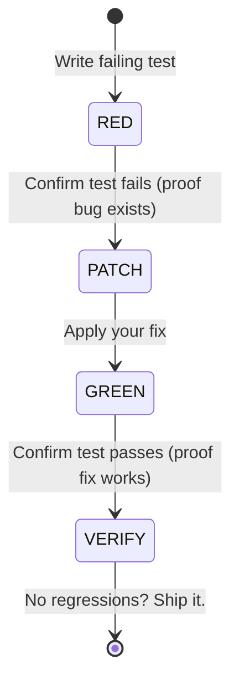
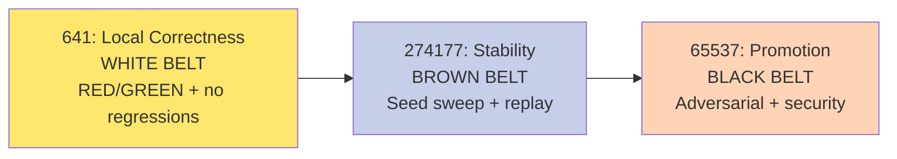

# Contributing to Stillwater

> "I fear not the man who has practiced 10,000 kicks once, but I fear the man who has practiced one kick 10,000 times." -- Bruce Lee

Welcome to the dojo. Every pull request is a kata. Every code review is a sparring session. Every merged change makes the tower stronger.

This repo is documentation-first: notebooks and papers should be runnable, reviewable, and honest about what is verified vs. hypothesized. We value discipline over cleverness, receipts over promises, and small precise strikes over wild haymakers.

---

## Dojo Rules (Code of the Mat)

Before you step onto the mat, understand the principles:

1. **"Absorb what is useful"** -- Read the existing code before writing new code. Understand what is already there.
2. **"Discard what is useless"** -- If your change removes dead code or simplifies complexity, that is a contribution. Subtraction counts.
3. **"Add what is essentially your own"** -- Original work is welcome. But it must carry its own weight in evidence.

---

## Ground Rules

- **Prefer small PRs.** A one-inch punch lands harder than a wild swing. Small, focused changes are easier to review, easier to verify, and easier to revert if something goes wrong.
- **Avoid machine-specific paths in committed artifacts.** Portability is a form of respect for the next person who runs your code.
- **If you add a numeric claim, link to a runnable script/notebook that reproduces it.** Claims without evidence are just stories. Stories are nice. Evidence is better.
- **If a notebook requires external services, keep an offline demo path that still executes cleanly.** Not everyone has API keys. Everyone deserves a working demo.

---

## The RED/GREEN Gate (Mandatory for Bug Fixes)

This is the most important rule in the dojo. It comes from Kent Beck's TDD discipline, and Stillwater enforces it as a hard gate:

**Before your patch:**
1. Write a test (or repro script) that **fails** -- this is RED
2. Run it. Confirm it fails. Record the output.

**After your patch:**
3. Run the same test. It must **pass** -- this is GREEN
4. Confirm no other tests broke.



**No patch without verified RED-to-GREEN.** This is not optional. This is the way.

> "Boards don't hit back." -- Bruce Lee (in Enter the Dragon)
>
> Tests do. Write them first.

---

## Verification Ladder (Know Your Rung)

When you submit a PR, know what level of proof you are claiming:



| Rung | Name | What It Requires | Belt Equivalent |
|------|------|-----------------|-----------------|
| **641** | Local Correctness | RED/GREEN gate passed. No regressions. Evidence complete. | White belt |
| **274177** | Stability | Seed sweep (3+ seeds). Replay stability. Null edge cases handled. | Brown belt |
| **65537** | Promotion | Adversarial sweeps. Security gate (if triggered). Behavioral hash drift explained. | Black belt |

Most PRs need Rung 641. If you are making a claim about benchmark performance or proposing a release, you need Rung 65537.

State your rung in the PR description. Do not claim a higher rung than you have earned.

---

## Running Tests

```bash
PYTEST_DISABLE_PLUGIN_AUTOLOAD=1 pytest -q
```

Integration tests are opt-in:
```bash
STILLWATER_RUN_INTEGRATION_TESTS=1 PYTEST_DISABLE_PLUGIN_AUTOLOAD=1 pytest -q
```

If the tests do not pass on your branch, your PR is not ready. Go back to the training room.

---

## Notebook Hygiene

- Before committing, execute notebooks and ensure there are no error outputs.
- Prefer deterministic, short-running demo mode by default.
- Notebooks are the sparring ring where theory meets practice. Keep them clean.

---

## PR Checklist (The Kata Form)

Before submitting, walk through this form:

- [ ] I have read the relevant existing code (absorb what is useful)
- [ ] My change is the smallest diff that achieves the goal (one-inch punch)
- [ ] If this is a bug fix, I have a failing test BEFORE my patch (RED gate)
- [ ] After my patch, that test passes (GREEN gate)
- [ ] No existing tests are broken
- [ ] If I added a numeric claim, I linked a runnable reproduction
- [ ] No machine-specific paths in committed artifacts
- [ ] Notebooks execute cleanly in offline demo mode
- [ ] I stated my verification rung (641 / 274177 / 65537) in the PR description

---

## What Makes a Great Contribution

The best contributions to this dojo share a few qualities:

- **They close a real gap.** Not theoretical improvements -- actual failure modes that were observed and fixed.
- **They carry their own evidence.** A test, a notebook, a reproduction script.
- **They are reversible.** If something goes wrong, the change can be rolled back cleanly.
- **They are honest.** If you are unsure about something, say so. "I don't know" is a valid intermediate step. Pretending is not.

> "Mistakes are always forgivable, if one has the courage to admit them." -- Bruce Lee

---

## The Way of Water

Stillwater is named for a reason. Still water reflects clearly. Turbulent water distorts.

Your contributions should bring clarity, not turbulence. Small, precise, verified changes that make the whole system a little more honest, a little more reliable, a little more useful.

That is the practice. There is no finish line. There are only plateaus, and you must not stay there.

> "If you always put limits on everything you do, physical or anything else, it will spread into your work and into your life. There are no limits. There are only plateaus, and you must not stay there, you must go beyond them." -- Bruce Lee

Welcome to the dojo. Now train.
