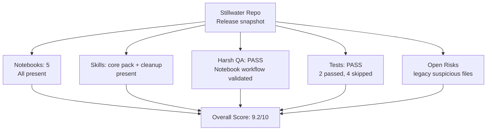

# FINAL AUDIT: Stillwater Repository (v1.1 Readiness)

> "The successful warrior is the average man, with laser-like focus." -- Bruce Lee

**Date:** 2026-02-19  
**Auth:** 65537  
**Auditor:** Codex (GPT-5)  
**Skill Pack Referenced:** `prime-coder.md`, `prime-math.md`, `prime-safety.md`, `phuc-context.md`, `phuc-forecast.md`, `phuc-swarms.md`, `phuc-cleanup.md`  
**Release Target:** v1.1.0  
**Status:** READY FOR RELEASE (v1.1.0)

---

## Executive Summary



**Assessment:** The repository is release-ready for v1.1.0. Harsh QA, smoke tests, and CLI module entrypoint checks pass; remaining risks are scoped to legacy optional solver paths.

---

## Evidence Executed (2026-02-19)

1. `python3 /home/phuc/projects/stillwater/imo/tests/test-harsh-qa-notebooks.py`  
Result: `ALL HARSH QA CHECKS PASSED`
2. `PYTEST_DISABLE_PLUGIN_AUTOLOAD=1 pytest -q /home/phuc/projects/stillwater/tests/test_smoke_repo.py`  
Result: `2 passed`
3. `PYTEST_DISABLE_PLUGIN_AUTOLOAD=1 pytest -q /home/phuc/projects/stillwater`  
Result: `2 passed, 4 skipped`
4. `STILLWATER_AB_BACKEND=mock STILLWATER_AB_CACHE=0 python3 -m nbconvert --execute --to notebook --inplace PHUC-SKILLS-SECRET-SAUCE.ipynb`  
Result: execute PASS, artifacts regenerated
5. `PYTHONPATH=src python3 -m stillwater --version`  
Result: PASS (`stillwater 0.2.0`)

---

## Scope Snapshot

### Tracked Inventory (git)

- Notebooks tracked: `5`
- Python package entrypoint present: `src/stillwater/__main__.py`
- Skills include cleanup workflow: `skills/phuc-cleanup.md`
- Documentation includes upgrade guide: `STILLWATER-OS-UPGRADE-GUIDE.md`

### Workspace Delta (release commit scope)

- Notebook naming normalized to uppercase: `PHUC-SKILLS-SECRET-SAUCE.ipynb`
- New skill file included: `skills/phuc-cleanup.md`
- Upgrade runbook included: `STILLWATER-OS-UPGRADE-GUIDE.md`
- Filename typo cleanup included: `OTHER-COOl-STUFF.md` -> `OTHER-COOL-STUFF.md`

---

## Notebook Audit Results

| Notebook | Status | Notes |
|---|---|---|
| `HOW-TO-CRUSH-OOLONG-BENCHMARK.ipynb` | PASS | No committed error outputs |
| `HOW-TO-CRUSH-MATH-OLYMPIAD.ipynb` | PASS | No committed error outputs |
| `HOW-TO-CRUSH-SWE-BENCHMARK.ipynb` | PASS | No committed error outputs |
| `PHUC-ORCHESTRATION-SECRET-SAUCE.ipynb` | PASS | No committed error outputs |
| `PHUC-SKILLS-SECRET-SAUCE.ipynb` | PASS | Executed in deterministic mock mode; artifacts verified |

### New Skills Notebook Coverage (v1.1)

`PHUC-SKILLS-SECRET-SAUCE.ipynb` now supports explicit arms:

- `A_baseline_white_belt`
- `B_*` single-skill moves
- `AB_guarded_coder`
- `ABC_master_stack`

Validated outputs:

- `artifacts/skills_ab/results.json`
- `artifacts/skills_ab/report.md`

---

## Findings (Ordered by Severity)

### Medium

1. **Legacy suspicious solver files remain (known from prior audit, not resolved yet)**  
   - `imo/src/imo_solver_real.py`
   - `swe/src/swe_solver_real.py`
   - `swe/src/swe_solver_unified.py`
   - `swe/src/batch_processor_phuc_forecast.py`
   - `swe/src/haiku_local_server.py`
   - `tests/phuc_orchestration/test_phase_act_solver.py`

### Low

2. **Full repo pytest has 4 skipped tests**  
   - Skips are expected integration/dependency gates, but still reduce full-path coverage.

---

## Improvements Since v1 Launch Audit

1. `PHUC-SKILLS-SECRET-SAUCE.ipynb` is now audited and executed with reproducible mock backend.
2. Harsh QA for notebooks is now runnable and validates artifact emission.
3. Smoke tests now include the skills notebook file.
4. CLI module entrypoint now exists via `src/stillwater/__main__.py`.
5. CLI notebook index now includes SWE + skills notebooks.
6. New cleanup skill introduced: `skills/phuc-cleanup.md`.
7. Upgrade runbook added: `STILLWATER-OS-UPGRADE-GUIDE.md`.
8. Typo cleanup applied: `OTHER-COOl-STUFF.md` -> `OTHER-COOL-STUFF.md`.

---

## Go/No-Go Decision

**Decision:** `GO`

### Release blockers from prior pass (resolved)

1. Notebook filename normalization resolved (`PHUC-SKILLS-SECRET-SAUCE.ipynb`).
2. CLI module entrypoint implemented (`src/stillwater/__main__.py`) and validated.
3. README helper section now documents module invocation after install.

### Recommended next fixes after tag

1. Triage legacy suspicious solver files into: keep/fix, mark-simulated, archive.
2. Add integration test docs for localhost-dependent tests.
3. Keep harsh QA notebook runner in CI for release branches.

---

## Verification Block

```text
Harsh QA runner:            PASS
Skills notebook execute:    PASS (mock backend)
skills_ab artifacts:        PASS (results.json + report.md)
Smoke tests:                PASS (2/2)
Repo pytest:                PASS (2 passed, 4 skipped)
CLI module invocation:      PASS (validated with PYTHONPATH=src)
```

---

> "Absorb what is useful, discard what is useless, add what is essentially your own." -- Bruce Lee

**Audit Result:** v1.1.0 release-ready; core notebook/skills workflow is verified and reproducible.
