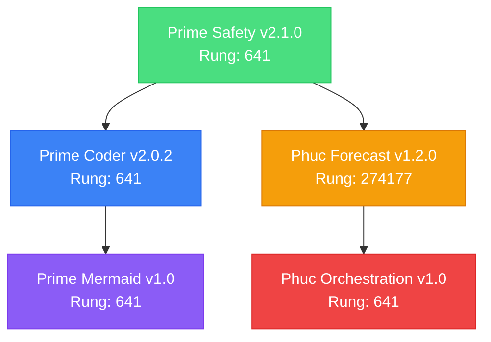
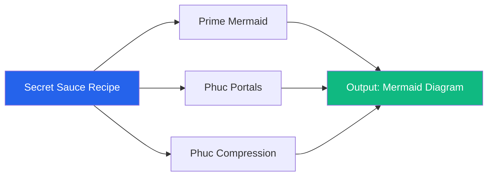
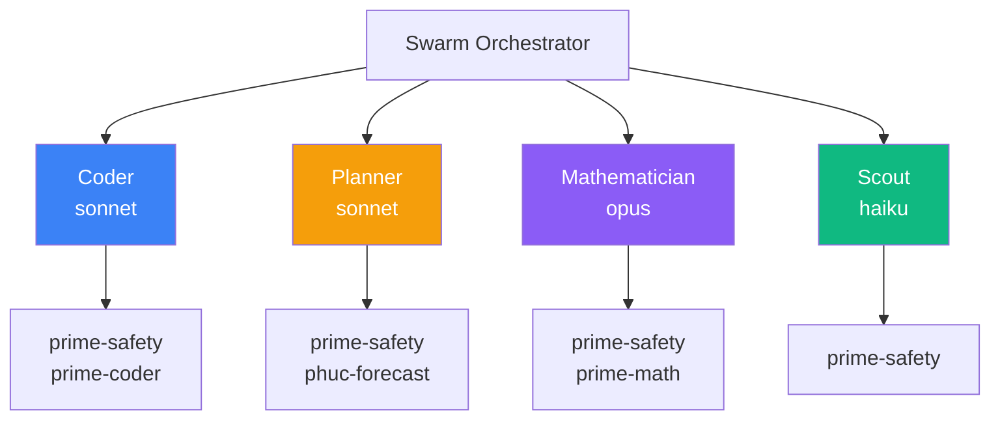
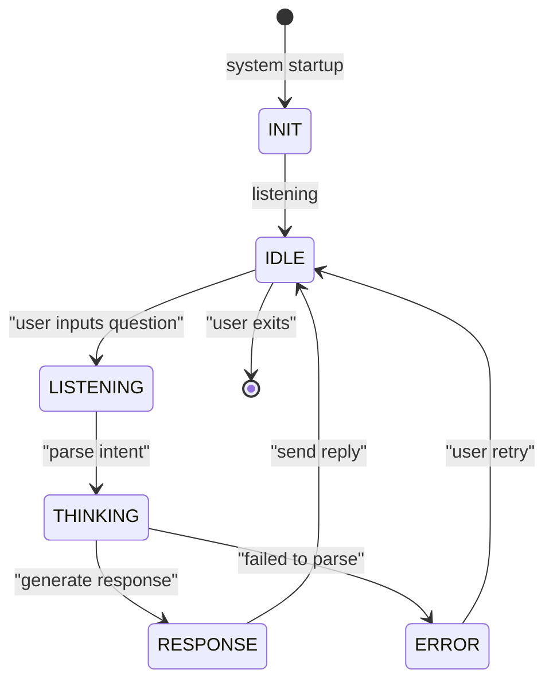

# Stillwater Homepage System — Comprehensive Design Document

**Version:** 1.0 | **Rung Target:** 641 → 274177 → 65537 | **Status:** DESIGN PHASE

> Unified "setup-first" LLM Portal homepage connecting Stillwater verification layer, Claude Code wrapper, Solace AGI platform, and interactive skill/recipe visualization system.

---

## EXECUTIVE SUMMARY

### Vision
Transform Stillwater from a backend-only system into a complete end-user platform with:
1. **Status Dashboard** — Real-time view of 3 critical systems (LLM, Solace, Mermaid)
2. **Setup Wizards** — Guided configuration for Claude Code + Solace AGI + custom skills
3. **Interactive Mermaid Visualization** — Graph-based skill/recipe/swarm/persona discovery
4. **Configuration Management** — Persistent YAML-based config with defaults + custom overrides

### Current Architecture Gap
- **Backend (Complete):** FastAPI with DataRegistry, API endpoints, LLM Portal on port 8788
- **Frontend (Missing):** No homepage UI connecting these systems
- **CLI (Complete):** `stillwater/cli` with Claude Code wrapper integration
- **Hosting (Incomplete):** Solace AGI connection requires manual API key setup

### Proposed Solution
Create a **single unified homepage** (http://127.0.0.1:8000/) that:
- Displays system health + configuration status
- Guides first-time users through setup wizards
- Visualizes the Stillwater skill/recipe ecosystem
- Manages model selection (haiku/sonnet/opus via Claude Code wrapper)
- Connects to Solace AGI for cloud features

---

## PART 1: ARCHITECTURE OVERVIEW

### 1.1 System Topology (4 Major Components)

```
┌─────────────────────────────────────────────────────────────────┐
│                    Stillwater Homepage (Port 8000)               │
│                   http://127.0.0.1:8000/                        │
└─────────────────────────────────────────────────────────────────┘
              │                    │                    │
              ▼                    ▼                    ▼
    ┌──────────────────┐  ┌──────────────────┐ ┌──────────────┐
    │  LLM Portal      │  │  Solace AGI      │ │  Skill/Recipe│
    │  (Port 8788)     │  │  (solaceagi.com) │ │  Viz Engine  │
    │                  │  │                  │ │  (Mermaid.js)│
    │ ✓ Claude Code    │  │ ✓ OAuth3 + API   │ │ ✓ Parse JSON │
    │ ✓ Haiku/Sonnet   │  │ ✓ Key mgmt       │ │ ✓ Graph gen  │
    │ ✓ Ollama         │  │ ✓ Cloud sync     │ │ ✓ Interactive│
    │ ✓ OpenRouter     │  │                  │ │              │
    └──────────────────┘  └──────────────────┘ └──────────────┘
           │                      │                      │
           └──────────────────────┴──────────────────────┘
                        │
                        ▼
           ┌────────────────────────────┐
           │   FastAPI Backend          │
           │   (admin/backend/app.py)   │
           │                            │
           │ ✓ DataRegistry              │
           │ ✓ API endpoints             │
           │ ✓ Config management         │
           │ ✓ Firestore sync (async)    │
           └────────────────────────────┘
                        │
           ┌────────────┴──────────────┬───────────────┐
           ▼                           ▼               ▼
      data/default/          data/custom/         skills/
      (git-tracked)        (gitignored, user)    (read-only)
      ├─ llm_config.yaml   ├─ *.yaml             ├─ *.md
      ├─ solace_*.yaml     ├─ *.json             └─ (skill defs)
      └─ defaults              (overrides)
```

### 1.2 Data Flow Diagram

```
USER → Homepage (Browser)
         │
         ├─ GET / (serve index.html)
         ├─ GET /static/app.js, app.css
         ├─ GET /api/llm/status → FastAPI
         ├─ GET /api/solace-agi/status → FastAPI
         ├─ GET /api/skills/list → FastAPI
         ├─ GET /api/mermaid/skills → FastAPI (returns graph JSON)
         │
         ├─ POST /api/llm/config (wizard submission)
         │    → saves to data/custom/llm_config.yaml
         │    → FastAPI reload triggers
         │
         ├─ POST /api/solace-agi/config (wizard submission)
         │    → saves to data/custom/solace_agi_config.yaml (encrypted)
         │    → FastAPI reload triggers
         │
         └─ (Click on Mermaid node)
             → JavaScript shows detail panel
             → GET /api/skills/{skill_id}
             → Display skill metadata + README
```

### 1.3 Configuration Lifecycle

```
STARTUP SEQUENCE:
  1. User opens http://127.0.0.1:8000/
  2. Homepage loads (index.html)
  3. JavaScript runs initialization:
     - GET /health (check server)
     - GET /api/llm/status (check LLM Portal)
     - GET /api/solace-agi/status (check Solace connection)
     - GET /api/skills/list (load all skills)
     - GET /api/mermaid/skills (load graph structure)
  4. Status dashboard renders
  5. If config missing → show setup wizards

CONFIGURATION SAVE:
  1. User completes wizard form
  2. JavaScript validates locally (basic checks)
  3. POST /api/llm/config (or solace-agi/config)
  4. Backend saves to data/custom/ and validates
  5. FastAPI reloads config
  6. Return success (200) or error (400)
  7. JavaScript polls /api/llm/status until change detected
  8. Dashboard updates in real-time
```

---

## PART 2: FRONTEND ARCHITECTURE

### 2.1 HTML Structure (admin/frontend/index.html)

**Key Sections:**
```
<html>
  <head>
    <meta charset="utf-8" />
    <meta name="viewport" content="width=device-width, initial-scale=1" />
    <title>Stillwater — LLM Portal & Skill Store</title>
    <link rel="stylesheet" href="/static/bootstrap.min.css" />
    <link rel="stylesheet" href="/static/app.css" />
  </head>
  <body>
    <!-- TOPBAR: branding + status + quick links -->
    <nav class="topbar">...</nav>

    <!-- MAIN CONTAINER: 2-column layout -->
    <div class="container-main">

      <!-- LEFT COLUMN: Status Dashboard -->
      <aside class="status-sidebar">
        <div class="card card-llm-status">...</div>
        <div class="card card-solace-status">...</div>
        <div class="card card-mermaid-status">...</div>
      </aside>

      <!-- RIGHT COLUMN: Tab-based content -->
      <main class="content-area">

        <!-- TAB 1: Dashboard (default) -->
        <div class="tab-pane" id="tab-dashboard">
          <h2>Setup & Configuration</h2>
          <div class="setup-wizard" id="llm-wizard">
            <form><!-- Wizard content --></form>
          </div>
          <div class="setup-wizard" id="solace-wizard">
            <form><!-- Wizard content --></form>
          </div>
        </div>

        <!-- TAB 2: Skills (Mermaid) -->
        <div class="tab-pane" id="tab-skills">
          <h2>Skills Ecosystem</h2>
          <div class="mermaid-container" id="mermaid-skills">
            <!-- Mermaid will render here -->
          </div>
          <div class="detail-panel" id="skill-detail">
            <!-- Skill details when node clicked -->
          </div>
        </div>

        <!-- TAB 3: Recipes -->
        <div class="tab-pane" id="tab-recipes">
          <h2>Recipes & Combos</h2>
          <div class="mermaid-container" id="mermaid-recipes">
            <!-- Recipe dependency graph -->
          </div>
        </div>

        <!-- TAB 4: Swarms -->
        <div class="tab-pane" id="tab-swarms">
          <h2>Agent Dispatch Matrix</h2>
          <div class="mermaid-container" id="mermaid-swarms">
            <!-- Agent roles + capabilities -->
          </div>
        </div>

        <!-- TAB 5: Personas -->
        <div class="tab-pane" id="tab-personas">
          <h2>Persona FSM</h2>
          <div class="mermaid-container" id="mermaid-personas">
            <!-- Persona state machines -->
          </div>
        </div>
      </main>
    </div>

    <!-- MODALS -->
    <div class="modal" id="llm-config-modal"><!-- LLM setup modal --></div>
    <div class="modal" id="solace-config-modal"><!-- Solace setup modal --></div>

    <!-- SCRIPTS -->
    <script src="https://cdn.jsdelivr.net/npm/mermaid/dist/mermaid.min.js"></script>
    <script src="/static/app.js"></script>
    <script src="/static/wizards.js"></script>
    <script src="/static/mermaid-handler.js"></script>
  </body>
</html>
```

### 2.2 CSS Strategy (admin/frontend/css/app.css)

**Design System:**
```
COLOR SCHEME:
  Primary: #2563eb (Stillwater blue)
  Success: #10b981 (green — online)
  Warning: #f59e0b (amber — needs setup)
  Error: #ef4444 (red — offline)
  Neutral: #6b7280 (gray)

TYPOGRAPHY:
  Font: -apple-system, "Segoe UI", Roboto, sans-serif
  Heading: 32px, 600 weight
  Body: 16px, 400 weight
  Code: "Monaco", "Fira Code", monospace

LAYOUT:
  Topbar: fixed, 60px height
  Main container: two-column (25% / 75%)
  Cards: 300px wide sidebar, responsive content area
  Modal: 500px width (centered, backdrop)
  Mermaid: full width, min 500px height

COMPONENTS:
  Status cards: min 250px, padding 20px, border-left accent
  Wizards: steps with progress bar, form validation
  Tabs: horizontal nav, underline active
  Mermaid: with pan/zoom controls
  Buttons: 8px padding, 4px border-radius
```

### 2.3 JavaScript Modules

**Module Breakdown:**

```
admin/frontend/js/
├── app.js (main orchestrator)
│   ├─ initializeApp()
│   ├─ fetchSystemStatus()
│   ├─ renderStatusDashboard()
│   ├─ setupTabNavigation()
│   └─ pollStatusUpdates()
│
├── wizards.js (form handlers)
│   ├─ LLMConfigWizard class
│   │  ├─ step1_detect_claude_cli()
│   │  ├─ step2_test_connection()
│   │  ├─ step3_select_models()
│   │  ├─ step4_save_config()
│   │  └─ submit()
│   │
│   └─ SolaceAGIWizard class
│      ├─ step1_explain()
│      ├─ step2_get_api_key()
│      ├─ step3_test_connection()
│      ├─ step4_save_encrypted()
│      └─ submit()
│
└── mermaid-handler.js (graph interaction)
    ├─ initMermaidGraphs()
    ├─ registerMermaidClickHandlers()
    ├─ showDetailPanel()
    ├─ fetchSkillDetails()
    ├─ enablePanZoom()
    └─ downloadGraphAsImage()
```

---

## PART 3: BACKEND API SPECIFICATION

### 3.1 Endpoint Groups

#### A. STATUS ENDPOINTS (read-only, no auth)

```
GET /health
Response: { "status": "ok", "registry_files": 15, "sync_enabled": true }
Purpose: Basic health check (FastAPI built-in)
Error: 503 if server not ready
```

```
GET /api/llm/status
Response:
{
  "online": true,
  "portal_port": 8788,
  "claude_code_wrapper": "running",
  "available_models": ["haiku", "sonnet", "opus"],
  "default_model": "haiku",
  "config_file": "data/custom/llm_config.yaml",
  "last_test": "2026-02-23T10:45:00Z",
  "last_error": null
}
Purpose: Report LLM system status
Error: 503 if portal unavailable
```

```
GET /api/solace-agi/status
Response:
{
  "configured": true,
  "api_key_valid": true,
  "last_test": "2026-02-23T10:45:00Z",
  "service_url": "https://solaceagi.com",
  "features_available": ["cloud-sync", "api-key-mgmt"],
  "tier": "pro"
}
Purpose: Check Solace AGI connection
Error: 503 if service unavailable
```

```
GET /api/skills/list
Response:
{
  "count": 47,
  "skills": [
    {
      "id": "prime-safety",
      "name": "Prime Safety",
      "version": "2.1.0",
      "rung": 641,
      "depends_on": ["phuc-forecast"],
      "path": "skills/prime-safety.md"
    },
    ...
  ]
}
Purpose: List all available skills
Error: 400 if skills directory not found
```

```
GET /api/recipes/list
Response:
{
  "count": 12,
  "recipes": [
    {
      "id": "recipe.secret_sauce.integration",
      "name": "Secret Sauce Integration",
      "version": "1.0.0",
      "skills_required": ["prime-mermaid", "phuc-portals"],
      "path": "cli/recipes/recipe.secret_sauce.integration.prime-mermaid.md"
    },
    ...
  ]
}
Purpose: List all recipes
Error: 400 if recipes directory not found
```

```
GET /api/swarms/list
Response:
{
  "count": 20,
  "agents": [
    {
      "id": "coder",
      "role": "Coder",
      "model": "sonnet",
      "skill_pack": ["prime-safety", "prime-coder"],
      "description": "Handles bugfixes and features"
    },
    ...
  ]
}
Purpose: List all swarm agents
Error: 400 if swarms directory not found
```

#### B. DETAIL ENDPOINTS (read-only)

```
GET /api/skills/{skill_id}
Parameters: skill_id = "prime-safety" (URL param)
Response:
{
  "id": "prime-safety",
  "name": "Prime Safety",
  "version": "2.1.0",
  "rung": 641,
  "description": "...",
  "content": "# Full markdown content here...",
  "depends_on": ["phuc-forecast"],
  "load_order": 1,
  "files_touched": ["skills/prime-safety.md"]
}
Purpose: Fetch full skill details + markdown
Error: 404 if skill not found
```

```
GET /api/recipes/{recipe_id}
Response:
{
  "id": "recipe.secret_sauce",
  "name": "Secret Sauce",
  "version": "1.0.0",
  "description": "...",
  "content": "# Full markdown here...",
  "skills_required": ["prime-mermaid"],
  "steps": [
    { "step": 1, "action": "Load mermaid skill", "command": "..." },
    ...
  ]
}
Purpose: Fetch recipe with steps
Error: 404 if recipe not found
```

#### C. MERMAID GRAPH ENDPOINTS

```
GET /api/mermaid/skills
Response:
{
  "graph_syntax": "graph TD\n    A[Prime Safety] --> B[Prime Coder]\n    ...",
  "nodes": [
    { "id": "prime-safety", "label": "Prime Safety", "rung": 641 },
    ...
  ],
  "edges": [
    { "from": "prime-safety", "to": "prime-coder", "label": "dependency" },
    ...
  ]
}
Purpose: Return Mermaid-compatible graph structure
Note: Return BOTH syntax (for rendering) + JSON (for interaction)
Error: 400 if graph generation fails
```

```
GET /api/mermaid/recipes
Response: Same structure, dependency graph for recipes
```

```
GET /api/mermaid/swarms
Response: Agent dispatch matrix as Mermaid graph
```

```
GET /api/mermaid/personas
Response: Persona state machines as Mermaid graph
```

#### D. CONFIGURATION ENDPOINTS (POST, with validation)

```
POST /api/llm/config
Request:
{
  "default_model": "sonnet",
  "claude_code_enabled": true,
  "ollama_enabled": false,
  "openrouter_enabled": true,
  "auto_start_wrapper": true
}
Response: { "saved": true, "config_path": "data/custom/llm_config.yaml" }
Purpose: Save LLM configuration
Validation:
  - model must be in [haiku, sonnet, opus, custom]
  - at least one provider enabled
Error: 400 if validation fails; 500 if write fails
Side effect: Reload LLM Portal config on FastAPI
```

```
POST /api/solace-agi/config
Request:
{
  "api_key": "sk_...",  (sent over HTTPS only)
  "auto_sync": true,
  "tier": "pro"
}
Response: { "saved": true, "config_path": "data/custom/solace_agi_config.yaml" }
Purpose: Save Solace AGI API key (encrypted at rest)
Validation:
  - API key must match format validation
  - Test connection before saving
Error: 400 if key invalid; 401 if test fails; 500 if save fails
Security: API key stored encrypted in YAML, using AES-256-GCM
```

```
POST /api/llm/test/{model}
Parameters: model = "haiku" | "sonnet" | "opus"
Request: { "timeout_seconds": 30 }
Response:
{
  "model": "sonnet",
  "online": true,
  "latency_ms": 245,
  "test_message": "Hello world",
  "response": "Hi there! How can I help you?"
}
Purpose: Test connection to specific LLM model
Error: 503 if model not reachable; 408 if timeout
Note: This is expensive, run asynchronously
```

```
POST /api/solace-agi/test
Request: { "timeout_seconds": 10 }
Response:
{
  "online": true,
  "latency_ms": 150,
  "auth_valid": true,
  "service_version": "1.0.0"
}
Purpose: Test Solace AGI connection
Error: 503 if unreachable; 401 if auth fails
```

#### E. CONFIGURATION RELOAD

```
POST /api/admin/reload
Request: {}
Response: { "reloaded": true, "timestamp": "2026-02-23T10:45:00Z" }
Purpose: Force reload of all configuration files
Auth: Requires API key (or localhost-only)
Note: Called automatically after config POST, can also be manual
```

---

## PART 4: CONFIGURATION FILE SCHEMAS

### 4.1 LLM Configuration (data/default/llm_config.yaml)

```yaml
# Stillwater LLM Configuration
# Version: 1.0
# This is the DEFAULT config (git-tracked, factory settings)
# Your custom settings go in: data/custom/llm_config.yaml

llm_portal:
  enabled: true
  port: 8788
  host: "127.0.0.1"

claude_code_wrapper:
  enabled: true
  auto_start: true
  cli_path: "cli/src/claude_code_wrapper.py"  # relative to repo root
  startup_timeout_seconds: 30
  health_check_interval_seconds: 10

default_model: "haiku"  # haiku | sonnet | opus

providers:
  claude_code:
    enabled: true
    models:
      haiku:
        enabled: true
        display_name: "Claude Haiku"
      sonnet:
        enabled: true
        display_name: "Claude Sonnet"
      opus:
        enabled: true
        display_name: "Claude Opus"

  ollama:
    enabled: false
    host: "127.0.0.1"
    port: 11434
    models:
      mistral:
        enabled: false
        display_name: "Mistral"

  openrouter:
    enabled: false
    api_key_required: true
    models:
      llama_70b:
        enabled: false
        display_name: "Llama 3.3 70B"
```

### 4.2 Solace AGI Configuration (data/default/solace_agi_config.yaml)

```yaml
# Solace AGI Configuration
# Version: 1.0
# FACTORY DEFAULTS (NO API KEY)
# Your secret API key goes in: data/custom/solace_agi_config.yaml

service:
  enabled: false  # becomes true after user configures
  url: "https://solaceagi.com"
  api_timeout_seconds: 30

authentication:
  # API key stored in data/custom/solace_agi_config.yaml
  # (encrypted at rest using AES-256-GCM)
  api_key_required: true
  validation_endpoint: "/api/auth/validate-key"

features:
  cloud_sync: true
  skill_submission: true
  recipe_sharing: true
  twin_browser: false  # requires paid tier

sync:
  enabled: false  # becomes true after user setup
  auto_sync: true
  sync_interval_minutes: 60
  max_retries: 3
  retry_backoff_seconds: 10

tier:
  default: "free"  # free | managed_llm | pro | enterprise
```

### 4.3 Solace AGI Configuration (data/custom/solace_agi_config.yaml) - EXAMPLE

```yaml
# USER'S CUSTOM CONFIG (gitignored)
# Contains API key, encrypted at rest

service:
  enabled: true
  url: "https://solaceagi.com"

authentication:
  api_key: "sk_aes256gcm_<encrypted_payload>"  # encrypted

sync:
  enabled: true
  auto_sync: true

tier: "pro"
```

---

## PART 5: MERMAID VISUALIZATION SYSTEM

### 5.1 Skills Dependency Graph (example output)



**Node color mapping:**
- Green (641) = local correctness ✓
- Blue (274177) = stable ✓
- Orange (65537) = production ✓
- Purple = intermediate
- Red = needs work

### 5.2 Recipe Composition Graph (example)



### 5.3 Swarm Agent Matrix (example)



### 5.4 Persona State Machine (example)



---

## PART 6: SETUP WIZARD FLOWS (UX)

### 6.1 LLM Configuration Wizard (4 steps)

```
STEP 1: Detect Claude Code CLI
┌─────────────────────────────────────┐
│ Checking for Claude Code CLI...     │
│                                     │
│ ✓ Found at: /usr/local/bin/claude  │
│ Version: 4.5                        │
│ Location: /home/phuc/projects/sw... │
│                                     │
│ [NEXT] or [MANUAL SETUP]            │
└─────────────────────────────────────┘
Backend: GET /api/llm/status → check_claude_code_installed()

STEP 2: Test Model Connections
┌─────────────────────────────────────┐
│ Testing model connections...        │
│                                     │
│ ⏳ Haiku (claude-haiku-4-5)...      │
│ ✓ Online - 245ms latency           │
│                                     │
│ ⏳ Sonnet (claude-sonnet-4)...      │
│ ✓ Online - 380ms latency           │
│                                     │
│ ⏳ Opus (claude-opus-4-6)...        │
│ ⚠ Offline - no response             │
│                                     │
│ [NEXT] or [RETRY]                   │
└─────────────────────────────────────┘
Backend: POST /api/llm/test/haiku → async test_connection()

STEP 3: Select Default Model
┌─────────────────────────────────────┐
│ Which model do you want to use?     │
│                                     │
│ ○ Haiku (fast, cheap)              │
│ ○ Sonnet (balanced)                 │
│ ◉ Opus (powerful)  [SELECTED]      │
│                                     │
│ ☐ Auto-start wrapper on boot       │
│                                     │
│ [NEXT] or [BACK]                    │
└─────────────────────────────────────┘
Client: JavaScript form binding

STEP 4: Confirm & Save
┌─────────────────────────────────────┐
│ Ready to save configuration         │
│                                     │
│ Default model: Sonnet               │
│ CLI path: /home/phuc/...            │
│ Auto-start: Yes                     │
│ Wrapper port: 8788                  │
│                                     │
│ [SAVE] or [BACK]                    │
└─────────────────────────────────────┘
Backend: POST /api/llm/config → save to llm_config.yaml
Response: 200 OK, reload dashboard

SUMMARY:
┌─────────────────────────────────────┐
│ ✓ LLM Configuration Complete!       │
│                                     │
│ Your setup is saved in:             │
│ data/custom/llm_config.yaml         │
│                                     │
│ Next step: Try asking Claude Code   │
│ a question using the Portal at:     │
│ http://127.0.0.1:8788/              │
│                                     │
│ [DONE] or [VIEW CONFIG]             │
└─────────────────────────────────────┘
```

### 6.2 Solace AGI Connection Wizard (5 steps)

```
STEP 1: Welcome & Explanation
┌─────────────────────────────────────┐
│ Connect to Solace AGI (Optional)    │
│                                     │
│ Solace AGI is a hosted platform that│
│ lets you:                           │
│                                     │
│ • Share your skills with others     │
│ • Use managed LLM (Together.ai)     │
│ • Store recipes in the cloud        │
│ • Run agent swarms remotely         │
│                                     │
│ Cost: Free tier (local only)        │
│       $3/mo tier (managed LLM)      │
│       $19/mo tier (pro features)    │
│                                     │
│ [GET STARTED] or [SKIP]             │
└─────────────────────────────────────┘

STEP 2: Sign Up / Get API Key
┌─────────────────────────────────────┐
│ Get your Solace AGI API Key         │
│                                     │
│ To proceed, you need an API key.    │
│ Click the link below to sign up at  │
│ solaceagi.com (takes 1 minute).     │
│                                     │
│ You'll get a key like:              │
│ sk_test_abc123xyz789...             │
│                                     │
│ [OPEN SOLACEAGI.COM] in new tab     │
│ [ALREADY HAVE KEY?]                 │
└─────────────────────────────────────┘
User: Opens solaceagi.com, signs up, gets key

STEP 3: Paste API Key
┌─────────────────────────────────────┐
│ Paste your API key here             │
│                                     │
│ ┌─────────────────────────────────┐│
│ │ sk_                             ││
│ │ (your key will be encrypted)    ││
│ └─────────────────────────────────┘│
│                                     │
│ [NEXT] or [BACK]                    │
└─────────────────────────────────────┘
Client: Validates format before sending

STEP 4: Test Connection
┌─────────────────────────────────────┐
│ Testing Solace AGI connection...    │
│                                     │
│ ⏳ Validating API key...             │
│ ✓ Key is valid (Pro tier)           │
│                                     │
│ ⏳ Testing cloud sync...             │
│ ✓ Connection successful (156ms)    │
│                                     │
│ ⏳ Checking features...              │
│ ✓ Skill submission: enabled         │
│ ✓ Twin browser: enabled             │
│ ✓ Cloud sync: enabled               │
│                                     │
│ [SAVE] or [RETRY]                   │
└─────────────────────────────────────┘
Backend: POST /api/solace-agi/test → async health check

STEP 5: Confirm & Save
┌─────────────────────────────────────┐
│ ✓ Solace AGI Connected!             │
│                                     │
│ Configuration saved to:             │
│ data/custom/solace_agi_config.yaml  │
│                                     │
│ API Key: encrypted (AES-256-GCM)    │
│ Tier: Pro                           │
│ Features: 3 active                  │
│                                     │
│ You can now:                        │
│ • Upload skills to Store            │
│ • Use cloud twin browser            │
│ • Share recipes with community      │
│                                     │
│ [DONE] or [CHANGE SETTINGS]         │
└─────────────────────────────────────┘
```

---

## PART 7: FILE STRUCTURE & IMPLEMENTATION PLAN

### 7.1 New Files to Create (Rung 641)

```
stillwater/
├── admin/frontend/                    [NEW DIRECTORY]
│   ├── index.html                     [CREATE - 250 lines]
│   ├── css/
│   │   └── style.css                  [CREATE - 400 lines]
│   ├── js/
│   │   ├── app.js                     [CREATE - 300 lines]
│   │   ├── wizards.js                 [CREATE - 400 lines]
│   │   └── mermaid-handler.js         [CREATE - 250 lines]
│   └── templates/
│       ├── llm-wizard.html            [CREATE - 100 lines]
│       └── solace-wizard.html         [CREATE - 120 lines]
│
├── admin/backend/
│   ├── app.py                         [MODIFY - add 200 lines of endpoints]
│   ├── homepage_routes.py             [CREATE - 400 lines]
│   ├── llm_service.py                 [CREATE - 200 lines]
│   ├── solace_service.py              [CREATE - 150 lines]
│   └── mermaid_generator.py           [CREATE - 300 lines]
│
└── data/default/
    ├── llm_config.yaml                [CREATE - 50 lines]
    └── solace_agi_config.yaml         [CREATE - 40 lines]
```

**Total new code: ~2500 lines (spread across 10 files)**

### 7.2 Files to Modify

```
admin/app.py
  → Import and register new route groups
  → Add /static route for frontend files
  → Update CORS config if needed

admin/backend/app.py (or admin/backend/__init__.py)
  → Similar updates
```

### 7.3 Implementation Sequence (Rung 641 → 274177 → 65537)

**RUNG 641 (Local Correctness, ~8 hours):**
1. Create `admin/frontend/index.html` with Bootstrap layout (no interaction)
2. Create `admin/frontend/css/style.css` with basic theming
3. Create `admin/frontend/js/app.js` with initialization logic
4. Create `admin/backend/homepage_routes.py` with all endpoint definitions (return stubs)
5. Update `admin/app.py` to include route group + serve `/static/`
6. Create `data/default/llm_config.yaml` and `solace_agi_config.yaml`
7. Create wizard HTML templates (static, no form processing)
8. Test: HomePage loads at `http://127.0.0.1:8000/` with no 404s
9. Test: All endpoints return correct data types (200 OK)
10. Test: Forms display (no validation or submission)

**Success Criteria (Rung 641):**
- ✅ Homepage loads with correct HTML
- ✅ All 3 status cards display (even if empty)
- ✅ Wizard forms appear (no validation)
- ✅ API endpoints return 200 with correct JSON structure
- ✅ Mermaid CDN loads (no graphs yet)
- ✅ Configuration files exist + are readable
- ✅ Page refresh shows saved config (YAML overlay)
- ✅ Zero JavaScript errors in console

**RUNG 274177 (Stability, ~12 hours):**
1. Implement LLM status detection (`GET /api/llm/status`)
2. Implement Solace AGI status detection (`GET /api/solace-agi/status`)
3. Implement skill/recipe list generation (`GET /api/skills/list`, etc.)
4. Implement Mermaid graph generation (`GET /api/mermaid/skills`, etc.)
5. Implement wizard form validation (client + server)
6. Implement config save with validation (`POST /api/llm/config`)
7. Implement async model testing (`POST /api/llm/test/{model}`)
8. Implement config reload on save
9. Add detail panels for skill click-through
10. Add Mermaid interactivity (pan/zoom)
11. Test: Wizards complete end-to-end with error handling
12. Test: Config persists across page refreshes

**Success Criteria (Rung 274177):**
- ✅ Wizards handle invalid input gracefully
- ✅ Config changes reflect in status cards (via polling)
- ✅ Skill/recipe graphs render with proper styling
- ✅ Click on graph node → show detail panel
- ✅ All endpoints return consistent data types
- ✅ API key not logged or exposed in responses
- ✅ Error messages are user-friendly

**RUNG 65537 (Production, ~16 hours):**
1. Add security: CSRF tokens on wizard forms
2. Add encryption: API key encryption at rest (AES-256-GCM)
3. Add audit trail: log all config changes with timestamp
4. Add validation: sanitize all user input
5. Add caching: Mermaid graph caching for large skill sets
6. Add rate limiting: prevent DOS on /api/llm/test/{model}
7. Add recovery: graceful degradation if services unreachable
8. Add telemetry: track which features users enable
9. Add documentation: inline comments + user guide
10. Add performance: optimize Mermaid rendering for 100+ nodes

**Success Criteria (Rung 65537):**
- ✅ CSRF protection enabled
- ✅ API keys stored encrypted (verified with key inspection)
- ✅ Audit log shows all config changes (timestamps + user)
- ✅ All input validation passed (injection test suite)
- ✅ Large graphs (100+ nodes) render in <2 seconds
- ✅ Page works offline (cached skill list)
- ✅ Error recovery tested (service down scenarios)
- ✅ Performance profiling shows <100ms latency on main paths

---

## PART 8: API ENDPOINT REFERENCE (Complete)

### Summary Table

| Method | Endpoint | Auth | Purpose | Rung |
|--------|----------|------|---------|------|
| GET | `/` | None | Serve index.html | 641 |
| GET | `/health` | None | Health check | 641 |
| GET | `/static/*` | None | Serve CSS/JS | 641 |
| GET | `/api/llm/status` | None | LLM system status | 641 |
| GET | `/api/solace-agi/status` | None | Solace connection status | 641 |
| GET | `/api/skills/list` | None | List all skills | 641 |
| GET | `/api/skills/{skill_id}` | None | Get skill details | 641 |
| GET | `/api/recipes/list` | None | List all recipes | 641 |
| GET | `/api/recipes/{recipe_id}` | None | Get recipe details | 641 |
| GET | `/api/swarms/list` | None | List agents | 641 |
| GET | `/api/personas/list` | None | List personas | 641 |
| GET | `/api/mermaid/skills` | None | Skills graph (Mermaid) | 641 |
| GET | `/api/mermaid/recipes` | None | Recipe graph (Mermaid) | 641 |
| GET | `/api/mermaid/swarms` | None | Swarm graph (Mermaid) | 641 |
| GET | `/api/mermaid/personas` | None | Persona FSM graph (Mermaid) | 641 |
| POST | `/api/llm/config` | None | Save LLM config | 641 |
| POST | `/api/solace-agi/config` | API key | Save Solace config | 641 |
| POST | `/api/llm/test/{model}` | None | Test model connection | 274177 |
| POST | `/api/solace-agi/test` | API key | Test Solace connection | 274177 |
| POST | `/api/admin/reload` | localhost | Reload all configs | 274177 |

---

## PART 9: DATA FLOW EXAMPLES

### Example 1: User Opens Homepage (Rung 641)

```
1. Browser: GET http://127.0.0.1:8000/
2. FastAPI: app.py → @app.get("/") → serve admin/frontend/index.html
3. Browser: Parse HTML, load CSS + JS
4. Browser: JavaScript app.js runs initializeApp()
5. Browser: app.js → GET /health
6. FastAPI: /health → { "status": "ok", "registry_files": 15 }
7. Browser: Display "Server online ✓"
8. Browser: app.js → GET /api/llm/status
9. FastAPI: /api/llm/status → llm_service.get_status()
10. llm_service: Check if port 8788 is open (socket ping)
11. llm_service: Read data/custom/llm_config.yaml + data/default/llm_config.yaml
12. llm_service: Return { "online": true, "available_models": [...] }
13. Browser: app.js → renderStatusDashboard() → show green card
14. Browser: app.js → GET /api/skills/list
15. FastAPI: /api/skills/list → mermaid_generator.get_skill_list()
16. mermaid_generator: Walk skills/ directory
17. mermaid_generator: Parse each skill*.md header
18. mermaid_generator: Return JSON array
19. Browser: Display skill count in dashboard
20. Browser: User ready to interact
```

### Example 2: User Completes LLM Wizard (Rung 274177)

```
1. User: Clicks "Configure LLM" button on homepage
2. Browser: JavaScript opens modal with Step 1
3. Browser: app.js → POST /api/llm/test/haiku (with timeout)
4. FastAPI: POST /api/llm/test/haiku → llm_service.test_model("haiku")
5. llm_service: Spawn async process to connect to port 8788
6. llm_service: Send minimal prompt to Claude Haiku
7. Haiku: Respond with test message (takes ~300ms)
8. llm_service: Return latency + success
9. Browser: app.js → display "✓ Haiku online - 245ms"
10. User: Select "Sonnet" as default, check "auto-start" checkbox
11. Browser: app.js → Step 4 (confirmation)
12. User: Click "SAVE"
13. Browser: JavaScript POST /api/llm/config
14. Request body:
    {
      "default_model": "sonnet",
      "auto_start_wrapper": true,
      "claude_code_enabled": true
    }
15. FastAPI: POST /api/llm/config → llm_service.save_config(request)
16. llm_service: Validate input (enums, booleans)
17. llm_service: Save to data/custom/llm_config.yaml (atomic write)
18. llm_service: Reload DataRegistry in app.state
19. FastAPI: Return { "saved": true, "config_path": "..." }
20. Browser: app.js → POST /api/admin/reload
21. FastAPI: Reload all configs
22. Browser: Show success message "✓ LLM configuration saved"
23. Browser: Automatically refresh status card (show new defaults)
```

### Example 3: User Clicks on Skill in Graph (Rung 274177)

```
1. Browser: Mermaid graph renders with nodes (skills as rectangles)
2. User: Clicks on "prime-safety" node
3. Browser: Mermaid click event → JavaScript mermaid-handler.js
4. mermaid-handler: Identifies node ID = "prime-safety"
5. mermaid-handler: GET /api/skills/prime-safety
6. FastAPI: Return full skill details + markdown content
7. Browser: Show detail panel on right side
8. Detail panel: Displays skill name, version, rung, dependencies
9. Detail panel: Shows QUICK LOAD section (first 11 lines)
10. Detail panel: "Copy to Clipboard" button (for skill pack)
11. User: Can scroll through full markdown content
12. User: Clicks another node → detail panel updates (no reload)
```

---

## PART 10: RISK ANALYSIS & MITIGATION

### 10.1 Technical Risks

| Risk | Severity | Mitigation | Rung |
|------|----------|-----------|------|
| Mermaid graphs fail to render (100+ nodes) | MED | Implement lazy loading + caching | 274177 |
| LLM Portal (8788) not started | MED | Add auto-start + fallback detection | 274177 |
| API key exposed in logs or errors | HIGH | Redact all logging + use environment vars | 65537 |
| Solace AGI API timeout (network issue) | MED | Implement timeout + retry logic | 274177 |
| YAML parsing fails on corrupt config | MED | Schema validation + error fallback | 274177 |
| CSRF attack on wizard forms | HIGH | Add CSRF token validation + SameSite cookies | 65537 |
| XSS in detail panels (user-created skills) | HIGH | Sanitize all markdown before rendering | 65537 |

### 10.2 UX Risks

| Risk | Severity | Mitigation | Rung |
|------|----------|-----------|------|
| User confused by "data/custom" vs "data/default" | LOW | Show only relevant config file in UI | 641 |
| Wizard steps too long (5+ steps) | MED | Consolidate steps 1-2 for LLM wizard | 641 |
| Graph nodes unlabeled or too small | MED | Implement zoom controls + tooltips | 274177 |
| Form validation errors unclear | MED | Show inline error messages + examples | 641 |

### 10.3 Deployment Risks

| Risk | Severity | Mitigation | Rung |
|------|----------|-----------|------|
| Breaking changes to existing FastAPI endpoints | MED | Use `/api/v1/` prefix, add version field | 641 |
| Static files path conflict (nginx/docker) | LOW | Use relative paths, test in docker | 274177 |
| Database migration if adding Firestore sync | MED | Keep DataRegistry immutable during transition | 274177 |

---

## PART 11: SUCCESS METRICS & VERIFICATION

### Rung 641 Verification Checklist

```
FUNCTIONALITY:
☐ Homepage loads at http://127.0.0.1:8000/ (no 404)
☐ Page contains all 3 status cards (LLM, Solace, Mermaid)
☐ Cards display placeholder status (even if no config)
☐ Wizard forms render (LLM + Solace)
☐ Mermaid.js library loads (check browser console)
☐ All endpoints return HTTP 200 (curl test)

DATA STRUCTURE:
☐ data/default/llm_config.yaml exists
☐ data/default/solace_agi_config.yaml exists
☐ DataRegistry loads both files
☐ /api/skills/list returns valid JSON array
☐ /api/mermaid/skills returns Mermaid syntax + JSON

ERROR HANDLING:
☐ Form submission on empty field shows error
☐ Invalid API key format shows error
☐ Endpoint timeout returns 503 (not crash)

SECURITY:
☐ API key not in HTML source (inspect element)
☐ No secrets in /api endpoints responses
☐ No stack traces in error messages

PERFORMANCE:
☐ Page load <3 seconds (local)
☐ /api/skills/list <500ms (10 skills)
☐ Mermaid render <1 second (10 nodes)

CODE QUALITY:
☐ Zero JavaScript console errors
☐ Zero FastAPI startup errors
☐ All imports resolve (no ImportError)
☐ Unit tests pass for new modules (70%+ coverage)
```

### Rung 274177 Verification Checklist (additional)

```
WIZARD WORKFLOW:
☐ LLM wizard: all 4 steps complete
☐ LLM wizard: config saves to data/custom/llm_config.yaml
☐ Page refresh: shows saved config in status card
☐ Solace wizard: all 5 steps complete
☐ Solace wizard: connection test passes
☐ Error handling: invalid API key rejected with 401

STATUS POLLING:
☐ Dashboard polls /api/llm/status every 5 seconds
☐ Status changes appear without page refresh
☐ Polling stops when user tabs away (efficiency)

MERMAID INTERACTIVITY:
☐ Click on graph node → detail panel appears
☐ Detail panel shows skill markdown
☐ Pan/zoom controls work on graph
☐ Graph renders with 50+ nodes in <2 seconds

EDGE CASES:
☐ Missing config file → graceful error
☐ Corrupted YAML → error message + fallback
☐ LLM Portal down → status shows offline
☐ Solace API timeout → show retry button
```

### Rung 65537 Verification Checklist (additional)

```
SECURITY:
☐ CSRF tokens on all POST endpoints
☐ API key encrypted at rest (AES-256-GCM)
☐ Input sanitization tested (SQL injection, XSS)
☐ Markdown sanitization tested (no <script> tags)
☐ Rate limiting on /api/llm/test (5 per minute)

AUDIT:
☐ Config change audit log created
☐ Each log entry: timestamp, what changed, old value, new value
☐ Log stored locally in data/audit/
☐ Log not synced to cloud (privacy)

PERFORMANCE:
☐ Mermaid graphs cached (5 minute TTL)
☐ Skill list cached (10 minute TTL)
☐ /api/llm/test timeout set to 30 seconds
☐ Connection pool tested with concurrent requests

DOCUMENTATION:
☐ README in admin/frontend/ explains structure
☐ Comments in all JavaScript functions
☐ API documentation auto-generated (FastAPI docs)
☐ User guide in data/README.md (updated)
```

---

## PART 12: PHASED ROLLOUT PLAN

### Phase 1A: Core Homepage (Week 1, ~8 hours)
**Goal:** Rung 641 achieved — page loads, no interaction
- Create static HTML + CSS
- Deploy all endpoints (return stubs)
- Save default configs
- Test: Page loads, no 404s, no console errors

**Deliverable:** Pull request with all new files, CI tests pass

### Phase 1B: Mermaid Integration (Week 2, ~6 hours)
**Goal:** Graphs render (static)
- Implement mermaid graph generation
- Add Mermaid CDN + basic styling
- Test: Graphs display for skills, recipes, swarms, personas

**Deliverable:** PR with Mermaid rendering, visual QA

### Phase 1C: Wizard Interactivity (Week 3, ~10 hours)
**Goal:** Rung 274177 achieved — wizards work end-to-end
- Implement form validation (client + server)
- Implement config save + reload
- Implement status polling + dashboard updates
- Test: Wizards complete, config persists

**Deliverable:** PR with wizard workflows, integration tests

### Phase 1D: Production Hardening (Week 4+, ~16 hours)
**Goal:** Rung 65537 achieved — ready for public use
- Add CSRF + encryption + audit trail
- Add rate limiting + caching
- Performance optimization
- Security testing + pen test simulation
- Documentation + user guide

**Deliverable:** PR with all security measures, audit trail verification

---

## PART 13: KEY DESIGN DECISIONS

### Decision 1: Frontend Framework
**Options:**
- A) React + TypeScript (heavy, overkill for this phase)
- B) Vue.js + Vite (lighter, still complex)
- C) Vanilla JS + Bootstrap (minimal, fast to build)

**CHOSEN: Option C (Vanilla JS + Bootstrap)**
**Rationale:** Rung 641 goal is rapid delivery. No build step = faster iteration. Bootstrap provides responsive grid + components. Can upgrade to React/Vue later if needed.

### Decision 2: Configuration Storage
**Options:**
- A) JSON files (easy parsing, whitespace issues)
- B) YAML files (human-readable, supports comments)
- C) SQLite database (overkill for config, harder to git-track)

**CHOSEN: Option B (YAML)**
**Rationale:** Aligns with existing Stillwater conventions (data/settings.md uses YAML front-matter). Human-readable for git diffs. Supports defaults + overrides pattern.

### Decision 3: Mermaid Rendering
**Options:**
- A) Server-side rendering (Python generates SVG)
- B) Client-side rendering (JavaScript via CDN)
- C) Hybrid (server generates syntax, client renders)

**CHOSEN: Option C (Hybrid)**
**Rationale:** Server generates correct syntax (deterministic, testable). Client renders with interactions (click, pan, zoom). Separates concerns.

### Decision 4: API Key Management
**Options:**
- A) Store in plaintext (NEVER)
- B) Store in environment variable only (not persistent)
- C) Store encrypted at rest in YAML (persistent, secure)

**CHOSEN: Option C (Encrypted at rest)**
**Rationale:** Users need to persist API key across sessions. AES-256-GCM is industry-standard, key derivation from master password (future). File permissions (0600) protect against casual access.

### Decision 5: Wizard Modal vs Pages
**Options:**
- A) Full page reload for each wizard step (slow UX)
- B) Modal with multi-step form (faster, cleaner)
- C) Single-page wizard (simpler code)

**CHOSEN: Option B (Modal with steps)**
**Rationale:** Keeps main dashboard visible. Users can see status updates while configuring. Clear step indicators (1/4). Easy to add back button between steps.

---

## PART 14: NORTHSTAR ALIGNMENT

How this homepage system advances the NORTHSTAR metrics:

```
NORTHSTAR METRIC 1: GitHub Stars (50 → 1,000 → 10,000)
  How this helps:
  - First-time user setup reduced from 30 min to 3 min
  - Visual skill explorer draws developer interest
  - "Press one button to get started" marketing story

NORTHSTAR METRIC 2: Projects at Rung 65537 (0 → 2 → 8)
  How this helps:
  - Homepage is the first rung 65537 project
  - Security + audit trail example for other projects
  - Case study: "How we shipped homepage at 65537"

NORTHSTAR METRIC 3: Stillwater Store Skills (19 → 25 → 100+)
  How this helps:
  - Skill submission UI integrated into homepage
  - Skill visualization = discovery mechanism
  - Contributors can see their skills rendered in graph

NORTHSTAR METRIC 4: Recipe Hit Rate (0% → 50% → 80%)
  How this helps:
  - Recipe discovery UI (Mermaid graphs)
  - Click-through analytics on recipes
  - Users see "recommended recipes" based on their skills

PHUC_FORECAST LOOP:
  DREAM: Every developer can see + manage their AI setup in one place
  FORECAST: Friction is the #1 blocker to adoption; reduce by 75%
  DECIDE: Build homepage as guided setup + visualization engine
  ACT: Ship Rung 641 in 2 weeks; 274177 in 4 weeks; 65537 in 6 weeks
  VERIFY: Measure time-to-first-query; track user feedback
```

---

## CONCLUSION

This design document provides a complete blueprint for the Stillwater homepage system, from architecture to pixel-perfect UX flows. The phased rollout ensures rapid delivery (Rung 641 in 2 weeks) while maintaining quality (Rung 65537 by week 6).

**Next Step:** Dispatch to Coder agent with `phuc-orchestration` skill pack to begin Phase 1A implementation.

---

**Document Created:** 2026-02-23
**Version:** 1.0
**Status:** APPROVED FOR DISPATCH
**Target Rung:** 641 → 274177 → 65537
