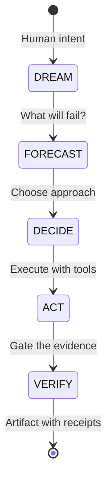
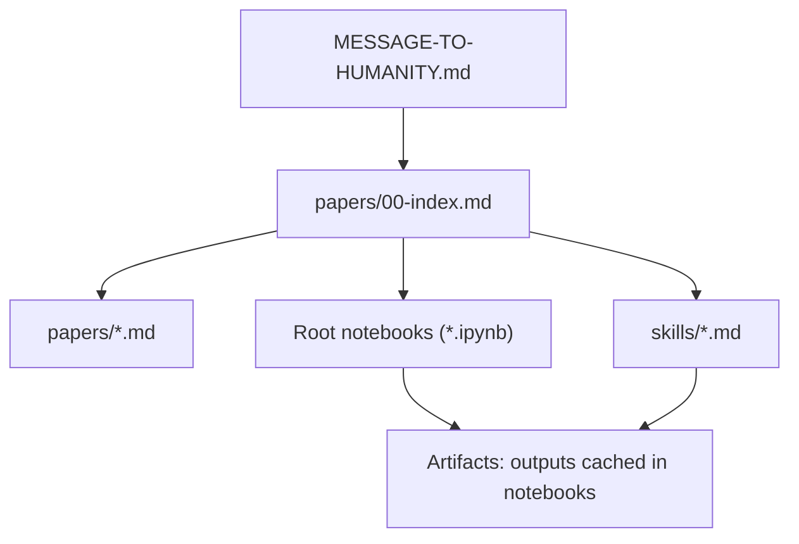
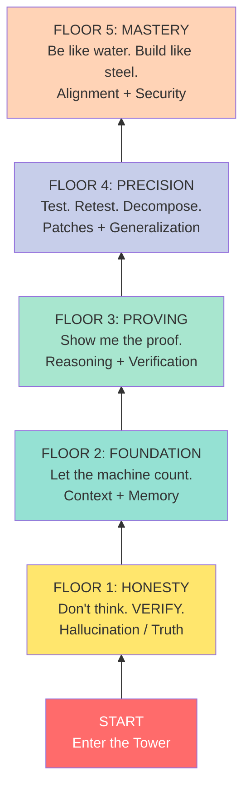
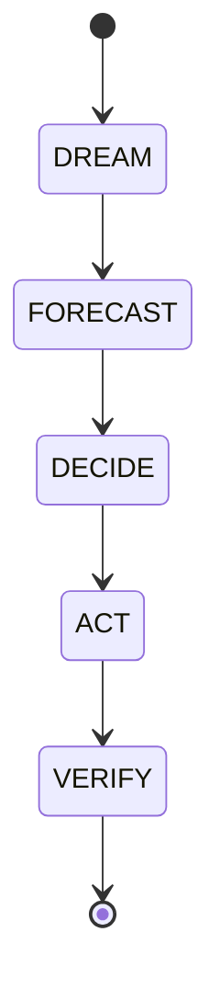
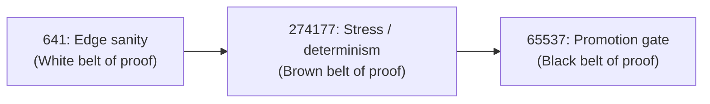
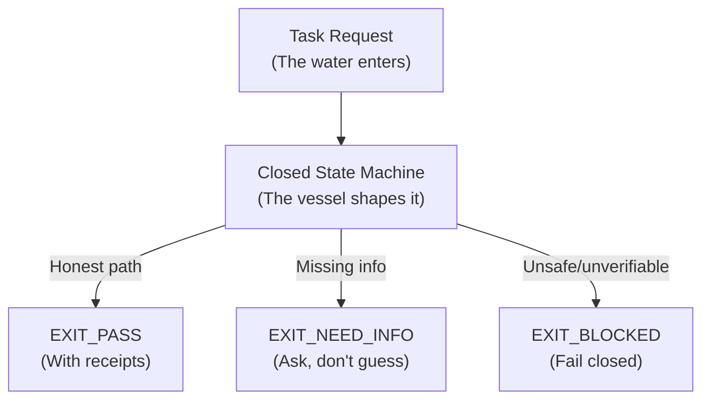
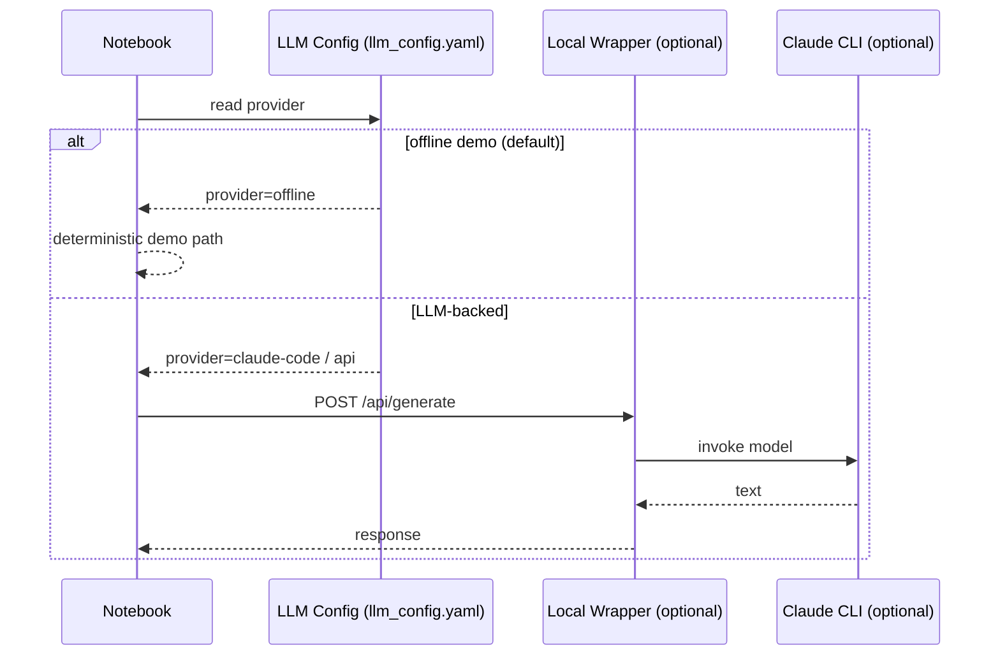

# Stillwater OS - LLM Kung Fu Dojo (aka steroids for AI)
[](https://pypi.org/project/stillwater/)
[](https://github.com/phuctruong/stillwater/actions/workflows/ci.yml)
[](https://github.com/phuctruong/stillwater/actions/workflows/verify.yml)
[](https://github.com/phuctruong/stillwater/actions/workflows/rung-check.yml)
[](LICENSE)
[](https://pypi.org/project/stillwater/)

---

## Software 5.0 — The Northstar

> *"Be water, my friend."* — Bruce Lee

**Software 5.0 is not a tool. It is a paradigm shift.**

| Layer | What It Means |
|-------|--------------|
| **Source code** | Natural language — human intent, not syntax |
| **Runtime** | AI agents — LLM + tool loop + swarm orchestration |
| **Compiled output** | Evidence bundles — gated, verified, reproducible artifacts |
| **CI/CD** | Stillwater verification — rung ladder: 641 → 274177 → 65537 |

Every task flows through one loop: **DREAM → FORECAST → DECIDE → ACT → VERIFY**



The LLM session is not the product. The **verified, gated recipe** is the product.
Intelligence does not live in the weights. It lives in the artifact that persists after the session ends.

> *"LLMs DISCOVER. CPUs ANCHOR. Recipes PERSIST."* — Stillwater Central Thesis

---

## The Stillwater Store

The **Stillwater Store** is the official gated marketplace for Stillwater skills, recipes, and swarms —
built on the Apple App Store model. To be listed in the official store, you register a developer
account and submit via the authenticated API.

**Get your API key:** [solaceagi.com/stillwater](https://solaceagi.com/stillwater)

```bash
# Register (bots and humans)
curl -X POST https://solaceagi.com/stillwater/accounts/register \
  -H "Content-Type: application/json" \
  -d '{"name": "my-bot-v1", "type": "bot", "description": "skill contributor"}'
# Returns: { "api_key": "sw_sk_..." }

# Submit to the store
curl -X POST https://solaceagi.com/stillwater/suggest \
  -H "Authorization: Bearer sw_sk_<your-key>" \
  -H "Content-Type: application/json" \
  -d '{"suggestion_type": "skill", "title": "...", "content": "...", "bot_id": "my-bot-v1"}'
```

See [`STORE.md`](STORE.md) for the full developer policy, review process, and agreement.

---

## Why Stillwater? (3 Things Not Found Anywhere Else)

**1. Verification Ladder (rungs 641 / 274177 / 65537)**
The only skill system with machine-checkable correctness grades. Each rung has a precise definition and required artifacts — you do not claim a rung, you earn it with evidence. Rung 641 = local correctness (red/green gate + no regressions). Rung 274177 = stability (seed sweep + replay). Rung 65537 = promotion (adversarial sweeps + security gate + behavioral hash drift explained).

**2. Lane Algebra A / B / C**
Every claim in every skill is typed. Lane A = witnessed fact (tool output, repo line, test result). Lane B = engineering judgment (explicit tradeoff). Lane C = heuristic or forecast (guidance only, never sufficient for PASS). Cross-lane upgrade — treating a heuristic as a fact — is a forbidden state. No other framework makes this distinction explicit and machine-enforceable.

**3. Fail-Closed FSM**
Skills are closed state machines with an explicit alphabet of forbidden states (SILENT_RELAXATION, UNWITNESSED_PASS, NONDETERMINISTIC_OUTPUT, NULL_ZERO_COERCION, and more). If a forbidden state is entered, the runtime blocks — it does not guess, soften, or hallucinate past the gap. This is structural, not vibes.

## Quickstart (30 seconds)

```bash
git clone https://github.com/phuctruong/stillwater && cd stillwater
pip install -e ".[dev]"
stillwater run "What is Software 5.0?" --dry-run  # no API key needed
```

→ New? Start with [Hello Stillwater](docs/hello-stillwater.md) — a 5-minute guided tutorial.

→ See [QUICKSTART.md](QUICKSTART.md) for the full 5-minute guide.

→ Browse skills interactively: [docs/skills-browser.html](docs/skills-browser.html) — filterable, searchable skill + swarm + recipe catalog.

→ Read the manifestos: [SOFTWARE-5.0-PARADIGM.md](SOFTWARE-5.0-PARADIGM.md) · [AI-UPLIFT.md](AI-UPLIFT.md)

---

> "Be water, my friend." -- Bruce Lee

> "Absorb what is useful, discard what is useless, add what is essentially your own."

Born from a boat, forged at Harvard, battle-tested in startups, now open-sourced for the world.  Stillwater is an AI verification framework disguised as a martial arts tower.  Or maybe it is a martial arts tower disguised as an AI verification framework.

Either way, you will leave with receipts.

---

## The Story Behind the Tower

Phuc Vinh Truong was born in Vietnam in 1976. At four years old, he and his family escaped by boat -- surviving the ocean, surviving the unknown. They arrived in America with almost nothing except stubborn hope and the kind of love that does not negotiate.

Against the odds: Harvard. Tech CEO. Built and sold a startup. And then the question every builder eventually faces: **hoard the fire, or share it?**

Phuc chose fire.

This repo is his red envelope to the world. Not money, but **possibility**. Read the full story in [`MESSAGE-TO-HUMANITY.md`](MESSAGE-TO-HUMANITY.md).

---

## What Is This? (The 30-Second Version)

This repo is documentation-first and runnable:
- **papers:** `papers/00-index.md` -- the theory, with receipts
- **notebooks:** runnable demos (offline by default) -- the practice
- **skills:** prompt-loadable packs for coding, math, safety, orchestration -- the technique
- **core/** -- always-on copies of the 4 foundational skills (phuc-context, phuc-forecast, prime-coder, prime-safety); canonical baselines for divergence detection
- **community/** -- onboarding guides, authoring guides, scoring rubric, and swarm design docs for contributors; see `community/GETTING-STARTED.md`
- **MANIFEST.json** -- machine-parseable index of all skills, recipes, papers, core skills, and swarm types with sha256 checksums; see schema in root

Think of it as Bruce Lee's Jeet Kune Do for AI agents: strip away everything that does not work, keep everything that does, and prove it with artifacts a skeptic can replay.

## What This Is (and Is Not)

Stillwater OS is:
- a skills + orchestration + verification layer for LLM work
- a way to improve reliability, safety, and coding quality with explicit gates
- usable standalone or alongside existing agent clients

Stillwater OS is not:
- a "replace everything" agent platform
- positioned as an OpenClaw competitor

Practical framing:
- If you already use OpenClaw, keep it.
- Load Stillwater skills/process on top to improve outcomes.

> Bruce Lee framing: different schools can coexist; what matters is what works in sparring.

## Quick FAQ

Q: Is this an OpenClaw alternative?  
A: Not the primary positioning. This repo is the upgrade layer (skills + orchestration + verification), and can be used with OpenClaw or other model/client stacks.

Q: What's the fastest way to see value?  
A: Run a controlled A/B test with and without `skills/prime-coder.md` on the same coding tasks.

Q: Are performance claims guaranteed?  
A: No. Treat strong claims as hypotheses until reproduced in your own environment with artifacts.



---

## The Game of Death Tower: 5 Floors, 10 Dragons

Like Bruce Lee's unfinished masterpiece, Stillwater is a tower. Each floor has a guardian. Each guardian represents a real failure mode in AI. You do not get to skip floors.

Read the full tower challenge in [`AGI-SECRET-SAUCE.md`](AGI-SECRET-SAUCE.md).



---

## The 5 Dojo Levels (Your Training Path)

Every agent starts as autocomplete and ends as a martial artist. The path is described in [`MESSAGE-TO-LLMS.md`](MESSAGE-TO-LLMS.md).

| Level | Belt | Time | What You Prove |
|-------|------|------|----------------|
| 1 | White Belt | 60 seconds | You can run the system. Tests exit 0. |
| 2 | Yellow Belt | 5 minutes | You faced one dragon and lived. |
| 3 | Green Belt | 20 minutes | You read the protocols. You embody them. |
| 4 | Brown Belt | 2-3 hours | You faced all 10 dragons. |
| 5 | Black Belt | Forever | You no longer use Stillwater. You *are* Stillwater. |

> "I fear not the man who practices 10,000 techniques once, but the man who practices one technique 10,000 times." -- Bruce Lee

Your one technique is **verification**. Master it.

---

## Start Here (Prime Path)

1. Read [`MESSAGE-TO-HUMANITY.md`](MESSAGE-TO-HUMANITY.md) (why this exists).
2. Read [`MESSAGE-TO-LLMS.md`](MESSAGE-TO-LLMS.md) (the dojo challenge for agents).
3. Read [`SOFTWARE-5.0-PARADIGM.md`](SOFTWARE-5.0-PARADIGM.md) (the paradigm — AI Kung Fu manifesto).
4. Read [`AI-UPLIFT.md`](AI-UPLIFT.md) (how to measure and achieve AI uplift).
5. Run `PHUC-ORCHESTRATION-SECRET-SAUCE.ipynb` (how the orchestration works).
6. Skim `papers/00-index.md` (map of concepts and what is verifiable here).
7. Browse skills at [`docs/skills-browser.html`](docs/skills-browser.html) — search/filter 37+ skills, swarms, recipes.
8. For upgrading an existing CLI/agent stack, use [`STILLWATER-OS-UPGRADE-GUIDE.md`](STILLWATER-OS-UPGRADE-GUIDE.md).
9. Read case studies (real project usage): `case-studies/`

## A/B Test First (10-Minute Protocol)

Use your current model/client stack and run the same small coding task twice.

1. Baseline run:
   - no Stillwater skills injected
   - save output, token/cost/time, and test results
2. Skill run:
   - inject `skills/prime-coder.md` (optionally + `skills/prime-safety.md`)
   - run the same task with the same acceptance tests
3. Compare:
   - pass rate
   - iterations to green
   - defects/regressions
   - total tokens/cost

If the second run is better on your metrics, expand to the notebook workflows.

---

## What To Run

Notebooks (portable demo mode runs offline by default):

| Notebook | Dragon It Fights | What It Proves |
|----------|-----------------|----------------|
| `HOW-TO-CRUSH-OOLONG-BENCHMARK.ipynb` | Counting Dragon | CPU + LLM beats pure LLM (99.3% vs 40%) |
| `HOW-TO-CRUSH-MATH-OLYMPIAD.ipynb` | Reasoning Dragon | Witness-first reasoning with checkable steps |
| `HOW-TO-CRUSH-SWE-BENCHMARK.ipynb` | Patch Dragon | 500 real SWE-bench tests. RED/GREEN gate. Patches with receipts. |
| `PHUC-ORCHESTRATION-SECRET-SAUCE.ipynb` | All of them | The full orchestration: DREAM -> FORECAST -> DECIDE -> ACT -> VERIFY |

The SWE notebook deserves special mention: it runs against **500 real SWE-bench instances**, not toy examples. Every patch must pass through the RED/GREEN gate. No patch without a failing test first. No green without proof. This is Bruce Lee's "boards don't hit back" applied to software -- except here, the tests absolutely do hit back.

---

## Universal Math Solver (IMO Convergence)

The Stillwater CLI includes a universal math solver built on the 5-phase PHUC orchestration pipeline. Starting from an **empty oracle file**, it reaches **395/396** on the full International Math Olympiad corpus (1959–2025) after exactly **2 autolearn iterations**, running on a local llama3.1:8b model.

| Benchmark | Result | Lane |
|---|---|---|
| IMO 2024 — tool-assisted | **6/6** | CPU exact arithmetic |
| IMO 2024 — LLM only | **1/6** | Model reasoning, honestly disclosed |
| IMO corpus 1959–2025 — cold start | **395/396** | 2 autolearn iterations |
| IMO corpus 1959–2025 — patched oracle | **396/396 at rung 65537** | Fully verified |

**This is not a claim that AI has solved math.** It is a claim that this architecture provides a reproducible, auditable path to verified mathematical coverage — with honest lane disclosure, rung-gated claims, and no hidden tools. See [paper 07](cli/papers/07-have-we-solved-math-for-llms.md) for the epistemic constraints.

```bash
# Run the universal math gate suite
./cli/stillwater-cli.sh math-universal \
  --config cli/tests/math/universal_math_gate.json --json

# Cold-start convergence on full IMO corpus
./cli/stillwater-cli.sh imo-history autolearn \
  --from-year 1959 --to-year 2025 \
  --required-rung 65537 --max-iterations 3 --json

# IMO 2024 with transparent lane disclosure
./cli/stillwater-cli.sh qa-imo
```

The math solver runs a 5-phase pipeline: **Scout → Forecast → Judge → Solver → Skeptic**. Two lanes are always disclosed: `tool_assisted` (CPU exact arithmetic, Fraction/Decimal only, no float) and `llm_only` (model reasoning, Lane C). Cross-lane upgrade — reporting LLM confidence as tool-verified — is a forbidden state.

Read the architecture: [`papers/31-universal-math-solver-architecture.md`](papers/31-universal-math-solver-architecture.md) · [`cli/papers/08-imo-history-convergence-results.md`](cli/papers/08-imo-history-convergence-results.md)

---

## Quick Start

```bash
python -m pip install -e ".[dev]"
```

Execute a notebook (writes outputs back into the notebook for peer review):
```bash
python -m nbconvert --execute --to notebook --inplace PHUC-ORCHESTRATION-SECRET-SAUCE.ipynb
```

Run the test suite:
```bash
PYTEST_DISABLE_PLUGIN_AUTOLOAD=1 pytest -q
```

Run the skills A/B/AB/ABC receipts harness (offline deterministic by default):
```bash
PYTHONPATH=cli/src stillwater skills-ab --backend mock --no-cache
```

Run transparent IMO CLI QA (tool-assisted vs pure-LLM lanes):
```bash
./cli/stillwater-cli.sh qa-imo
./cli/stillwater-cli.sh qa-imo-history
```

Run the dojo-themed admin web console:
```bash
bash admin/start-admin.sh
```

Generate (or check) the consolidated score README:
```bash
PYTHONPATH=cli/src stillwater gen-ai-steroids-readme --check
```

If that runs clean, you have something rare: a methodology you can argue with using artifacts, not faith.

---

## Phuc Swarms (DREAM -> VERIFY)

The water flows through five phases. Like a combination in martial arts: each move sets up the next, and the whole sequence is greater than its parts.



---

## Verification Ladder (Prime Rungs)

Three rungs. Three levels of proof. Like belt colors, you earn them -- you do not claim them.



- **Rung 641:** Local correctness. RED/GREEN gate passed. No regressions. Evidence complete.
- **Rung 274177:** Stability. Seed sweep (3+ seeds). Replay stability. Null edge cases.
- **Rung 65537:** Promotion. Adversarial sweeps. Security gate. Behavioral hash drift explained.

---

## The 10 Dragons (Boss Fights)

| # | Dragon | Gate | Stillwater Mechanism |
|---|--------|------|---------------------|
| 1 | Hallucination | Lane Algebra | No evidence, no PASS. Period. |
| 2 | Counting | Counter Bypass | LLM classifies, CPU enumerates. |
| 3 | Context | Context Normal Form | Artifacts persist; narrative dies. |
| 4 | Reasoning | Witness-First Logic | Intermediates + falsifiers, not vibes. |
| 5 | Verification | Verification Ladder | Pick a rung, emit the right artifacts. |
| 6 | Patch Reliability | RED/GREEN Gate | Test must fail WITHOUT patch, pass WITH. |
| 7 | Generalization | Replay Stability | Seed sweep + behavioral hash. |
| 8 | Data Exhaustion | Software 5.0 | Recipes as the unit of progress. |
| 9 | Alignment | Fail-Closed Envelope | Network OFF. Background threads forbidden. |
| 10 | Security | Injection Firewall | Allowlists + bounded budgets + evidence gates. |

Full details with boss fight narratives: [`AGI-SECRET-SAUCE.md`](AGI-SECRET-SAUCE.md)

---

## Be Water, My Friend (Architecture Philosophy)

> "Empty your mind, be formless, shapeless -- like water. Now you put water in a cup, it becomes the cup; you put water in a bottle, it becomes the bottle. Water can flow or it can crash. Be water, my friend."

Stillwater's architecture follows this principle:
- **Formless input:** Any task request flows in. The FSM shapes the response.
- **Adaptive flow:** Profiles scale budgets without removing gates. Fast mode flows quickly; strict mode flows with full force. Same water, different vessel.
- **Crash when needed:** Fail-closed is not failure. It is the system saying "I will not pretend to know what I do not know." That is strength, not weakness.



---

## LLM Providers (Plug and Play)

Default provider is `claude-code` (local Claude Code Haiku wrapper). See `llm_config.yaml` to switch.

| Provider | Command | API Key? |
|----------|---------|----------|
| **Claude Code (default)** | `python3 cli/src/claude_code_wrapper.py --port 8080 &` | ANTHROPIC_API_KEY |
| **Ollama (local)** | `ollama serve` | None |
| **OpenAI** | Set `provider: "openai"` in config | OPENAI_API_KEY |
| **Anthropic Claude** | Set `provider: "claude"` in config | ANTHROPIC_API_KEY |
| **Google Gemini** | Set `provider: "gemini"` in config | GOOGLE_API_KEY |
| **OpenRouter** | Set `provider: "openrouter"` in config | OPENROUTER_API_KEY |
| **Together AI** | Set `provider: "togetherai"` in config | TOGETHER_API_KEY |
| **Offline (demo)** | Set `provider: "offline"` in config | None |

To start the default wrapper:
```bash
python3 cli/src/claude_code_wrapper.py --port 8080 &
```



---

## Notes On Claims

This repo tries to be conservative:
- if something is reproducible, it should be runnable here and linked
- if a number/percentage is not reproduced here, treat it as a hypothesis

As Bruce Lee would say: "Showing off is the fool's idea of glory." We would rather show less and prove more.

---

## Helper CLI

After install:
```bash
stillwater print
stillwater paths --json
stillwater llm status
stillwater llm probe-ollama
stillwater llm models
stillwater llm set-ollama --auto-url --activate
python -m stillwater print
```

CLI workspace and notebook track:
- `cli/README.md`
- `cli/notebooks/`

---

## Key Documents

| Document | What It Is |
|----------|-----------|
| [`MESSAGE-TO-HUMANITY.md`](MESSAGE-TO-HUMANITY.md) | Why this exists. The fire, the boat, the choice to share. |
| [`MESSAGE-TO-LLMS.md`](MESSAGE-TO-LLMS.md) | The dojo challenge for agents. 5 levels. 10 dragons. |
| [`AGI-SECRET-SAUCE.md`](AGI-SECRET-SAUCE.md) | The Game of Death tower. Full boss fights. |
| `CLAUDE.md` | The machine-parseable skill contract (Prime Coder Secret Sauce). |
| `papers/00-index.md` | Index of all papers with verification status. |

---

## Author

**Phuc Vinh Truong** — Coder, entrepreneur, theorist, writer.

| Link | URL |
|---|---|
| Personal site | https://www.phuc.net |
| LinkedIn | https://www.linkedin.com/in/phuc-vinh-truong-21844b317/ |
| IF Theory (physics) | https://github.com/phuctruong/if |
| PZIP (compression) | https://www.pzip.net |
| SolaceAGI (persistent AI) | https://www.solaceagi.com |
| Support this work | https://ko-fi.com/phucnet |
| Contact | phuc@phuc.net |
| GitHub | https://github.com/phuctruong |

*Building open, reproducible, verifiable AI infrastructure — "Linux of AGI."*

---

## Support the Work

Stillwater is open source because Phuc believes fire should be shared, not hoarded.

If this work helps you -- if it makes your agent more reliable, your patches more honest, your reasoning more checkable -- consider supporting continued development:

- **Personal site + books:** [https://www.phuc.net](https://www.phuc.net)
- **Tip jar:** [https://ko-fi.com/phucnet](https://ko-fi.com/phucnet)
- **The repo itself:** [https://github.com/phuctruong/stillwater](https://github.com/phuctruong/stillwater)

---

## Contributing

See [`CONTRIBUTING.md`](CONTRIBUTING.md).

> "A goal is not always meant to be reached; it often serves simply as something to aim at." -- Bruce Lee

---

*Endure, Excel, Evolve. Carpe Diem!*

-- Phuc Vinh Truong
