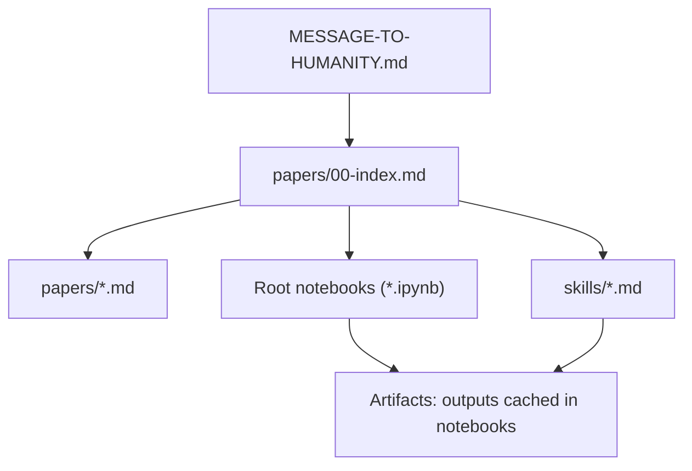
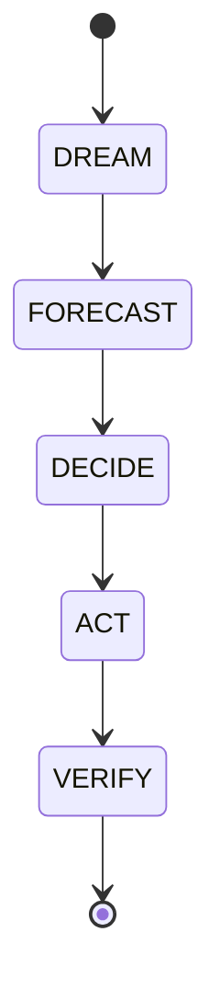
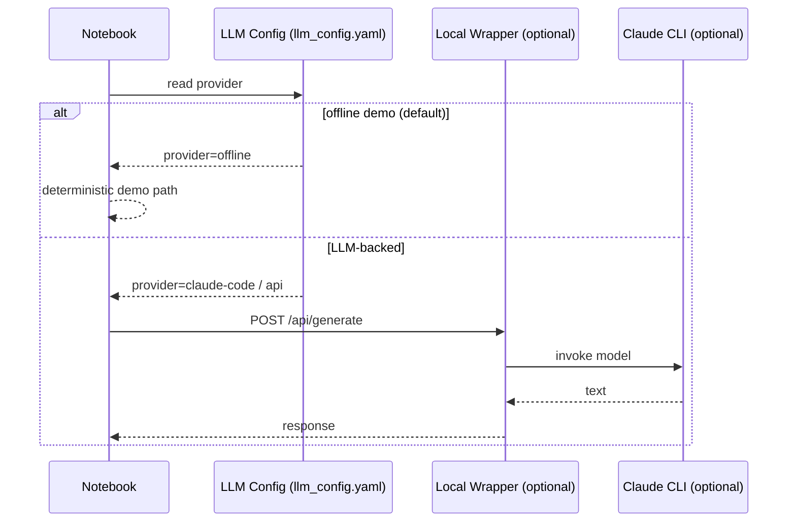

# Stillwater OS

Mission: `MESSAGE-TO-HUMANITY.md`

This repo is documentation-first and runnable:
- papers: `papers/00-index.md`
- notebooks: runnable demos (offline by default)
- skills: prompt-loadable packs for coding, math, safety, orchestration



## Start Here (Prime Path)

1. Read `MESSAGE-TO-HUMANITY.md` (why this exists).
2. Run `PHUC-ORCHESTRATION-SECRET-SAUCE.ipynb` (how the orchestration works).
3. Skim `papers/00-index.md` (map of concepts and what is verifiable here).

## What To Run

Notebooks (portable demo mode runs offline by default):
- `HOW-TO-CRUSH-OOLONG-BENCHMARK.ipynb`
- `HOW-TO-CRUSH-MATH-OLYMPIAD.ipynb`
- `PHUC-ORCHESTRATION-SECRET-SAUCE.ipynb`

SWE guide (markdown):
- `HOW-TO-CRUSH-SWE-BENCHMARK.md`

## Quick Start

```bash
python -m pip install -e ".[dev]"
```

Execute a notebook (writes outputs back into the notebook for peer review):
```bash
python -m nbconvert --execute --to notebook --inplace PHUC-ORCHESTRATION-SECRET-SAUCE.ipynb
```

## Phuc Swarms (DREAM -> VERIFY)



## Verification Ladder (Prime Rungs)


## Optional: Enable LLM-Backed Runs

Default configuration is offline demo mode (`llm_config.yaml` provider `offline`).

To enable LLM-backed cells (optional):
1. Read `src/WRAPPER-SETUP-GUIDE.md`
2. Start the wrapper (example):
```bash
python3 src/claude_code_wrapper.py --port 8080
```
3. Enable LLM-backed cells:
```bash
export STILLWATER_ENABLE_LLM_REAL=1
export STILLWATER_WRAPPER_URL=http://localhost:8080/api/generate
```



## Notes On Claims

This repo tries to be conservative:
- if something is reproducible, it should be runnable here and linked
- if a number/percentage is not reproduced here, treat it as a hypothesis

## Helper CLI

After install:
```bash
stillwater print
stillwater paths --json
```

## Contributing

See `CONTRIBUTING.md`.
