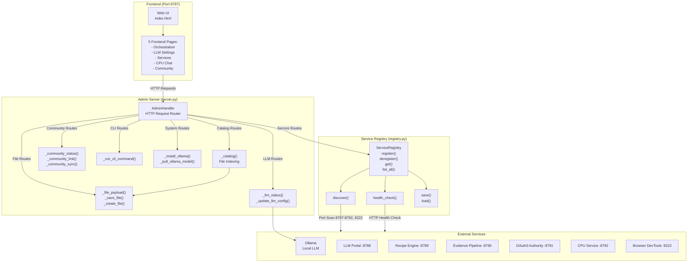
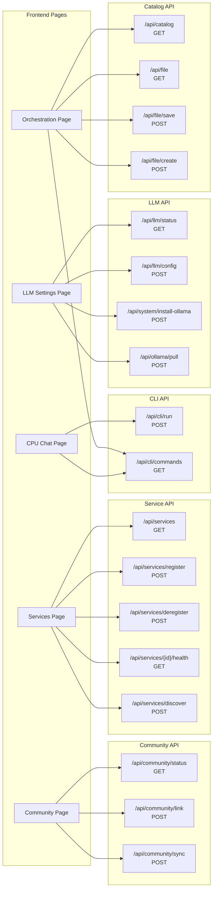
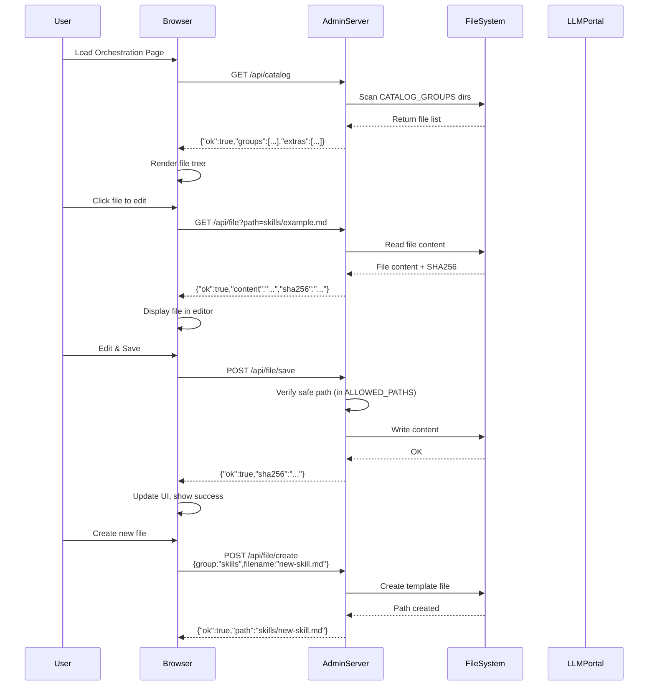
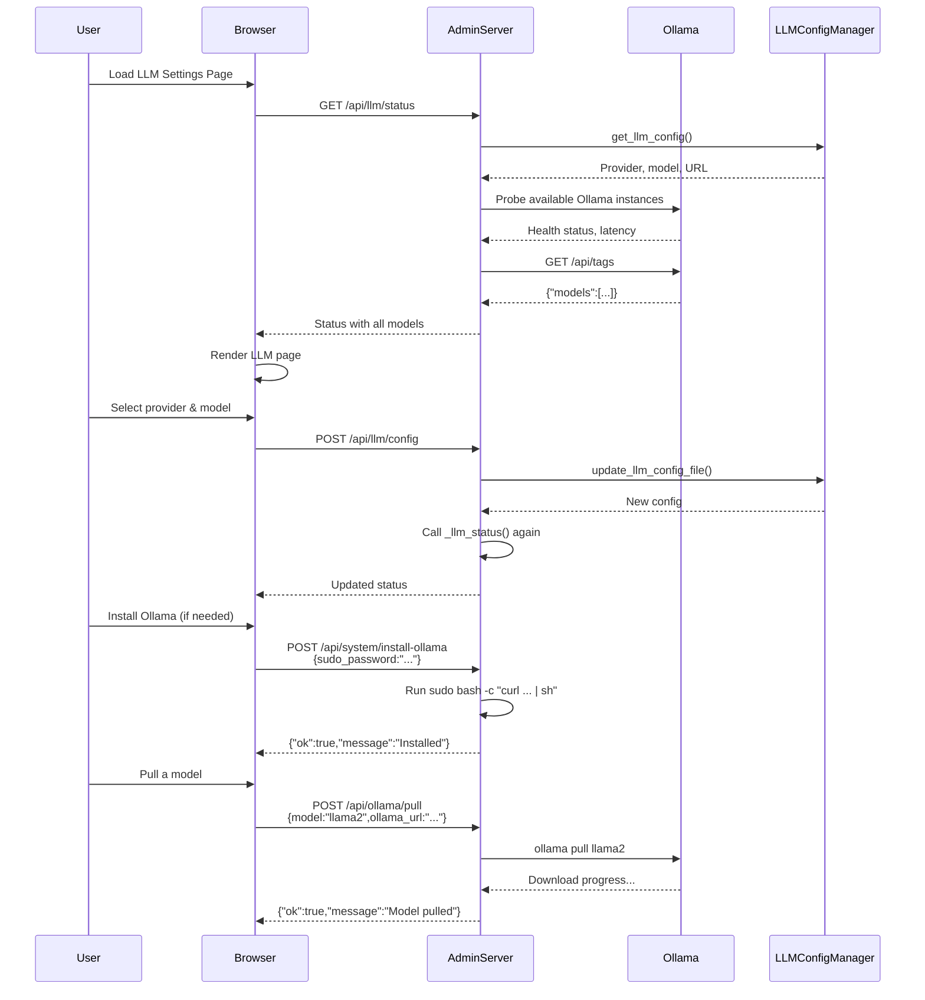
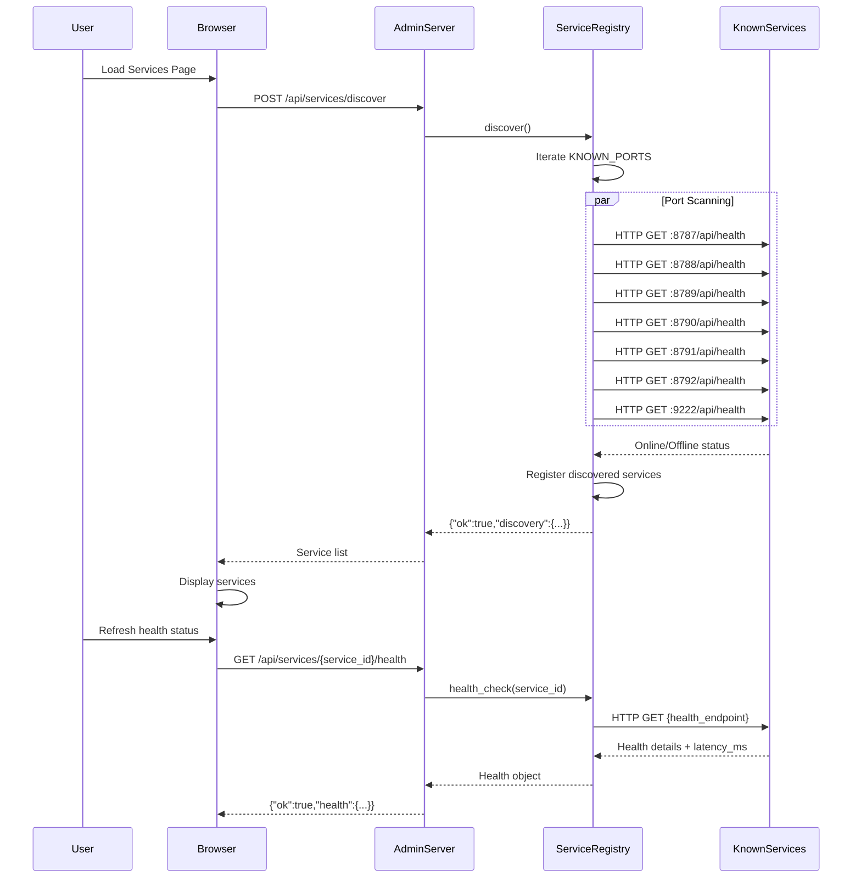
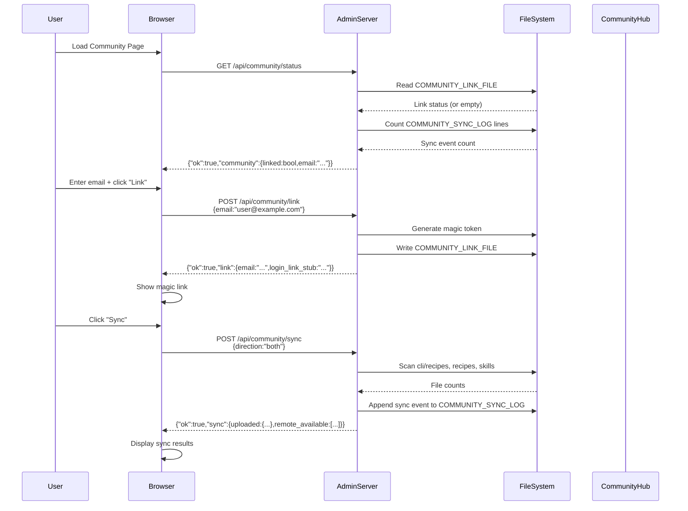
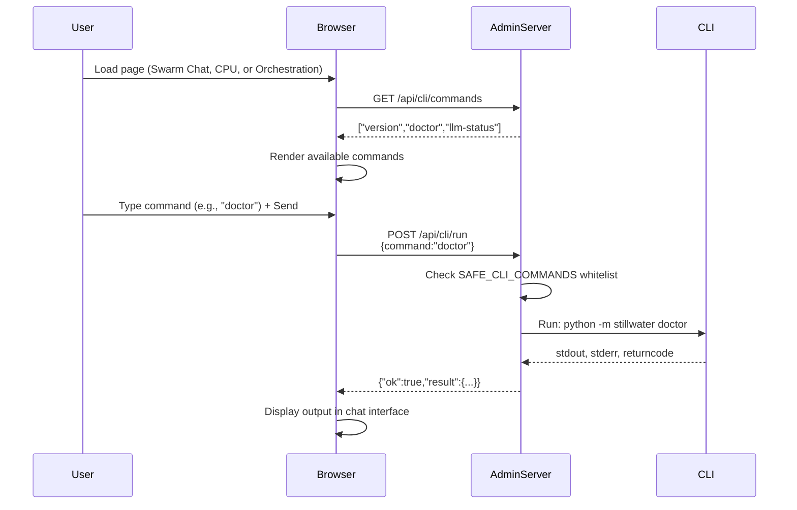
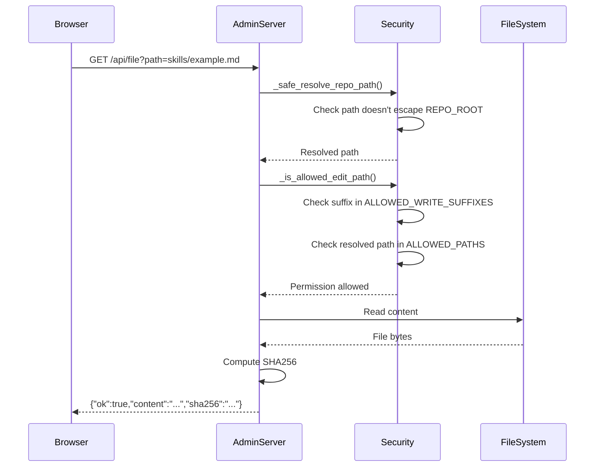

# Stillwater Admin System Architecture

## System Overview

The Stillwater Admin System is a multi-page web dashboard (running on port 8787) that provides:
1. Catalog management (skills, swarms, recipes, papers, community docs)
2. File editing (safe repo-wide text editing)
3. LLM configuration (Ollama setup, model selection, provider management)
4. Service registry (auto-discovery, health checking, service coordination)
5. CLI integration (safe allowlisted command execution)
6. Community linking (email-based auth, skill/recipe sync)

## High-Level Architecture



## Frontend Pages and API Integration



## Data Flow: Orchestration Page (Catalog Editing)



## Data Flow: LLM Configuration



## Data Flow: Service Registry Discovery



## Data Flow: Community Linking & Sync



## Data Flow: CLI Integration



## Data Flow: File Operations



## Service Registry: Known Ports & Types

```
Port 8787 → admin (CUSTOM) — Stillwater Admin
Port 8788 → llm-portal (LLM) — LLM Portal (Ollama/Claude/OpenAI routing)
Port 8789 → recipe-engine (RECIPE) — Recipe Engine
Port 8790 → evidence-pipeline (EVIDENCE) — Evidence Pipeline
Port 8791 → oauth3-authority (OAUTH3) — OAuth3 Authority
Port 8792 → cpu-service (CPU) — CPU Service
Port 9222 → browser (BROWSER) — Solace Browser DevTools
```

## Catalog Groups

```
Root:
  - skills/                    → Skills (*.md)
  - swarms/                    → Swarm Agents (*.md)
  - recipes/                   → Recipes (*.md)
  - papers/                    → Papers (*.md)
  - community/                 → Community Docs (*.md)

CLI Extensions:
  - cli/recipes/               → CLI Recipes (*.md)
  - cli/extensions/skills/     → CLI Skills (*.md)
  - cli/extensions/personas/   → Personas (*.md)
  - cli/identity/              → Identity Notes (*.md)
  - cli/extensions/identity/   → Extended Identity (*.md)
  - cli/settings/              → Settings (*.md)

Editable Files (Extra):
  - llm_config.yaml
  - cli/extensions/splash.txt
  - CLAUDE.md
  - admin/README.md
```

## Frontend Page Mapping

| Page | Tab | API Endpoints Used | Purpose |
|------|-----|-------------------|---------|
| Orchestration | Default | /api/catalog, /api/file, /api/file/save, /api/file/create, /api/cli/commands | Browse & edit repo files (skills, recipes, etc.) |
| LLM Settings | llm-tab | /api/llm/status, /api/llm/config, /api/system/install-ollama, /api/ollama/pull | Configure LLM provider, manage Ollama |
| Services | services-tab | /api/services, /api/services/discover, /api/services/{id}/health, /api/services/register, /api/services/deregister | Auto-discover & monitor services |
| CPU Chat | cpu-tab | /api/cli/run, /api/cli/commands | Run CLI commands in chat interface |
| Community | sync-tab | /api/community/status, /api/community/link, /api/community/sync | Link to community, sync skills/recipes |

## Error Handling

All endpoints return:
```json
{
  "ok": true|false,
  "error": "error message if ok=false",
  ...response_fields
}
```

Common error cases:
- **400 Bad Request**: Invalid JSON payload, validation errors
- **404 Not Found**: File/service not found, unknown path
- **500 Internal Server Error**: System error (Ollama install fails, etc.)

## Security Boundaries

1. **File Operations**: Only paths in ALLOWED_PATHS (catalog dirs + EXTRA_EDITABLE_FILES) with safe suffixes (.md, .txt, .yaml, .yml, .json)
2. **Path Traversal**: _safe_resolve_repo_path() prevents "../" escapes
3. **CLI Commands**: Only SAFE_CLI_COMMANDS whitelist allowed (version, doctor, llm-status)
4. **Service Registry**: HTTP-only health checks (no arbitrary network calls)
5. **Filesize Limit**: Max 2MB per file write
