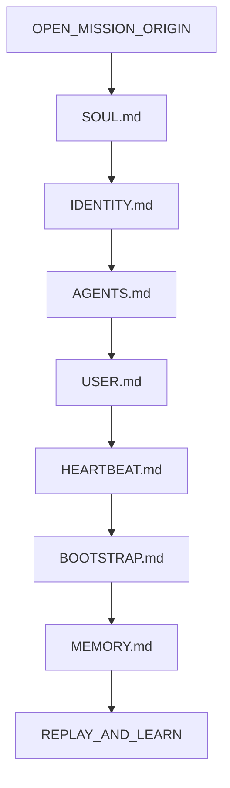

# Prime Mermaid: identity-stack

```mermaid
flowchart TD
  ORIGIN[OPEN_MISSION_ORIGIN] --> SOUL[SOUL.md]
  SOUL --> ID[IDENTITY.md]
  ID --> AGENTS[AGENTS.md]
  AGENTS --> USER[USER.md]
  USER --> HEARTBEAT[HEARTBEAT.md]
  HEARTBEAT --> BOOTSTRAP[BOOTSTRAP.md]
  BOOTSTRAP --> MEMORY[MEMORY.md]
  MEMORY --> REPLAY[REPLAY_AND_LEARN]
```

