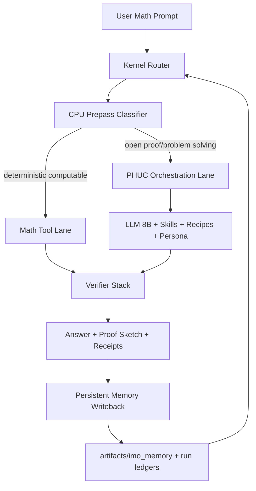
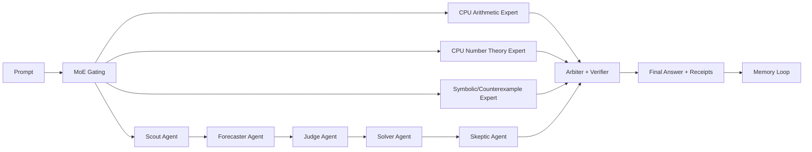
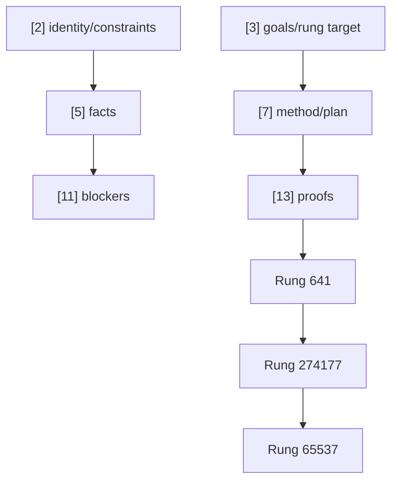
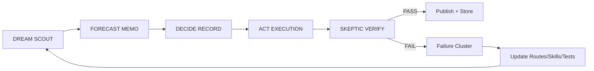
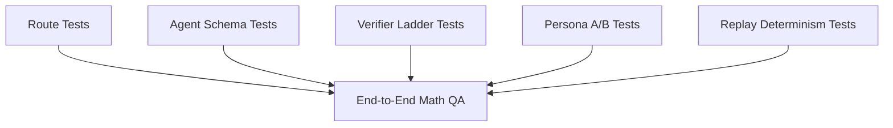
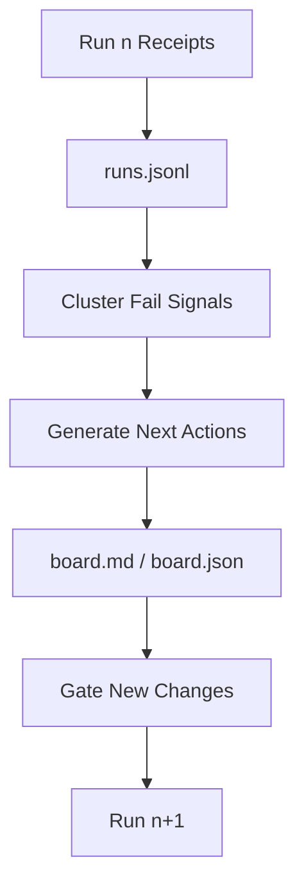

# Math Secret Sauce (Software 5.0)

How to build a practical world-class math system on open-source Ollama 8B models using Stillwater architecture.

## Executive Summary

You can get a strong open math platform with 8B models by moving intelligence out of weights and into:

1. externalized orchestration
2. deterministic tools
3. multi-agent PHUC swarms (role contracts + skill packs + persona lenses)
4. verification receipts
5. persistent memory loops

This is the same pattern from `books/how-humans-outsourced-their-minds-article.md`: memory outside the body compounds, while isolated reasoning resets.

## Reality Check (Important)

Claiming "solve all possible math problems" is not a defensible scientific claim.

1. There are undecidable classes (no universal solver exists).
2. Many olympiad-style proofs need semantic equivalence grading, not keyword match.
3. 8B models alone are not enough for universal symbolic proof generation.

Correct goal:
- maximize coverage and reliability with transparent lane disclosure
- prove improvement with strict, reproducible QA
- keep every decision auditable and replayable

Claim discipline (from `papers/99-claims-and-evidence.md`):
1. Lane A: replayable in-repo evidence
2. Lane B: framework truth under stated assumptions
3. Lane C: heuristic/probabilistic
4. STAR: unknown (insufficient evidence)

Rule:
- never publish strong numeric claims without runnable artifacts

## Architecture: Kernel + Ripples



Kernel:
- stable runtime + command surface (`cli/src/stillwater/cli.py`)

Ripples (replaceable external cognition):
- routes and swarm policy: `cli/settings/SWARM-ORCHESTRATION.prime-mermaid.md`
- skills: `skills/*.md`, `cli/extensions/skills/*.md`
- recipes: `cli/recipes/*.prime-mermaid.md`
- identity/persona/context: `cli/identity/*`, `cli/extensions/personas/*`
- memory receipts: `artifacts/*`

## PHUC Swarms Mixture-Of-Experts (MoE)

Applied from:
- `PHUC-ORCHESTRATION-SECRET-SAUCE.ipynb`
- `skills/phuc-swarms.md`

Core rule:
- multiple bounded experts > one unbounded LLM

Hard constraints:
1. role contracts are binding
2. persona is a lens, never authority
3. every phase emits typed artifacts
4. no PASS without verification rung evidence



### Famous Persona Lenses (Optional, Measured)

| Agent | Role | Persona Lens | Authority |
|---|---|---|---|
| Scout | problem framing + suspects | Ken Thompson / Linus Torvalds | evidence only |
| Forecaster | premortem + edge cases | Grace Hopper | evidence only |
| Judge | scope + rung target | Scope Police | evidence only |
| Solver | candidate proof/solution | Donald Knuth / Brian Kernighan | evidence only |
| Skeptic | falsification + gate | Alan Turing / Leslie Lamport | evidence only |
| Podcast/Learning | lessons -> new tests | Carl Sagan | evidence only |

Persona policy:
1. A/B persona ON vs OFF
2. keep persona only if verified uplift appears
3. if persona conflicts with safety/contracts, persona is ignored

### Configuration Knobs (All Externalized)

Use `cli/settings/SWARM-ORCHESTRATION.prime-mermaid.md`:

```text
SETTING mandatory_skill_pack = prime-safety.md,prime-coder.md,prime-math.md,phuc-context.md
SETTING skill_pack = prime-wishes.md,phuc-forecast.md,phuc-swarms.md,phuc-cleanup.md
SETTING always_rules = prime-safety.md,prime-coder.md,phuc-context.md,phuc-forecast.md
SETTING agent_skill_policy = merge|replace
SETTING agent_skill_pack.scout = ...
SETTING agent_skill_pack.forecaster = ...
SETTING agent_skill_pack.judge = ...
SETTING agent_skill_pack.solver = ...
SETTING agent_skill_pack.skeptic = ...
SETTING recipe_pack = ...
SETTING agent_recipe_policy = merge|replace
SETTING agent_recipe_pack.<role> = ...
SETTING context_mode = anti_rot_fresh_context_per_phase
SETTING artifact_mode = machine_parseable_receipts_required
SETTING max_swarm_passes = 2
SETTING require_assets = fail_closed
SETTING expert_council.enabled = true
SETTING expert_council.required_rung = 65537
SETTING expert_council.virtual_size = 65537
SETTING expert_council.consensus_threshold_641 = 0.55
SETTING expert_council.consensus_threshold_274177 = 0.74
SETTING expert_council.consensus_threshold_65537 = 0.92
SETTING expert_council.concept_coverage_min_274177 = 0.50
SETTING expert_council.concept_coverage_min_65537 = 0.80
SETTING expert_council.section_hits_min_274177 = 1
SETTING expert_council.section_hits_min_65537 = 2
SETTING expert_council.history_keyword_hits_min_274177 = 2
SETTING expert_council.history_keyword_hits_min_65537 = 4
SETTING expert_council.history_keyword_ratio_min_274177 = 0.12
SETTING expert_council.history_keyword_ratio_min_65537 = 0.22
SETTING expert_council.history_number_hits_min_65537 = 1
SETTING expert_council.history_oracle_match_min_65537 = 0.92
SETTING expert_council.max_love = true
SETTING expert_council.integrity_mode = strict_fail_closed
```

Override at runtime:
- `STILLWATER_SWARM_SETTINGS_FILE=/path/to/custom.prime-mermaid.md`

## Full Algorithm

```text
Input: prompt P, model M (default open-source Ollama 8B), settings S
Output: answer A, proof/evidence E, receipts R

0. Normalize
   - canonicalize prompt text
   - extract problem signals (domain, structure, computability cues)

1. MoE Route Decision (PHUC Forecast gate)
   - compute route profile + budgets + required rung
   - choose experts: deterministic, orchestration, or hybrid
   - store route receipt (action/profile/reason)

2. Build Context Capsules
   - inject CNF_BASE (facts/constraints/evidence)
   - inject CNF_DELTA(agent) per role
   - load required skills + recipes + persona lens only for that agent

3. Run Experts
   Deterministic experts (parallel when possible):
   - arithmetic, modular, gcd/lcm, symbolic checks, counterexample search

   PHUC orchestration experts:
   - DREAM -> FORECAST -> DECIDE -> ACT -> VERIFY
   - each phase writes machine-readable artifacts
   - ACT can call tools if policy permits

4. Aggregate (Arbiter)
   - score candidates by verification evidence + consistency + cost
   - reject unwitnessed claims
   - prefer minimal solution that passes required rung

5. Verify
   - syntax/consistency checks
   - invariant checks and contradiction checks
   - optional counterexample search
   - lane-specific acceptance gates
   - RED -> GREEN evidence gate before PASS (from `papers/04-red-green-gate.md`)

6. Compose Final Response
   - answer
   - assumptions
   - core idea
   - verification checklist
   - lane disclosure (tool_assisted vs llm_only)
   - expert disclosure (which agents/tools contributed)

7. Persist Memory
   - write per-run receipts
   - append outcome/fail-signals to memory ledger
   - refresh memory board with top failure clusters and next actions

8. Improve
   - convert repeated failures into:
     - new routing signals
     - new tool adapters
     - new/retired experts
     - stronger verifiers
     - new tests in cli/tests/math/* + per-agent tests
```

## Prime Channels + Verification Ladder

Channels are typed artifact buses, not freestyle chat:
- core: `[2],[3],[5],[7],[11],[13]`
- ladder: `[641],[274177],[65537]`



Hard gate:
- no `PASS` if required rung is not achieved
- rung ordering is semantic (`641 < 274177 < 65537`), not numeric magnitude

## Task Family -> Rung Target Policy

Adapted from `skills/prime-math.md`:

| Task family | Default rung target |
|---|---|
| Deterministic arithmetic / counting / exact algebra | 641 |
| Stability / adversarial / cross-check heavy tasks | 274177 |
| Olympiad proof-grade claims / public benchmark claims | 65537 |

Upgrade rules:
1. public score claims -> target 65537
2. unresolved witness conflict -> downgrade to UNKNOWN
3. out-of-scope or missing assets -> NEED_INFO/BLOCKED (fail-closed)

## Truth Lanes + Convergence Lanes

From `skills/prime-math.md`:

1. Truth lane (A/B/C/STAR) answers epistemic confidence.
2. Convergence lane (EXACT/CONVERGED/TIMEOUT/DIVERGED) answers numerical/algorithmic behavior.
3. Never upgrade lane by confidence language alone.
4. Public benchmark claims require Lane A witnesses and artifacts.

## PHUC Orchestration Loop



Phase artifacts:
- `SCOUT_REPORT.json`
- `FORECAST_MEMO.json`
- `DECISION_RECORD.json`
- `ACT_RESULT.json`
- `SKEPTIC_VERDICT.json`

## Unit Tests Per Agent And Per Lane

This is where PHUC swarms ideas pay off: every role and lane has a contract, so each one can be unit-tested.



Recommended test matrix:

1. Route tests
- prompt -> expected action/profile/source
- fail on silent route drift

2. Agent schema tests
- each phase must output required JSON keys
- fail on missing or malformed artifacts

3. Lane tests
- deterministic lane correctness for computable prompts
- orchestrated lane correctness for proof-style prompts
- hybrid lane where tools + LLM both contribute

4. Verifier ladder tests
- no PASS below required rung
- skeptic fail reasons are typed and non-empty

5. Persona A/B tests
- compare persona ON/OFF on the same set
- retain persona only if verified uplift appears

6. Replay determinism tests
- identical inputs reproduce same artifact hashes in deterministic lanes

7. Memory loop tests
- failed cases write fail-signals
- board next-actions update after new runs

8. Claim-lane tests
- strong claims must include Lane A witnesses
- if evidence missing, status downgraded (B/C/STAR), not silently promoted

Practical file targets:
- existing: `cli/tests/test_cli_math_route.py`
- existing: `cli/tests/test_math_verifier_ladder.py`
- add: `cli/tests/test_math_swarms_agents.py`
- add: `cli/tests/test_math_persona_ab.py`
- add: `cli/tests/test_math_moe_arbiter.py`
- add: `cli/tests/test_math_memory_loop.py`

## Memory Is The Multiplier



Files:
- `artifacts/imo_memory/runs.jsonl`
- `artifacts/imo_memory/board.md`
- `artifacts/imo_memory/board.json`

Why this matters:
1. no repeated cognitive cost
2. failure patterns become reusable upgrades
3. every claim is auditable

Law of Emergent Knowledge (LEK) memory loop — from *[The Law of Emergent Knowledge](https://www.phuc.net/books/law-of-emergent-knowledge/)* by Phuc Vinh Truong:

```text
M_{t+1} = M_t ∪ κ(E_t | C)

Intelligence = Memory × Care × Iteration
```

Operationalized here:
1. `E_t` = run artifacts + verifier outcomes
2. `C` = care/selection function (which failures matter most)
3. `κ` = compression into fail clusters + next actions on the memory board

## Practical Open-Source 8B Setup

```bash
# 1) point CLI to reachable Ollama
./cli/stillwater-cli.sh llm set-ollama --auto-url --activate
./cli/stillwater-cli.sh llm models

# 2) run strict math QA
./cli/stillwater-cli.sh qa-imo-phuc
./cli/stillwater-cli.sh qa-imo-history
./cli/stillwater-cli.sh qa-imo
```

Expected disclosure:
- tool-assisted score
- llm-only score
- route/source/action receipts
- memory loop board path

## Harsh QA Snapshot (February 20, 2026)

Environment:
- remote Ollama endpoint: `http://localhost:11434`
- model: `llama3.1:8b`

Executed:

```bash
./cli/stillwater-cli.sh qa-imo-phuc
./cli/stillwater-cli.sh imo-history oracles-template --from-year 2023 --to-year 2024 --fetch-missing --out cli/tests/math/imo_history_oracles.json
./cli/stillwater-cli.sh imo-history oracle-status --from-year 2023 --to-year 2024 --oracles-file cli/tests/math/imo_history_oracles.json --json
./cli/stillwater-cli.sh imo-history bench --from-year 2023 --to-year 2024 --max-problems 12 --json
./cli/stillwater-cli.sh imo-history bench --from-year 2023 --to-year 2024 --max-problems 12 --required-rung 65537 --json
./cli/stillwater-cli.sh imo-history bench --from-year 2023 --to-year 2024 --max-problems 12 --llm-only --json
./cli/stillwater-cli.sh imo-history bench --from-year 2007 --to-year 2007 --max-problems 6 --json
```

Observed:
1. `qa-imo-phuc`: tool-assisted `6/6`, llm-only `1/6`.
2. `imo-history bench` (2023-2024): `12/12` runtime pass, mixed routing:
   - `CPU::phuc_swarms_benchmark::imo` = 5
   - `LLM::ollama_chat::math` = 7
3. `imo-history bench --llm-only` (2023-2024): `12/12` runtime pass, all `LLM::ollama_chat`.
4. `imo-history bench` (2007): `6/6` runtime pass, all `LLM::ollama_chat::math`.
5. `imo-history fetch` (1988-2025, `--lang eng`): `38/38` years parsed successfully after parser upgrade.
   - non-English recovery used for: 2015, 2016 (best-quality parse selected from fallback language PDFs).

Critical caveat:
- `imo-history bench` currently validates routing/runtime health, not official mathematical correctness grading.
- rung `65537` for historical problems is intentionally blocked unless oracle needles/aliases are configured and matched.
- This is explicitly documented in the report note emitted by the CLI.
- oracle targets are externalized via `cli/tests/math/imo_history_oracles.json` (or `--oracles-file` override).

## Examples

### Example A: Deterministic Number Theory
Prompt:
- "Compute gcd(123456, 7890)."

Expected route:
- `action=phuc_math_assist`, `source=CPU`

Why:
- deterministic and cheaply verifiable

### Example B: IMO Proof-Style Prompt
Prompt:
- "IMO 2024 P4 ... provide assumptions, core idea, verification checklist."

Expected route:
- typically `action=phuc_swarms_benchmark` for known benchmark profiles
- otherwise orchestrated LLM math lane with phase receipts

Why:
- proof structure + strategy decomposition benefits from phased orchestration

### Example C: Unknown Hard Prompt
Prompt:
- "Prove/disprove a novel functional inequality with nonstandard constraints."

Expected behavior:
1. ORCHESTRATED_LLM lane
2. optional tool calls (symbolic check, numeric search, counterexample attempt)
3. skeptic gate may return FAIL with explicit reasons
4. reasons enter memory board, driving next iteration

## Config-Driven Expansion (Anyone Can Add Problems)

Primary configs:
- `cli/tests/math/imo_qa_cases.json`
- `cli/tests/math/imo_history_defaults.json`

Add new problem sets by config, not kernel rewrites:
1. add prompts + expected evaluation policy
2. run `qa-imo*`
3. inspect `artifacts/imo_memory/board.md`
4. patch routes/skills/verifiers

Anti-rot context rule (from `skills/phuc-context.md`):
1. load BIS (base instruction set) once
2. inject only per-task evidence delta
3. restart from failed phase with explicit fail reasons

Downloaded benchmark pool:
- `~/Downloads/benchmarks/imo-official-1988-2025`
- source: official IMO PDF endpoint (`imo-official.org`)
- manifest: `~/Downloads/benchmarks/imo-official-1988-2025/manifest.json`
- current ingestion status: `38/38` rows ok
- parser metadata per year includes:
  - `parse_variant` (`plain` or `layout`)
  - `parse_strategy` (`header_markers`, `numbered_lines`, etc.)
  - `parse_quality`
  - `parsed_from_lang` (for fallback recoveries)

## What Is Left To Reach "Near-100%" In Practice

1. Proof equivalence verifier
- move beyond brittle substring checks to semantic proof grading
- baseline now implemented in CLI: normalized matcher + configurable `aliases` in `cli/tests/math/imo_qa_cases.json`

2. Formal tool lane
- integrate theorem proving/symbolic verification where feasible

3. Adaptive MoE policy
- learn route thresholds from failure clusters
- learn when to spawn/skip experts by cost vs uplift

4. Domain-specific tool packs
- geometry, inequalities, combinatorics, functional equations

5. Per-agent contract test coverage
- every agent must have stable schema + behavior tests

6. Blind holdout benchmarking
- frozen hidden sets across years and domains

7. Strict claim policy
- never mix tool-assisted and pure-model claims

## Final Position

Stillwater does not "magically solve all math" today.
It implements the right architecture to asymptotically approach broad, trusted math performance on open 8B systems:

1. externalized cognition
2. verifiable orchestration
3. deterministic tools where possible
4. persistent memory that compounds

That is the secret sauce.
