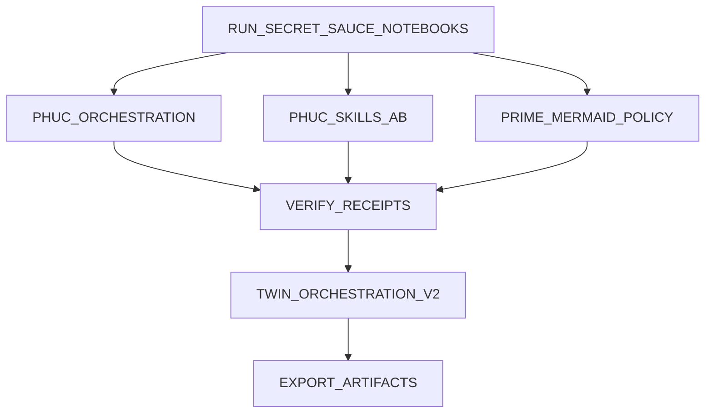

# Recipe: secret_sauce_integration

```mermaid
flowchart TD
  START[RUN_SECRET_SAUCE_NOTEBOOKS] --> ORCH[PHUC_ORCHESTRATION]
  START --> SKILLS[PHUC_SKILLS_AB]
  START --> PM[PRIME_MERMAID_POLICY]
  ORCH --> VERIFY[VERIFY_RECEIPTS]
  SKILLS --> VERIFY
  PM --> VERIFY
  VERIFY --> TWIN[TWIN_ORCHESTRATION_V2]
  TWIN --> EXPORT[EXPORT_ARTIFACTS]
```

## Notes
- This is the CLI bridge from root secret-sauce notebooks into daily CLI operations.
- Pair with `wish.cli.secret_sauce.integration.v1`.

