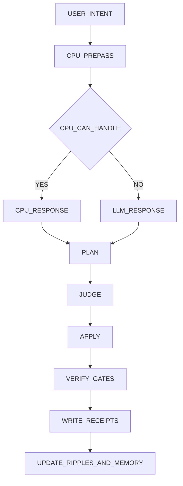

# Recipe: twin_orchestration_v2

Date: 2026-02-19T00:00:00Z

This recipe normalizes the "2x twin orchestration" pattern:
1. Twin A: CPU prepass + LLM fallback.
2. Twin B: PLAN/JUDGE/APPLY loop guided by wishes/recipes/context.

## Secret-sauce Mapping

- `PHUC-ORCHESTRATION-SECRET-SAUCE.ipynb`:
  DREAM -> FORECAST -> DECIDE -> ACT -> VERIFY
- `PHUC-SKILLS-SECRET-SAUCE.ipynb`:
  A/B/AB/ABC skill impact with receipts
- `PRIME-MERMAID-LANGUAGE-SECRET-SAUCE.ipynb`:
  externalized cognition contracts as source-of-truth

