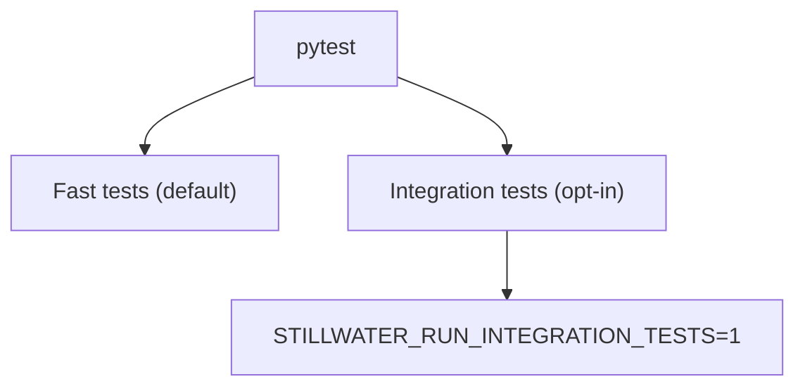

# cli/tests/

This repo includes a small test suite for orchestration behavior.

## Test Layout

- `cli/tests/phuc_orchestration/`: opt-in integration tests (require data + local services)
- `cli/tests/math/`: IMO/math QA configuration files consumed by tests and shell QA flows.
- `cli/tests/test_notebook_root_parity.py`: maps each root notebook to an equivalent CLI command path.
- `cli/tests/test_cli_kernel_config.py`: validates external skill/book/paper directory support through kernel config.



## Run

Disable auto-loading external pytest plugins (portable + avoids host env issues):

```bash
PYTEST_DISABLE_PLUGIN_AUTOLOAD=1 pytest -q
```

Run integration tests:

```bash
STILLWATER_RUN_INTEGRATION_TESTS=1 PYTEST_DISABLE_PLUGIN_AUTOLOAD=1 pytest -q
```
