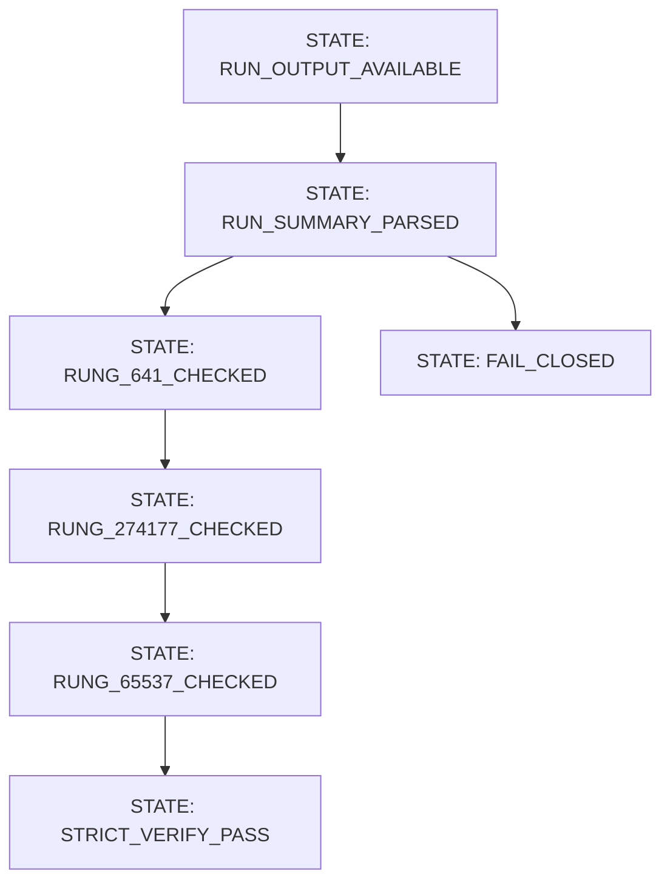

# Prime Mermaid: `wish.cli.oolong.verify.v1`

```mermaid
flowchart TD
  INPUT[STATE: RUN_OUTPUT_AVAILABLE] --> PARSED[STATE: RUN_SUMMARY_PARSED]
  PARSED --> R641[STATE: RUNG_641_CHECKED]
  R641 --> R274177[STATE: RUNG_274177_CHECKED]
  R274177 --> R65537[STATE: RUNG_65537_CHECKED]
  R65537 --> STRICT_PASS[STATE: STRICT_VERIFY_PASS]
  PARSED --> FAIL_CLOSED[STATE: FAIL_CLOSED]
```
