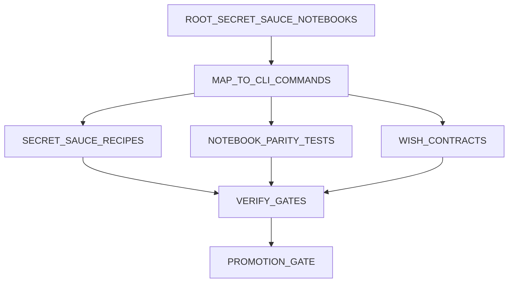

# Prime Mermaid: `wish.cli.secret_sauce.integration.v1`

```mermaid
flowchart TD
  ROOT_NOTEBOOKS[ROOT_SECRET_SAUCE_NOTEBOOKS] --> MAP[MAP_TO_CLI_COMMANDS]
  MAP --> TESTS[NOTEBOOK_PARITY_TESTS]
  MAP --> RECIPES[SECRET_SAUCE_RECIPES]
  MAP --> WISHES[WISH_CONTRACTS]
  RECIPES --> VERIFY[VERIFY_GATES]
  TESTS --> VERIFY
  WISHES --> VERIFY
  VERIFY --> PASS[PROMOTION_GATE]
```

