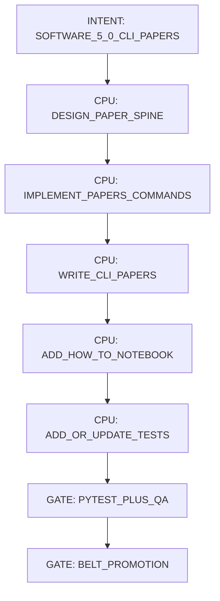

# Prime Mermaid: wish.cli.software5.papers.v1

```mermaid
flowchart TD
  START[INTENT: SOFTWARE_5_0_CLI_PAPERS] --> DESIGN[CPU: DESIGN_PAPER_SPINE]
  DESIGN --> IMPLEMENT[CPU: IMPLEMENT_PAPERS_COMMANDS]
  IMPLEMENT --> DOCS[CPU: WRITE_CLI_PAPERS]
  DOCS --> NOTEBOOK[CPU: ADD_HOW_TO_NOTEBOOK]
  NOTEBOOK --> TESTS[CPU: ADD_OR_UPDATE_TESTS]
  TESTS --> VERIFY[GATE: PYTEST_PLUS_QA]
  VERIFY --> PROMOTE[GATE: BELT_PROMOTION]
```
