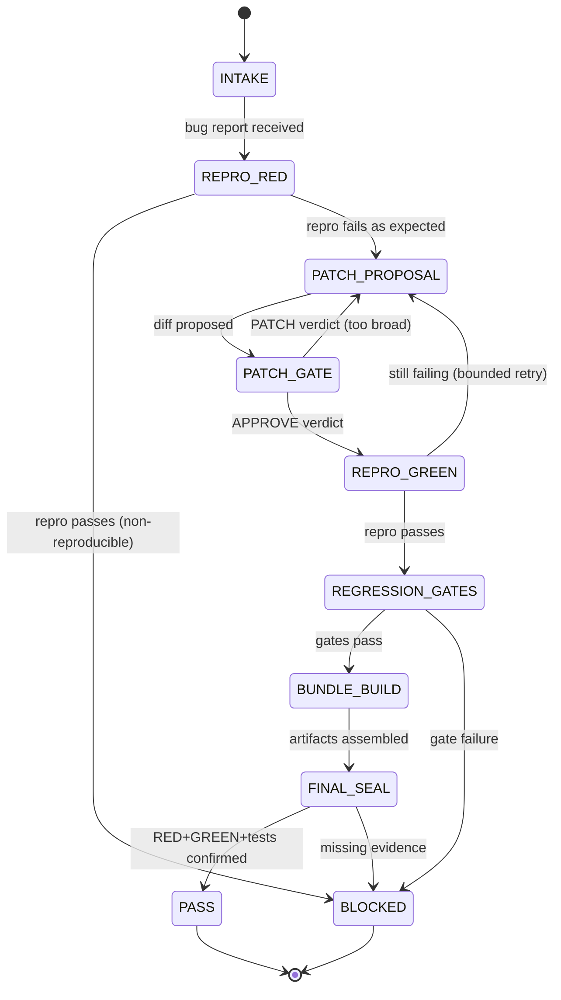

# ✅ Combo 4 — Bugfix → PR (Red→Green Mandatory)

This combo is the “patch is only real if it *changes a failing repro to passing*” loop. It consumes outputs from **CI Triage** and the **Run + Test Harness**, and produces a PR-ready patch bundle with proof + gates.

---

# W_BUGFIX_PR — Bugfix Patch With Red→Green Proof

**WISH_ID:** `wish_bugfix_pr_red_green`
**PRIORITY:** CRITICAL
**CLASS:** bugfix
**DEPENDS_ON:** `wish_plan_execute_split`, `wish_run_test_harness`, `wish_ci_triage`

---

## 🎯 Goal

Given a bug report (or CI triage output), produce a patch that:

1. **Reproduces the bug (RED)** with a minimal repro script/command.
2. **Fixes the bug (GREEN)** with the smallest safe change.
3. **Adds/locks regression coverage** (test or strengthened assertion).
4. Emits a **PR bundle**: diff + manifest + gates + proof.

---

## 🔐 Invariants

1. **Kent Gate (hard)**: No patch is accepted unless `repro` fails before and passes after.
2. **Minimality**: Touch the fewest files/hunks that plausibly fix the issue.
3. **No scope creep**: refactors are forbidden unless explicitly required for fix.
4. **Deterministic evidence**:

   * stable command list
   * stable artifact paths
   * normalized logs (timestamps stripped)
5. **Never-worse**: patch must not increase failing tests vs baseline.

---

## 🚫 Forbidden States

* `PATCH_WITHOUT_REPRO`
* `GREEN_WITHOUT_RED`
* `TESTS_REMOVED_OR_WEAKENED` (unless explicitly authorized by a deprecation plan)
* `BROAD_REFACTOR_UNDER_BUGFIX`
* `UNPINNED_DEPENDENCY_CHANGE` (belongs to dependency-bump combo)

---

## 🧪 Acceptance Tests

### A) Red proof exists

* `evidence/repro_red.log` with non-zero exit code.

### B) Green proof exists

* `evidence/repro_green.log` with zero exit code.

### C) Regression gate exists

* Either:

  * a new test covering the failure mode, or
  * an existing test tightened to cover it
* must be listed in `GATES.json`

### D) Patch bundle integrity

* `PATCH.diff` applies cleanly
* `MANIFEST.json` hashes match file bytes

---

## 📦 Required Artifacts

* `repro.py` or `ReproCommand.txt`
* `PATCH.diff`
* `MANIFEST.json` (before/after hashes)
* `GATES.json` (exact replay commands)
* Evidence:

  * `evidence/repro_red.log`
  * `evidence/repro_green.log`
  * `evidence/tests.json`
  * `evidence/behavior_hash.txt`
* Optional (if Stillwater intent):

  * `STILLWATER_SEAL_REQUEST.md`

---

# R_BUGFIX_PR — Bugfix-to-PR Recipe

**RECIPE_ID:** `recipe_bugfix_pr_v1`
**SATISFIES:** `wish_bugfix_pr_red_green`

---

## 🧠 Node Graph (L1–L5)

### Node 1 — L1 CPU: Intake + Normalize Bug Inputs

Inputs:

* `BUG_REPORT` (text)
* optional: `CI_TRIAGE_BUNDLE` (from Combo 3)
* repo status (`commit`, `dirty`)

Outputs:

* `BugSpec.json`:

  * `symptom`
  * `expected`
  * `observed`
  * `suspected_area` (if known)
  * `initial_gate_command` (if known)
  * `mode=execute` (bugfix implies execute)

Fail-closed if no runnable entrypoint is known and no CI triage data exists → `NEED_INFO`.

---

### Node 2 — L1 CPU: Repro Resolver (choose best repro)

Deterministic preference order:

1. existing failing test command from CI (`pytest ...::test_x`)
2. generated `repro.py` from CI triage
3. minimal CLI invocation (`python -m ...`)

Outputs:

* `ReproDescriptor.json`
* `ReproCommand.txt` or `repro.py`

---

### Node 3 — L4 Tool: RED Run (Mandatory)

Use **Run + Test Harness**:

* run repro
* record exit code + normalized log

Outputs:

* `evidence/repro_red.log`
* `evidence/repro_red_exit.json`

If repro passes → stop_reason `NON_REPRODUCIBLE`, status `BLOCKED`.

---

### Node 4 — L3 LLM: Patch Proposal (Smallest Delta)

Inputs:

* witness lines from localization (CI Triage)
* failing stack trace excerpt (from logs)
* constraints: minimality, no scope creep

Outputs:

* `PATCH_CANDIDATE.diff`
* `TouchedFiles.json` with 1-line justification per file

---

### Node 5 — L5 Judge: Patch Discipline Gate

Checks:

* file-touch justification present for each file
* no forbidden refactor markers (large renames, mass formatting, unrelated cleanups)
* no weakening of tests
* aligns with BugSpec

Verdicts:

* APPROVE → proceed
* PATCH → request smaller/safer diff
* REJECT → fail-closed with reason tags

Outputs:

* `PatchVerdict.json`

---

### Node 6 — L4 Tool: Apply Patch + GREEN Run

Actions:

* apply patch
* rerun repro

Outputs:

* `evidence/repro_green.log`
* `evidence/repro_green_exit.json`

If still failing → loop (bounded by Resource Governor), else proceed.

---

### Node 7 — L4 Tool: Run Regression Gates

Minimum gates:

* repro command
* nearest relevant test suite (e.g., `pytest -q` or targeted folder)
* any project-required lint/typecheck (only if already standard)

Outputs:

* `evidence/tests.json`

---

### Node 8 — L1 CPU: Bundle Builder (PR-ready)

Produce atomic bundle:

1. `PATCH.diff` (sorted by path)
2. `MANIFEST.json` (sha256 before/after)
3. `GATES.json` (exact replay commands + expected exit)
4. `PROOF.json` (if your Proof Builder is required for this category)

Outputs:

* `PATCH_BUNDLE/…`

---

### Node 9 — L5 Judge: Final Red→Green Seal

Hard requirements:

* RED exists and fails
* GREEN exists and passes
* tests.json shows gates ran
* manifest hashes correct

Outputs:

* `FinalVerdict.json`:

  * `status: PASS|BLOCKED`
  * `stop_reason`
  * `replay_commands`
  * `patch_id`

---

## 🔌 ABI: CI Triage → Bugfix PR

Consumes:

* `FailureSignature.json`
* `LocalizationReport.json`
* `ReproDescriptor.json` (or repro file/cmd)

Produces:

* PR bundle + proof artifacts

---

## 🎛️ Context Injection

* L1 CPU: CI artifacts + repo metadata
* L3 LLM: only witness lines + minimal error excerpt + invariants
* L4 Tool: Run manifest + commands
* L5 Judge: invariants + forbidden states + patch discipline rules

---

---

## Three Pillars Mapping

| Pillar | Element | Role in this Combo |
|--------|---------|-------------------|
| **L (Logic / Evidence)** | Kent Gate: repro_red → patch → repro_green | Forces executable evidence before any PASS claim |
| **E (Execution / Energy)** | Node 3 RED run + Node 6 GREEN run via Run+Test Harness | Mechanical execution with bounded retries and IO boundary |
| **K (Knowledge / Capital)** | LocalizationReport + PatchVerdict + MANIFEST.json | Skill capital preserved as replay-stable artifact bundle |

LEK summary: Knowledge (localization) targets the patch; Energy (runs) verifies it; Logic (Kent Gate) seals it.

| Pillar | How This Combo Applies It |
|--------|--------------------------|
| **LEK** (Self-Improvement) | Each bugfix iteration (RED→PATCH→GREEN) is a self-improvement loop: the codebase learns from its own failure and encodes the fix as regression coverage |
| **LEAK** (Cross-Agent Trade) | Coder agent holds patch knowledge asymmetrically; Skeptic judge holds invariant knowledge; they trade via PatchVerdict.json — neither can PASS alone |
| **LEC** (Emergent Conventions) | Kent Gate becomes a project-wide convention: every accepted patch has repro_red.log + repro_green.log, creating a shared evidence culture |

---

## State Diagram

---

Say **”next”** for:

**Combo 5 — Review + Security Scan Veto**.
