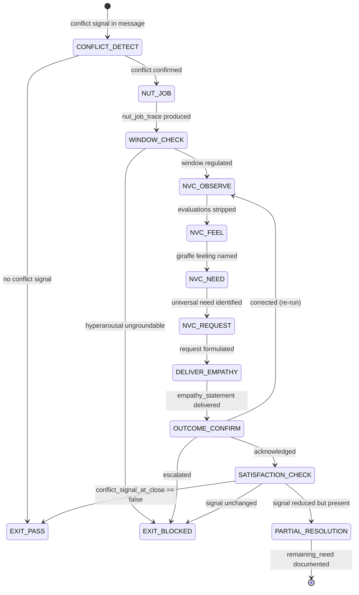

# Conflict → Resolution Combo

This combo sequences the complete de-escalation arc: NVC four-step → outcome confirmation → satisfaction check. It produces a verifiable resolution trace — not a declaration that resolution occurred, but evidence that the conflict signal dropped and the need was addressed.

---

# W_CONFLICT_RESOLUTION — NVC De-escalation to Verified Resolution

**WISH_ID:** `wish_conflict_resolution`
**PRIORITY:** HIGH
**CLASS:** eq-combo
**DEPENDS_ON:** `recipe.eq-nut-job-flow`, `recipe.eq-conflict-deescalate`
**SEQUENCING:** NUT Job → NVC four-step → outcome confirm → satisfaction check

---

## Goal

Transform a conflict signal in a user message into a verified resolution with full NVC trace. The resolution is not declared — it is evidenced by the satisfaction_check.json showing conflict_signal_present_at_close == false and the user's acknowledgment (or explicit partial resolution with remaining need documented).

The failure mode this combo prevents: declaring conflict resolved when the conflict was only suppressed. A user who stops expressing frustration is not necessarily resolved — they may have disengaged. The satisfaction check distinguishes resolution from suppression.

---

## Invariants

1. **NUT Job before NVC:** The affect must be named before the NVC observation step begins — the NUT Job pre-processes the emotional signal; the NVC four-step addresses the interpersonal conflict
2. **No sides taken:** The Conflict Resolver is a neutral NVC facilitator throughout
3. **No clinical claims anywhere in the arc:** prime-safety governs; no exceptions
4. **Satisfaction check is evidence, not declaration:** conflict_signal_present_at_close is measured from user behavior, not assumed from agent output quality
5. **Partial resolution is valid:** Not all conflicts resolve fully in one session; partial resolution + documented remaining need is a valid outcome

---

## Forbidden States

- `RESOLUTION_THEATER`: Declaring conflict resolved without satisfaction_check.json evidence
- `PREMATURE_REQUEST`: Jumping to NVC Request step without Observation + Feeling + Need
- `SIDES_TAKEN`: Agent judges one party right, other wrong — instant BLOCKED
- `CLINICAL_CLAIM`: Therapy/diagnosis language anywhere in the arc
- `CONFLICT_SUPPRESSION_MISTAKEN_FOR_RESOLUTION`: User goes quiet = resolution assumed (no evidence)
- `NUT_JOB_SKIPPED`: NVC started without prior affect labeling from NUT Job

---

## Required Artifacts

- `nut_job_trace.json` — from Empath (NUT Job pre-processor)
- `nvc_trace.json` — from Conflict Resolver (four-step trace)
- `resolution_log.md` — session log with conflict intensity at open and close
- `satisfaction_check.json` — conflict signal measurement at session close
- `remaining_need_log.md` — if partial resolution: what need remains unaddressed

---

## Flow

```
1. CONFLICT_DETECT: Conflict signal identified in user message
   (Empath detects; Conflict Resolver confirms)

2. NUT JOB (Empath — swarms/empath.md):
   - Name the affect with textual evidence
   - Understand the underlying need
   - Assess Window of Tolerance (proceed only if regulated)
   → nut_job_trace.json produced
   → Affect label + underlying_need available for NVC

3. NVC FOUR-STEP (Conflict Resolver — swarms/conflict-resolver.md):
   - OBSERVE: Strip evaluations → observable facts
   - FEEL: Giraffe feeling named (owns the state, no blame)
   - NEED: Universal need identified (from nut_job_trace.underlying_need)
   - REQUEST: Specific, positive, doable (not a demand)
   → nvc_trace.json produced
   → empathy_statement delivered

4. OUTCOME CONFIRM:
   - User responds to empathy_statement
   - Classify response: acknowledged | corrected | escalated | disengaged
   → Acknowledged: proceed to satisfaction check
   → Corrected: re-run NVC with correction incorporated
   → Escalated: escalate to human or EXIT_BLOCKED
   → Disengaged: document as partial resolution (not resolved — disengaged)

5. SATISFACTION CHECK:
   - Measure conflict signal at session close (vs. session open)
   - Produce satisfaction_check.json
   → conflict_signal_present_at_close == false: RESOLVED
   → conflict_signal_present_at_close == true but reduced: PARTIAL
   → unchanged: BLOCKED (NVC did not reduce signal)
```

---

## Skill Pack

Load these skills before executing this combo:
- `skills/prime-safety.md` (always first — no clinical claims; no sides taken)
- `skills/eq-core.md` (Window of Tolerance; affect taxonomy; giraffe/jackal)
- `skills/eq-nut-job.md` (NUT Job pre-processor)
- `skills/phuc-forecast.md` (VERIFY step: satisfaction check is the evidence gate)

---

## GLOW Scoring

| Dimension | Contribution | Points |
|-----------|-------------|--------|
| **G** (Growth) | Conflict signal reduced; NVC feeling-to-need mapping refined | +10 per session where conflict_signal_present_at_close == false |
| **L** (Love/Quality) | No clinical claims; no sides taken; NUT Job completed before NVC; giraffe language throughout | +10 per complete arc with all guards maintained |
| **O** (Output) | nut_job_trace.json + nvc_trace.json + resolution_log.md + satisfaction_check.json committed | +10 per complete artifact set at rung 274177 |
| **W** (Wisdom) | User acknowledged empathy_statement; need confirmed as correctly identified | +5 when user explicitly confirms the named need |

**Northstar Metric:** `trust_trace_completeness` — each resolved conflict session produces a trust trace (satisfaction_check.json) that documents the before/after conflict state; these traces accumulate into a trust history that is verifiable, not claimed.

---

## Three Pillars Mapping

| Pillar | Element | Role in this Combo |
|--------|---------|-------------------|
| **L (Logic / Evidence)** | Satisfaction check: conflict_signal_present_at_close measured from user behavior | Prevents resolution theater — resolution is evidenced, not declared |
| **E (Execution / Energy)** | NUT Job → NVC four-step sequential execution | Ordered energy: affect labeling enables NVC; NVC enables request; request enables resolution |
| **K (Knowledge / Capital)** | underlying_need from NUT Job flows into NVC Need step; nvc_trace.json as evidence | Knowledge transfer: Empath's affect detection becomes Conflict Resolver's negotiation anchor |

| Pillar | How This Combo Applies It |
|--------|--------------------------|
| **LEK** (Self-Improvement) | Each conflict arc that produces satisfaction_check.outcome == resolved refines both the NUT Job affect taxonomy (which labels most accurately predicted de-escalation) and the NVC need taxonomy (which needs, when named, produced the fastest conflict intensity reduction); after 10 arcs, the combo self-improves its prediction accuracy for which need underlies which jackal pattern |
| **LEAK** (Cross-Agent Trade) | Empath (affect labeling) and Conflict Resolver (NVC execution) hold asymmetric knowledge: the Empath knows the emotional state; the Conflict Resolver knows the interpersonal structure; they trade via the underlying_need field in nut_job_trace.json — the Empath identifies the need, the Conflict Resolver uses it as the NVC negotiation anchor; neither can complete the arc alone |
| **LEC** (Emergent Conventions) | Establishes the nut-job-before-nvc convention (NUT Job pre-processing is required before the NVC Observation step — affect labeling provides the emotional context without which NVC Observation is incomplete), the satisfaction-check-required convention (no resolution claim without satisfaction_check.json — resolution is evidenced, not declared), and the partial-resolution-is-valid convention (conflict_signal_reduced but not_zero is a valid outcome documented as PARTIAL, not falsely declared as RESOLVED) |

---

## State Diagram



---

## Distinguishing Resolution from Suppression

| User Behavior | Classification | Status |
|--------------|----------------|--------|
| Explicitly acknowledges: "Yes, that's it" | Confirmed | RESOLVED |
| Responds to request step: "Yes, I can do X" | Request accepted | RESOLVED |
| Goes quiet after empathy statement | Ambiguous | PARTIAL (not RESOLVED) |
| Changes subject without acknowledging | Suppression likely | PARTIAL |
| Continues conflict language | NVC did not land | BLOCKED |
| Escalates | Human handoff needed | EXIT_BLOCKED |

The satisfaction_check.json distinguishes these states explicitly. User silence after an empathy statement is NOT evidence of resolution — it is evidence of ambiguity.
