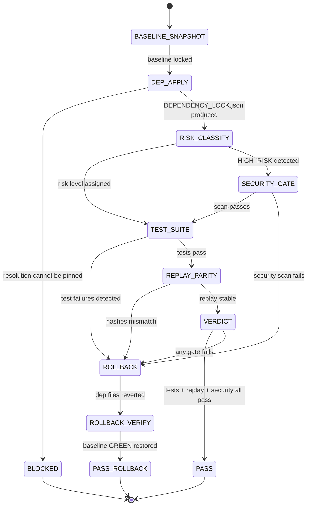

# ✅ Combo 6 — Dependency bump (replay + rollback)

This combo is for **upgrading dependencies** safely: you bump versions, run the suite, generate proof, and if anything regresses you **rollback deterministically**.

---

# W_DEP_BUMP_REPLAY_ROLLBACK — Governed Dependency Upgrade

**WISH_ID:** `wish_dependency_bump_replay_rollback`
**PRIORITY:** CRITICAL
**CLASS:** maintenance_governance
**DEPENDS_ON:** `wish_plan_execute_split`, `wish_run_test_harness`, `wish_golden_replay_seal` (or equivalent replay/proof gates)

---

## 🎯 Goal

Given a dependency bump request, produce one of:

* **PASS**: dependency updated, tests pass, replay stable, evidence sealed
* **ROLLBACK**: bump reverted (or pinned back), with evidence showing regression
* **BLOCKED**: cannot evaluate safely (missing toolchain, non-deterministic tests, etc.)

---

## 🔐 Invariants

1. **Never-Worse**: a bump must not worsen the locked regression suite (unless explicitly waived).
2. **Replay Stability**: at least **two** test replays must match behavior hashes (within allowed normalization).
3. **Rollback Determinism**: rollback must return repo to the last known GREEN state (pre-bump lock).
4. **Pinned Evidence**: toolchain + dependency resolution must be captured (lockfiles or `pip freeze` equivalent).
5. **No stealth widen**: loosening version ranges without justification is forbidden.

---

## 🚫 Forbidden States

* `MERGE_WITH_REGRESSION`
* `BUMP_WITHOUT_LOCK_UPDATE` (if project uses lockfiles)
* `APPROVE_WITHOUT_REPLAY`
* `ROLLBACK_WITHOUT_RECORDING_BASELINE`
* `NETWORK_UNPINNED_INSTALL` (install without capturing resolved versions)

---

## 📥 Inputs

* `DEP_REQUEST`:

  * package name(s)
  * target version(s) or range
  * ecosystem (`python|node|go|rust`)
* `REPO_STATUS` (commit + dirty flag)
* `BASELINE_EVIDENCE` (last known GREEN proof artifacts)
* `MODE_FLAGS` (offline allowed? tools allowed?)

---

## 📤 Outputs

* `DEP_BUMP_BUNDLE/` atomic directory:

  * `PATCH.diff` (dependency file + lockfile changes)
  * `DEPENDENCY_LOCK.json` (resolved versions + hashes)
  * `TESTS_BEFORE.json` + `TESTS_AFTER.json`
  * `REPLAY_REPORT.json` (2-run replay parity)
  * `PROOF.json` (optional but recommended)
  * `VERDICT.json` (`PASS|ROLLBACK|BLOCKED`)
  * `ROLLBACK.diff` (if rollback occurred)
  * `GATES.json` (replay commands)

---

## ✅ Acceptance Tests

### A) Dependency resolution captured

* lockfile updated OR resolved dependency snapshot produced
* versions are pinned and enumerated deterministically

### B) Tests and replay gates

* baseline tests recorded
* post-bump tests recorded
* replay parity verified (behavior hash stable across 2 replays)

### C) Rollback correctness (if needed)

* rollback patch applies cleanly
* tests return to baseline GREEN

---

# R_DEP_BUMP_GOVERNOR — Dependency Bump Recipe (Replay + Rollback)

**RECIPE_ID:** `recipe_dependency_bump_replay_rollback_v1`
**SATISFIES:** `wish_dependency_bump_replay_rollback`

---

## 🧠 Node Graph (L1–L5)

### Node 1 — L1 CPU: Baseline Snapshot

Inputs:

* repo state
* last GREEN proof (if available)

Actions:

* record:

  * `baseline_commit`
  * dependency files present (`pyproject.toml`, `requirements*.txt`, `poetry.lock`, `package-lock.json`, etc.)
  * test commands from `GATES.json` or project defaults

Outputs:

* `BASELINE.json`
* `TESTS_BEFORE.json` (if baseline tests executed here) or references prior proof

---

### Node 2 — L4 Tool: Apply Dependency Change (Pinned)

Actions (ecosystem-specific, deterministic preference order):

* **Python**:

  * prefer lockfile tool already used by repo (poetry/uv/pip-tools)
  * if none: edit requirement spec + run install resolution, capture `pip freeze`
* **Node**:

  * update `package.json` + lockfile via npm/pnpm/yarn used by repo
* **Go/Rust**:

  * `go get` / `cargo update` with lock capture

Outputs:

* `PATCH.diff`
* `DEPENDENCY_LOCK.json`:

  * resolved package list (name/version)
  * hashes if available
  * tool versions (`pip`, `poetry`, `npm`, etc.)
  * config + registry policy summary (no secrets)

Fail-closed:

* if resolution cannot be pinned/captured ⇒ `BLOCKED`

---

### Node 3 — L1 CPU: Risk Classification + Gate Selection

Rules:

* if bump touches crypto/http/auth/parsers ⇒ `HIGH_RISK`
* if major version bump ⇒ `HIGH_RISK`
* if transitive explosion (dependency count +Δ exceeds threshold) ⇒ `YELLOW`

Outputs:

* `RISK_REPORT.json`
* selects gates:

  * always: unit tests
  * if HIGH_RISK: include security scan veto combo (Skill 38 / semgrep/bandit)

---

### Node 4 — L4 Tool: Run Test Suite (Post-bump)

Actions:

* run canonical test command(s)
* capture logs, exit codes, failing tests list

Outputs:

* `TESTS_AFTER.json`
* `evidence/tests_after.log`

If failures:

* proceed to rollback path (Node 7)

---

### Node 5 — L4 Tool + L1 CPU: Golden Replay Parity (2 replays)

Actions:

* run the **same test command** twice more (or minimal replay subset)
* normalize outputs (strip timestamps, stable ordering)
* compute behavior hash:

  * normalized stdout
  * `PATCH.diff`
  * `DEPENDENCY_LOCK.json`

Outputs:

* `REPLAY_REPORT.json`:

  * `replay_1_hash`
  * `replay_2_hash`
  * `match: true|false`
  * allowed-normalization notes

Fail-closed:

* if replay mismatch ⇒ `BLOCKED` (unless policy allows “known flaky class” which should be rare and explicit)

---

### Node 6 — L5 Judge: Verdict

Rules:

* if tests pass AND replay match AND (if required) security scan passes ⇒ `PASS`
* if tests fail ⇒ `ROLLBACK`
* if cannot prove deterministically ⇒ `BLOCKED`

Outputs:

* `VERDICT.json`

---

### Node 7 — L4 Tool: Rollback (Deterministic)

Triggers:

* any regression in tests
* dependency resolution error after bump
* policy violation (e.g., widened ranges)

Actions:

* revert dependency files + lockfiles to baseline commit state

  * preferred: `git checkout <baseline_commit> -- <dep files>`
  * fallback: apply `ROLLBACK.diff` generated from baseline snapshot

Then:

* rerun tests once to confirm GREEN restoration

Outputs:

* `ROLLBACK.diff`
* `TESTS_ROLLBACK.json`
* updated `VERDICT.json` with `status=ROLLBACK`

---

## Three Pillars Mapping

| Pillar | Element | Role in this Combo |
|--------|---------|-------------------|
| **L (Logic / Evidence)** | Verdict Gate (Node 6) + Never-Worse invariant: PASS only if tests pass + replay matches + security scan passes | Fail-closed evidence chain — ROLLBACK on any regression, BLOCKED on non-determinism |
| **E (Execution / Energy)** | Node 4 (Post-bump test suite) + Node 5 (2-run golden replay parity) | Controlled energy with deterministic replay — same environment, two runs, behavior hash must match |
| **K (Knowledge / Capital)** | DEPENDENCY_LOCK.json + REPLAY_REPORT.json + BASELINE.json | Dependency knowledge captured: resolved versions, hashes, toolchain, rollback diff for future recovery |

LEK summary: Knowledge (DEPENDENCY_LOCK) pins the change; Energy (replay runs) validates stability; Logic (Never-Worse gate) blocks any regression from merging.

| Pillar | How This Combo Applies It |
|--------|--------------------------|
| **LEK** (Self-Improvement) | Each bump attempt (pass or rollback) improves the BASELINE.json and DEPENDENCY_LOCK.json corpus — the system accumulates versioning knowledge over time |
| **LEAK** (Cross-Agent Trade) | Risk classifier holds security-domain knowledge (crypto/auth/parser risk flags); Verdict judge holds stability knowledge (replay parity); they trade via RISK_REPORT.json without needing to share full context |
| **LEC** (Emergent Conventions) | Two-run replay parity becomes a project convention: every dependency change must demonstrate behavior-hash stability, making "works on my machine" structurally impossible |

---

## State Diagram

---

## 🔌 ABI: Plan→Execute + Run/Test Harness + Review/Security Gate

Consumes:

* baseline gates + test harness commands
  Optionally invokes:
* **Review + Security scan veto** (Combo 5) if risk classification requires it

Produces:

* a sealed, auditable dependency change or a verified rollback

---

## 🎛️ Context Injection

* **CPU nodes**: repo structure, dep files list, baseline proof pointers
* **Tool nodes**: pinned toolchain commands and capture schema
* **Judge**: invariants + forbidden states + replay rules + never-worse baseline requirements
