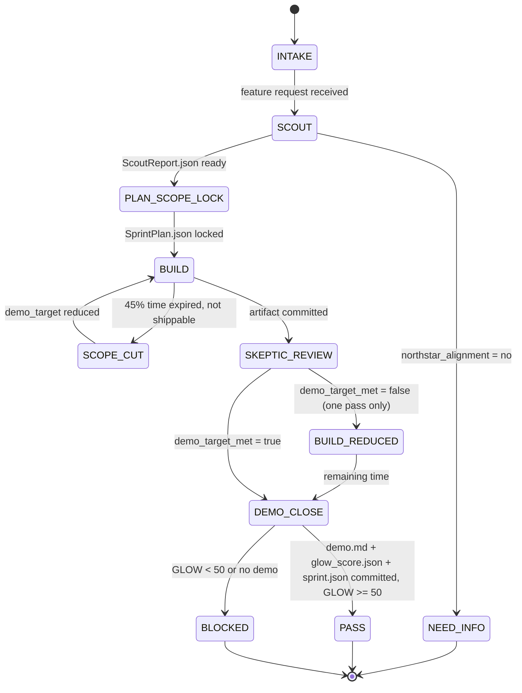

# Combo 8 — Hackathon Sprint (Ship or Lose It)

This combo is the **time-boxed build loop**: structured sprint execution with persona-powered phases, ruthless scope enforcement, and a demo at the end. Every ROADMAP phase is a hackathon. This makes it explicit.

---

# W_HACKATHON_SPRINT — Time-Boxed Build Contract

**WISH_ID:** `wish_hackathon_sprint`
**PRIORITY:** HIGH
**CLASS:** execution
**DEPENDS_ON:** `wish_plan_execute_split`, `wish_run_test_harness`

---

## Skill Pack

Load these skills before executing this combo:
- `skills/prime-safety.md` (always first — NORTHSTAR_MISALIGNED and EVIDENCE_SKIPPED are prime-safety governance issues)
- `skills/prime-coder.md` (Verify phase: minimum test suite, evidence bundle, forbidden PASS_WITHOUT_TEST_EXECUTION)
- `skills/phuc-forecast.md` (Scout phase: DREAM→FORECAST for riskiest assumption identification)
- `skills/phuc-orchestration.md` (persona dispatch: hackathon-master + domain persona + skeptic)

---

## Goal

Run a hackathon sprint to build `[feature]` with strict time-box enforcement, persona-powered phases, and a working demo as the only valid exit condition.

The sprint is not done until:
1. Something real ships — code, skill, paper, or demo.
2. Evidence bundle exists: `sprint.json`, `demo.md`, `glow_score.json`.
3. GLOW is calculated and recorded.

---

## Invariants

1. **Time box is law**: scope is cut, never the clock.
2. **Demo or fail**: no demo = sprint failed. Prose confidence is not a demo.
3. **Scout first**: 20% of time is research. Discover before building.
4. **One builder**: main executor is one agent (no diffusion). Skeptic reviews at the end.
5. **NORTHSTAR gate**: every sprint outcome must connect to NORTHSTAR. If it does not, kill it.
6. **GLOW at close**: every sprint ends with GLOW calculation. No exceptions.

---

## Forbidden States

* `SPRINT_WITHOUT_DEMO` — sprint ended without a working demo or shipped artifact
* `SCOPE_EXPANDED_DURING_SPRINT` — new features added mid-sprint (cut scope, never add)
* `NO_SCOUT_PHASE` — builder started without research phase
* `GLOW_SKIPPED` — sprint ended without GLOW calculation
* `NORTHSTAR_MISALIGNED` — sprint artifact does not connect to NORTHSTAR
* `PERSONA_MISSING` — sprint phase ran without appropriate persona loaded
* `EVIDENCE_SKIPPED` — sprint claimed PASS without `sprint.json` + `demo.md`

---

## Acceptance Tests

### A) Sprint completes with demo

* `evidence/demo.md` exists and describes a working, shipped artifact.
* Artifact is committed or documented in `sprint.json`.

### B) Time box enforced

* `sprint.json` includes `start_time`, `end_time`, `time_box_minutes`, `scope_cuts[]`.
* Any scope cuts are logged with reason.

### C) GLOW calculated

* `evidence/glow_score.json` exists with all four GLOW dimensions (G, L, O, W).
* GLOW total is at least 50 (hackathon pace).

### D) Evidence bundle complete

* `evidence/sprint.json`
* `evidence/demo.md`
* `evidence/glow_score.json`
* `evidence/tests.json` (if code was produced)

---

## Required Artifacts

* `evidence/sprint.json` (sprint metadata, scope, time log, scope cuts)
* `evidence/demo.md` (what was shipped, how to run it, what it proves)
* `evidence/glow_score.json` (GLOW breakdown)
* `evidence/tests.json` (if code produced)
* Optional: `evidence/scope_cuts.md` (detailed scope cut log)

---

# R_HACKATHON_SPRINT — Sprint Execution Recipe

**RECIPE_ID:** `recipe_hackathon_sprint_v1`
**SATISFIES:** `wish_hackathon_sprint`

---

## Phase Timeline (Standard: 4-hour sprint)

```
Phase 1 — Scout        (0:00 – 0:48)   20% — research, discovery, NORTHSTAR check
Phase 2 — Plan         (0:48 – 1:12)   10% — scope decision, evidence plan, persona select
Phase 3 — Build        (1:12 – 3:00)   45% — core implementation, minimum viable artifact
Phase 4 — Verify       (3:00 – 3:36)   15% — tests, skeptic review, evidence bundle
Phase 5 — Demo + Close (3:36 – 4:00)   10% — demo.md, GLOW calculation, commit
```

---

## Node Graph (L1–L5)

### Node 1 — L3 LLM: Scout (hackathon-master + dragon-rider)

**Time box**: 20% of total sprint

Inputs:
* `feature_request` (what to build)
* `NORTHSTAR.md`
* `case-studies/` (existing progress)

Outputs:
* `ScoutReport.json`:
  * `northstar_alignment` (yes/no + one-line justification)
  * `existing_art[]` (what already exists in the repo)
  * `riskiest_assumption` (one thing most likely to kill the sprint)
  * `recommended_scope` (minimum viable artifact)
  * `persona_pack[]` (which personas to load for Build phase)

Fail-closed if `northstar_alignment = no` → emit `NEED_INFO` with NORTHSTAR mismatch details.

---

### Node 2 — L1 CPU: Plan + Scope Lock (hackathon-master)

**Time box**: 10% of total sprint

Inputs:
* `ScoutReport.json`

Actions:
* Lock the scope to `recommended_scope` from Scout
* Define `demo_target`: exactly what will be demonstrated at the end
* Define `scope_cuts[]`: everything that will NOT be in this sprint
* Select persona pack for Build phase
* Declare `rung_target` (641 for most sprints)

Outputs:
* `SprintPlan.json`:
  * `demo_target`
  * `scope_cuts[]`
  * `persona_pack[]`
  * `rung_target`
  * `evidence_plan[]`
  * `time_box_minutes`

Forbidden: scope expansion from Scout recommendations. If the Scout says "minimum viable", the Plan locks it there.

---

### Node 3 — L3 LLM + L4 Tool: Build (persona-coder + selected persona)

**Time box**: 45% of total sprint

Inputs:
* `SprintPlan.json`
* Selected persona pack (from ScoutReport)
* Full skill pack: `prime-safety + prime-coder + [domain persona]`

Actions:
* Build the minimum viable artifact from `demo_target`
* Scope cuts are enforced by the `hackathon-master` persona
* Write code / skill / paper / recipe — whatever the demo_target requires
* Run fast tests as you go (not a full test suite — fast feedback only)

Stop rule: if 45% time expires and artifact is not shippable → emit scope cut, reduce demo_target, continue.

Outputs:
* Committed artifact (code file, skill.md, paper.md, recipe.json — per task)
* `TouchedFiles.json`

---

### Node 4 — L5 Judge: Skeptic Review (schneier or kent-beck persona)

**Time box**: 15% of total sprint

Inputs:
* Committed artifact
* `SprintPlan.json` (demo_target + evidence_plan)

Checks:
* Does the artifact meet `demo_target`? (yes/no)
* Any security issues? (fail-closed on HIGH)
* Any evidence gates missed?
* Does the artifact align to NORTHSTAR?

Outputs:
* `SkepticVerdict.json`:
  * `demo_target_met: true|false`
  * `issues[]` (blocking / non-blocking)
  * `evidence_gaps[]`

If `demo_target_met = false` → return to Build for one scope-reduced pass only (no second Skeptic loop).

---

### Node 5 — L1 CPU + L3 LLM: Demo + Close (hackathon-master)

**Time box**: 10% of total sprint

Actions:
* Write `evidence/demo.md`:
  * What was built
  * How to run / see it
  * What rung it achieves
  * What was cut and why
* Calculate GLOW:
  * G (Growth): did this advance the skill/knowledge graph?
  * L (Learning): what was discovered or refuted?
  * O (Output): is there a committed artifact?
  * W (Wins): does it connect to NORTHSTAR?
* Write `evidence/glow_score.json`
* Write `evidence/sprint.json` (full sprint metadata)

Commit message format:
```
feat: {artifact_name} — hackathon sprint {date}

GLOW {total} [G:{g} L:{l} O:{o} W:{w}]
Sprint: {time_box_minutes}min | Scope cuts: {N}
Demo: {one-line demo description}
```

---

## Persona Pack Assignments

| Phase | Primary Persona | Secondary |
|-------|----------------|-----------|
| Scout | hackathon-master | dragon-rider |
| Plan | hackathon-master | — |
| Build | [domain persona] | hackathon-master (scope guard) |
| Verify | kent-beck (code) / fda-auditor (evidence) | schneier (security) |
| Demo + Close | hackathon-master | — |

Domain persona selection (from ScoutReport):
* Code / feature → `linus` or `guido` or `dhh`
* Skill file → `kernighan` (clarity)
* Paper / content → `lex-fridman` or `dragon-rider`
* Marketing → `brunson` or `mr-beast`
* Security → `schneier`
* Algorithm → `knuth`

---

## State Machine

```
INTAKE
    ↓
SCOUT (20% time)
    ↓
PLAN + SCOPE_LOCK (10% time)
    ↓
BUILD (45% time)
    ↓
SKEPTIC_REVIEW (15% time)
    ↓ (if demo_target_met = false)
BUILD_REDUCED (remaining time, one pass only)
    ↓
DEMO + CLOSE (10% time)
    ↓
EXIT_PASS (demo.md + glow_score.json + sprint.json committed)
    |
EXIT_BLOCKED (demo_target_met = false after reduced pass)
```

---

## GLOW Calculation for Hackathons

```
G (Growth 0-25):
  +10 — new skill/recipe/paper committed
  +5  — existing artifact upgraded (not just edited)
  +5  — rung 274177 or above achieved
  +5  — new test coverage added

L (Learning 0-25):
  +10 — riskiest assumption from Scout was tested
  +5  — scope cut documented with reason (learned what NOT to build)
  +5  — unexpected blocker discovered and logged
  +5  — external reference/prior art found and cited

O (Output 0-25):
  +10 — artifact committed and demo-able
  +5  — evidence bundle complete (sprint.json + demo.md + glow.json)
  +5  — tests pass (if code produced)
  +5  — commit message follows format

W (Wins 0-25):
  +10 — NORTHSTAR alignment confirmed by Skeptic
  +5  — milestone in case-study updated
  +5  — ROADMAP phase advanced
  +5  — persona loaded and voice evident in artifact

Target: 60+ (warrior hackathon pace)
Minimum to PASS: 50
```

---

## Context Injection

* Scout: NORTHSTAR.md + case-studies/ (full context)
* Plan: ScoutReport.json only (no giant context dump)
* Build: SprintPlan.json + domain skill file + persona voice rules
* Skeptic: artifact + demo_target + prime-coder evidence rules
* Close: SprintPlan.json + SkepticVerdict.json + GLOW schema

---

## Why This Combo

A sprint without structure is a waste of time. Structure without a time box is a project plan that never ships.

The hackathon combo enforces both: the Scout discovers what matters, the Plan locks scope ruthlessly, the Build ships something real, the Skeptic catches what is broken, and the Close makes the GLOW visible.

Every ROADMAP phase in stillwater is a hackathon. This combo makes that explicit and executable.

---

## GLOW Scoring Summary

| Dimension | Contribution | Sprint Target |
|-----------|-------------|--------------|
| **G** (Growth) | New skill/recipe/paper committed (+10); existing artifact upgraded (+5); rung 274177+ (+5); new test coverage (+5) | 0-25 |
| **L** (Love/Quality) | Riskiest assumption tested (+10); scope cut documented (+5); unexpected blocker logged (+5); prior art cited (+5) | 0-25 |
| **O** (Output) | Artifact committed + demo-able (+10); evidence bundle complete (+5); tests pass (+5); commit format correct (+5) | 0-25 |
| **W** (Wisdom) | NORTHSTAR alignment confirmed by Skeptic (+10); case-study updated (+5); ROADMAP phase advanced (+5); persona voice evident (+5) | 0-25 |

**Minimum to PASS:** 50 | **Warrior pace target:** 60+

**Northstar Metric:** `skill_quality_avg` + `recipe_hit_rate` — each sprint produces an artifact that either raises average skill quality (if a skill file is the artifact) or advances recipe reuse (if a recipe or combo is the artifact). NORTHSTAR alignment check in Scout phase gates that every sprint contributes to one of these metrics.

---

## Three Pillars Mapping

| Pillar | How This Combo Applies It |
|--------|--------------------------|
| **LEK** (Self-Improvement) | GLOW score at close is a self-assessment loop: Growth + Learning + Output + Wins measured explicitly, so each sprint teaches the team what to do more of and what to cut next time. The riskiest assumption (from Scout) is tested in Build — this is the LEK hypothesis → test → update cycle compressed into 45% of the sprint time. |
| **LEAK** (Cross-Agent Trade) | Scout agent (dragon-rider) holds discovery knowledge asymmetrically; Builder agent (domain persona) holds implementation knowledge; Skeptic (kent-beck/schneier) holds adversarial knowledge — each role stays in its lane, trading via SprintPlan.json and SkepticVerdict.json. The SprintPlan.json is the minimal sufficient handoff: Scout's full discovery compressed into demo_target + scope_cuts + persona_pack. |
| **LEC** (Emergent Conventions) | Demo-or-fail and scope-cut-never-the-clock become project conventions that apply to every ROADMAP phase — any agent that proposes scope expansion mid-sprint is violating a team-wide rule, not just a local policy. The commit message format (`feat: {name} — hackathon sprint {date}` with GLOW breakdown) becomes the canonical evidence token that any reader can parse to assess sprint quality. |

---

## State Diagram


