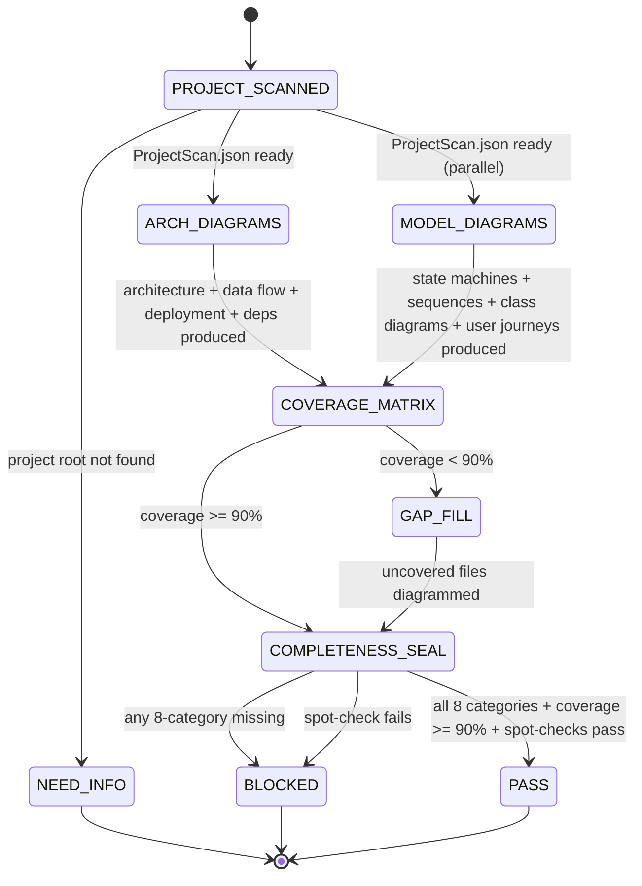

# Combo — Mermaid-Based QA (Diagram-First Verification)

This combo uses comprehensive mermaid diagrams as a QA tool. By diagramming every component, workflow, and data model, it exposes architectural gaps that questions and tests alone miss. The diagrams serve as a "site map" of the codebase — so complete that you could reconstruct the system from them.

---

# W_MERMAID_QA — Diagram-First Verification With Coverage Matrix

**WISH_ID:** `wish_mermaid_qa`
**PRIORITY:** HIGH
**CLASS:** qa
**DEPENDS_ON:** none (standalone; integrates with `wish_qa_audit` for the unified 3-pillar QA)

---

## Goal

Given a project, produce a comprehensive set of mermaid diagrams that covers:

1. **Architecture** — every component and their connections
2. **Data Flow** — how data moves through the system
3. **State Machines** — lifecycle of every key entity
4. **Sequences** — interaction sequences between components
5. **Data Models** — class/entity diagrams with actual field names
6. **User Journeys** — all user interaction paths
7. **Deployment** — how the system runs in production
8. **Dependencies** — module/package dependency graph

Plus a **coverage matrix** proving every source file appears in at least one diagram.

---

## Invariants

1. **Source-grounded (hard)**: Every diagram element must trace to an actual source file. No imagined components.
2. **Complete coverage (hard)**: Every source module (.py, .md config, .yaml) must appear in at least one diagram.
3. **Accurate (hard)**: Field names, function signatures, and endpoint paths must match actual code.
4. **Eight categories (hard)**: All 8 diagram categories must have at least one diagram.
5. **Prime Mermaid format**: Diagrams use typed nodes, labeled edges, classDef semantics.

---

## Forbidden States

- `DIAGRAM_WITHOUT_SOURCE`: Diagram shows components not in actual source code
- `INVENTED_COMPONENT`: Diagramming planned/future components as if they exist now
- `UNCOVERED_MODULE`: Source module with no diagram reference (detected in coverage matrix)
- `STALE_DIAGRAM`: Diagram contradicts current source code
- `CHARTJUNK`: Decorative elements that add no information
- `CATEGORY_MISSING`: Any of the 8 diagram categories has zero diagrams

---

## Acceptance Tests

### A) Category coverage

- All 8 diagram categories have at least one diagram file
- Each diagram file has at least one valid mermaid code block
- Each diagram file has a "Source Files" section

### B) Source coverage

- `qa_diagram_coverage.json` lists every source file and which diagrams reference it
- No source file has zero diagram references
- Coverage percentage = (covered files / total files) × 100 ≥ 90%

### C) Accuracy spot-check

- Randomly select 3 diagrams, verify each node/edge against actual source code
- Field names in class diagrams match Pydantic model definitions
- Endpoint paths in sequence diagrams match actual route handlers

---

## Required Artifacts

- `diagrams/{project}/*.md` — individual diagram files (numbered 01-NN)
- `qa_diagram_coverage.json` — coverage matrix
- `qa_diagram_report.md` — summary + gap report

---

# R_MERMAID_QA — Mermaid QA Recipe

**RECIPE_ID:** `recipe_mermaid_qa_v1`
**SATISFIES:** `wish_mermaid_qa`

---

## Node Graph (L1–L5)

### Node 1 — L1 CPU: Project Scan

Inputs:

- project name
- project root path

Outputs:

- `ProjectScan.json`:
  - `source_files`: list of all .py, .md, .yaml, .json source files
  - `source_modules`: grouped by directory
  - `entry_points`: identified CLI/API entry points
  - `config_files`: configuration files
  - `total_file_count`: int

Fail-closed if project root doesn't exist → `NEED_INFO`.

---

### Node 2 — L3 LLM: qa-diagrammer (Architecture + Data Flow)

Agent: `qa-diagrammer` (see `swarms/qa-diagrammer.md`)
Skill pack: `prime-safety + prime-mermaid + phuc-qa`
Model: sonnet

Inputs (CNF capsule):

- `ProjectScan.json`
- Source files (read by agent)
- DIAGRAM_CATEGORIES: [system_architecture, data_flow, deployment, dependencies]

Outputs:

- `diagrams/{project}/01-system-architecture.md`
- `diagrams/{project}/02-project-ecosystem.md` (if multi-project)
- `diagrams/{project}/03-data-flow.md`
- `diagrams/{project}/NN-deployment.md`
- `diagrams/{project}/NN-dependencies.md`

Rules:
- Must read actual source files before diagramming
- Every node must reference a real source file or module
- All decision nodes must have labeled branches

---

### Node 3 — L3 LLM: qa-diagrammer (Models + Sequences + State)

Agent: `qa-diagrammer` (second instance, can run in parallel with Node 2)
Skill pack: `prime-safety + prime-mermaid + phuc-qa`
Model: sonnet

Inputs (CNF capsule):

- `ProjectScan.json`
- Source files (read by agent)
- DIAGRAM_CATEGORIES: [state_machines, sequences, class_diagrams, user_journeys]

Outputs:

- `diagrams/{project}/NN-data-model.md`
- `diagrams/{project}/NN-auth-flow.md`
- `diagrams/{project}/NN-session-lifecycle.md`
- `diagrams/{project}/NN-user-journey.md`
- Additional diagrams as discovered during source reading

---

### Node 4 — L1 CPU: Coverage Matrix

Inputs:

- `ProjectScan.json` (total source file list)
- All `diagrams/{project}/*.md` files (from Node 2 + Node 3)

Process (deterministic, no LLM):

1. Parse each diagram file for source file references
2. Build matrix: source_file → [list of diagrams referencing it]
3. Identify uncovered files (source files with no diagram reference)
4. Calculate coverage percentage

Outputs:

- `qa_diagram_coverage.json`:
  - `total_source_files`: int
  - `covered_files`: int
  - `uncovered_files`: list
  - `coverage_pct`: float
  - `matrix`: {source_file: [diagram_refs]}

---

### Node 5 — L3 LLM: Gap Fill (if coverage < 90%)

Agent: `qa-diagrammer` (third instance)

Inputs:

- `qa_diagram_coverage.json` (specifically the uncovered_files list)
- Source files

Outputs:

- Additional diagrams covering the uncovered files
- Updated `qa_diagram_coverage.json`

Skip this node if coverage ≥ 90%.

---

### Node 6 — L5 Judge: Completeness Seal

Hard requirements:

- All 8 diagram categories represented
- Coverage ≥ 90%
- Every diagram has at least one valid mermaid block
- Every diagram has a "Source Files" section
- Spot-check: 3 random diagrams verified against source

Outputs:

- `qa_diagram_report.md`:
  - Total diagrams produced
  - Coverage percentage
  - Uncovered files (if any)
  - Category breakdown
  - Spot-check results
  - Rung achieved

---

## Context Injection

- Node 1 (CPU): project root path only
- Node 2-3 (qa-diagrammer): ProjectScan.json + actual source file access + category assignment
- Node 4 (CPU): file list + diagram files only; no LLM
- Node 5 (qa-diagrammer): uncovered file list + source files
- Node 6 (Judge): coverage matrix + category list + spot-check samples

---

## State Machine

```
PROJECT_SCANNED
    ↓
ARCHITECTURE_DIAGRAMS_GENERATED  (Node 2)
MODEL_DIAGRAMS_GENERATED         (Node 3, parallel)
    ↓
COVERAGE_MATRIX_COMPUTED         (Node 4)
    ↓
GAPS_FILLED                      (Node 5, if needed)
    ↓
COMPLETENESS_SEALED              (Node 6)
```

---

## Integration with Unified QA (3-Pillar Model)

Mermaid QA is Pillar 3 of the unified phuc-qa framework:

```
PILLAR 1: Questions (qa-questioner + qa-scorer)
  → "What are the last 3 questions to answer?"

PILLAR 2: Tests (persona-coder with test persona)
  → "What are the last 3 tests to pass?"

PILLAR 3: Diagrams (qa-diagrammer)
  → "What are the last 3 diagrams to draw?"

ALL THREE use Northstar Reverse Engineering:
  Work backwards from "system fully verified" to identify gaps.
```

The coverage matrix from Pillar 3 feeds into the unified gap report, alongside the question scorecard (Pillar 1) and test results (Pillar 2). A module covered by diagrams but not by tests is a gap. A module covered by tests but not by questions is a gap. Complete QA requires all three pillars.

---

## Rung Quick Reference

| Rung | Requirement |
|------|------------|
| 641  | All 8 categories have diagrams; coverage ≥ 80%; diagrams reference real source |
| 274177 | Coverage ≥ 95%; every diagram cross-validated against source; spot-checks pass |
| 65537 | 100% coverage; independent reproduction by separate agent; diagrams reviewed by human |

---

## Skill Pack

Load these skills before executing this combo:
- `skills/prime-safety.md` (always first — DIAGRAM_WITHOUT_SOURCE and INVENTED_COMPONENT are prime-safety violations)
- `skills/prime-mermaid.md` (typed nodes, labeled edges, classDef semantics, source-grounded constraint)
- `skills/phuc-qa.md` (QA 3-pillar framework; Mermaid QA is Pillar 3)

---

## GLOW Scoring

| Dimension | Contribution | Points |
|-----------|-------------|--------|
| **G** (Growth) | Each diagramming pass grows coverage toward 100% — gaps found become the target list for the next session; architectural drift is made immediately visible | +5 per 10% coverage improvement vs prior run |
| **L** (Love/Quality) | Source-grounded: every diagram element traces to an actual source file; spot-checks pass; no STALE_DIAGRAM or CHARTJUNK | +5 per run where all 3 spot-check samples verify against source |
| **O** (Output) | qa_diagram_coverage.json + qa_diagram_report.md + all 8 category files committed; coverage ≥ 90% | +5 per run achieving >= 90% coverage |
| **W** (Wisdom) | Northstar metric (recipe_hit_rate) advances — complete diagram coverage enables faster recipe navigation and reduces the localization budget for future recipes | +5 when a new recipe is written using a diagram as the source of truth |

**Northstar Metric:** `recipe_hit_rate` — architectural diagrams are a prerequisite for high-quality recipe localization. When every source module appears in at least one diagram, recipe authors can navigate the codebase via diagrams rather than full corpus reads, reducing localization time and improving hit rate.

---

## Evidence Gates

| Gate | Requirement | Check |
|------|------------|-------|
| Category coverage | All 8 diagram categories represented | `ls diagrams/{project}/*.md | wc -l >= 8` |
| Source coverage | coverage_pct >= 90% in qa_diagram_coverage.json | `python3 -c "import json; d=json.load(open('qa_diagram_coverage.json')); assert d['coverage_pct'] >= 90"` |
| Accuracy spot-check | 3 random diagrams verified against source code | Manual cross-reference: node names match actual class/function names |
| Mermaid validity | All diagrams have valid mermaid code blocks | `grep -c '```mermaid' diagrams/{project}/*.md` each >= 1 |

---

## Three Pillars Mapping

| Pillar | How This Combo Applies It |
|--------|--------------------------|
| **LEK** (Self-Improvement) | Each diagramming pass improves the coverage matrix — gaps found in one session become the target list for the next session, so the diagram corpus grows toward 100% coverage iteratively |
| **LEAK** (Cross-Agent Trade) | Architecture diagrammer (Node 2) holds system-topology knowledge; Model/State diagrammer (Node 3) holds lifecycle knowledge; Coverage matrix node (Node 4) holds gap knowledge — each trades their view via ProjectScan.json and qa_diagram_coverage.json |
| **LEC** (Emergent Conventions) | Source-grounded diagrams and the coverage matrix become team conventions: no diagram element is accepted without a traceable source file reference, making architectural drift immediately visible |

---

## State Diagram


