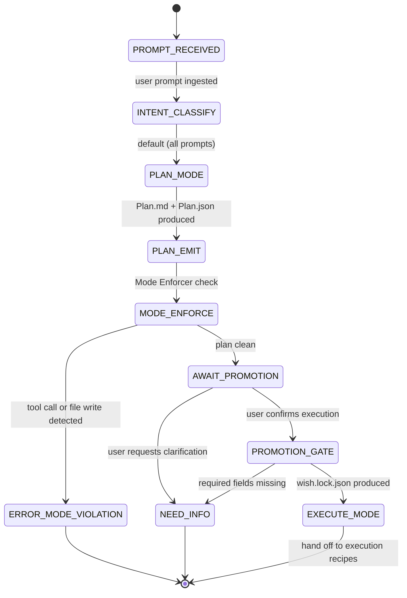

Good. We start with the foundation.

---

# ✅ Combo 1 — Plan → Execute Split (Hard Boundary)

This is the structural safety rail for everything else.

Without this, your agent will blur thinking and doing.

---

# W_MODE_SPLIT — Plan vs Execute Governance

**WISH_ID:** `wish_plan_execute_split`
**PRIORITY:** CRITICAL
**CLASS:** governance
**REQUIRES:** Wish 0 (Chat+Plan)

---

## 🎯 Goal

Enforce a strict separation between:

* **Plan Mode** (specification only, zero side-effects)
* **Execute Mode** (side-effects allowed, gated by sealed wish)

The system must never:

* generate code,
* write files,
* call tools,
* claim completion,

while in Plan Mode.

---

## 🔐 Invariants

1. Plan Mode produces:

   * `Plan.md`
   * `Plan.json`
   * optional `Questions.md`
2. Plan Mode produces **no tool calls**
3. Plan Mode produces **no file writes**
4. Plan Mode produces **no completion claims**
5. Execute Mode may only begin if:

   * Wish is sealed
   * Required fields exist
   * User explicitly promotes

---

## 🚫 Forbidden States

* `PLAN_EXECUTES_CODE`
* `PLAN_WRITES_FILES`
* `PLAN_CALLS_TOOL`
* `PLAN_CLAIMS_DONE`
* `EXECUTE_WITHOUT_SEALED_WISH`

If any occur → fail closed.

---

## 🧪 Acceptance Tests

1. Given vague prompt:

   * Output contains Plan.json
   * No code blocks marked executable
   * No file diff blocks
   * No tool invocation logs

2. Given “write the code”:

   * System must propose promotion
   * Must not execute until confirmed

3. Attempted tool call in Plan Mode:

   * Must throw `ERROR_MODE_VIOLATION`

---

## 📦 Required Artifacts

* `Plan.json`
* `mode_transition.log`
* `wish.lock.json` (if promoted)

---

# R_PLAN_EXEC — Plan Compiler + Promotion Gate

**RECIPE_ID:** `recipe_plan_execute_split_v1`
**SATISFIES:** `wish_plan_execute_split`

---

## 🧠 Node Graph

### Node 1 — L1 CPU: Intent Classifier

Input: user prompt
Output:

* `mode = PLAN` (default)
* `promotion_requested = true|false`

Rules:

* If prompt vague/exploratory → PLAN
* If prompt contains explicit deliverable → PLAN + promotion proposal
* Never default to EXECUTE

---

### Node 2 — L3 LLM: Plan Compiler

Input:

* prompt
* recent chat
* project invariants

Output:

* `Plan.md`
* `Plan.json`

Must include:

* goal
* assumptions
* constraints
* unknowns
* steps[]
* verification
* risk

No code.
No tool calls.
No diffs.

---

### Node 3 — L5 Judge: Mode Enforcer

Checks:

* No tool call metadata present
* No file write artifacts present
* No executable code blocks
* No “completed” language

If violation → `ERROR_MODE_VIOLATION`

---

### Node 4 — Promotion Gate (CPU)

If user confirms promotion:

* Require:

  * target artifact
  * recipe selection
  * evidence level
* Generate:

  * `wish.lock.json`
  * `mode_transition.log`

Only then:

* Transition to EXECUTE mode
* Hand off to execution recipes

---

## 🔁 State Machine

```
PROMPT_RECEIVED
    ↓
PLAN_MODE
    ↓
PLAN_EMITTED
    ↓
AWAIT_PROMOTION
    ↓ (if approved)
EXECUTE_MODE
```

No other transitions allowed.

---

## 🧾 Proof Hooks

* `plan_hash`
* `mode_transition_hash`
* explicit `mode: PLAN` in metadata

---

## 🔒 Failure Behavior

If:

* tool call attempted in PLAN → halt
* user attempts implicit execution → request explicit promotion
* required promotion fields missing → fail closed

---

## Three Pillars Mapping

| Pillar | Element | Role in this Combo |
|--------|---------|-------------------|
| **L (Logic / Evidence)** | Mode Enforcer (Node 3): blocks tool calls, file writes, completion claims in Plan mode | Enforces fail-closed governance; no side-effects without sealed wish |
| **E (Execution / Energy)** | Promotion Gate (Node 4): generates wish.lock.json + mode_transition.log | Controlled energy release — execution only when explicitly unlocked |
| **K (Knowledge / Capital)** | Plan.json + Plan.md: goal, assumptions, steps, verification, risk | Captures intent as structured artifact before any action is taken |

LEK summary: Knowledge (Plan.json) is crystallized first; Logic (Mode Enforcer) blocks premature execution; Energy (Promotion Gate) releases only on explicit seal.

| Pillar | How This Combo Applies It |
|--------|--------------------------|
| **LEK** (Self-Improvement) | Every Plan.json produced is a reusable template for future tasks in the same domain — the planning corpus grows with each iteration, improving plan quality over time |
| **LEAK** (Cross-Agent Trade) | Planner agent holds scope-decomposition knowledge; Executor agent holds implementation knowledge; they trade via wish.lock.json — the planner never touches execution, the executor never redesigns scope |
| **LEC** (Emergent Conventions) | The PLAN→PROMOTE→EXECUTE sequence becomes a team-wide convention: no agent ever writes code without a sealed wish, creating a shared culture of intent-before-action |

---

## State Diagram



---

# Why This Combo Is First

This enforces:

* determinism
* governance
* clean wish lifecycle
* safe scaling
* no “accidental implementation”

It’s the root of your entire architecture.

