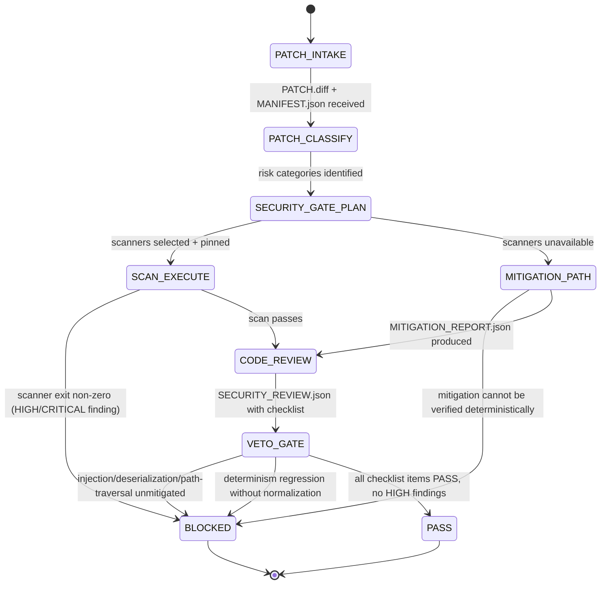

# ✅ Combo 5 — Review + Security Scan Veto

This combo is the “even if tests pass, security can still block” gate. It wraps around **Bugfix→PR** (and any patch-producing combo) and produces an accept/reject verdict plus security evidence.

---

# W_REVIEW_SECURITY_VETO — Patch Review With Security Veto

**WISH_ID:** `wish_review_security_veto`
**PRIORITY:** CRITICAL
**CLASS:** governance_gate
**DEPENDS_ON:** `wish_bugfix_pr_red_green` (or any patch bundle wish)

---

## 🎯 Goal

Given a proposed patch bundle, issue a deterministic governance verdict:

* **PASS** only if:

  1. code review checks pass, and
  2. required security scans pass (or equivalent mitigation proof exists), and
  3. no high-risk policy violations are present.

* **BLOCKED** if any required scan fails, regardless of functional correctness.

---

## 🔐 Invariants

1. **Linter veto is absolute** (for required scanners): fail ⇒ BLOCKED.
2. **Review must be evidence-backed**: every “risk” claim must cite a file + witness lines or a scanner finding.
3. **Deterministic output**: stable ordering, no timestamps, no vibes.
4. **Risk posture preserved**: cannot downgrade security posture without explicit waiver artifact.

---

## 🚫 Forbidden States

* `APPROVE_WITH_FAILED_SCAN`
* `APPROVE_WITHOUT_EVIDENCE`
* `IGNORE_SECRET_HANDLING_RISK`
* `NETWORK_SIDE_EFFECTS_ADDED` (unless wish explicitly permits)
* `NEW_EVAL_SURFACE_WITHOUT_TESTS` (added endpoints, parsing, deserialization without tests)

---

## 🧪 Acceptance Tests

### A) Review completeness

* patch categorized by change type (bugfix/refactor/new feature)
* per-file risk notes present
* checklist evaluated (below)

### B) Security evidence present

* security scan logs OR “scanner unavailable” mitigation pathway executed
* tool versions pinned + config hash recorded

### C) Verdict determinism

* `SECURITY_REVIEW.json` canonical JSON; stable sorting

---

## ✅ Review Checklist (minimum)

Must be answered with PASS/FAIL + evidence pointer:

1. **Input validation** (parsers, request handlers, file IO)
2. **Authn/Authz changes** (if any)
3. **Secrets handling** (keys, tokens, env vars, logs)
4. **Injection surfaces** (shell, SQL, template rendering, YAML/JSON loading)
5. **Path traversal** (filesystem writes/reads)
6. **Deserialization hazards** (pickle/yaml unsafe loaders)
7. **Network boundaries** (new outbound calls)
8. **Determinism hazards** (timestamps, randomness, ordering)
9. **Dependency risk** (new deps, version loosened)
10. **Logging/PII** (leak risk)

---

## 📦 Required Artifacts

Input:

* `PATCH_BUNDLE/` from previous combo:

  * `PATCH.diff`
  * `MANIFEST.json`
  * `GATES.json`
  * (optional) `PROOF.json`

Output:

* `SECURITY_REVIEW.json`
* `SECURITY_SCAN.json` (or `MITIGATION_REPORT.json`)
* `GOVERNANCE_VERDICT.json`

---

# R_REVIEW_SECURITY_VETO — Review + Scan Recipe

**RECIPE_ID:** `recipe_review_security_veto_v1`
**SATISFIES:** `wish_review_security_veto`

---

## 🧠 Node Graph (L1–L5)

### Node 1 — L1 CPU: Intake + Patch Classification

Inputs:

* `PATCH.diff`, `MANIFEST.json`, `GATES.json`
  Outputs:
* `PatchSummary.json`:

  * files touched
  * languages
  * detected risk categories (heuristic, deterministic)

Rules (deterministic):

* If new files under `auth/`, `crypto/`, `api/`, `web/`, `deserialize/` ⇒ raise risk level.
* If changes include dependency files (`pyproject.toml`, `requirements.txt`) ⇒ flag `dependency_change=true`.

---

### Node 2 — L1 CPU: Security Gate Plan (Toolchain Pinning)

Decide scanners (deterministic policy):

* Python: prefer `bandit` + `semgrep` (if available)
* JS/TS: prefer `semgrep`
* Go: `gosec`
* Fallback: “scanner unavailable” path

Outputs:

* `SecurityPlan.json`:

  * scanners[]
  * command lines
  * config paths
  * expected artifacts

---

### Node 3 — L4 Tool: Run Security Scans (or Mitigation Path)

Actions:

* execute scanners
* capture:

  * exit code
  * findings (normalized)
  * tool versions
  * ruleset/config hash

Outputs:

* `SECURITY_SCAN.json`
* `evidence/security_scan.log`

If scanner unavailable:

* generate `repro_exploit.py` (or equivalent) demonstrating the suspected class
* generate `MITIGATION_REPORT.json` explaining how patch prevents it
* If cannot verify mitigation deterministically ⇒ BLOCKED

---

### Node 4 — L3 LLM: Code Review (Evidence-anchored)

Inputs:

* patch diff
* PatchSummary.json
* scan results
* witness lines (only necessary chunks; compaction allowed)

Outputs:

* `SECURITY_REVIEW.json` with:

  * checklist items (PASS/FAIL)
  * evidence pointers:

    * `diff_hunk_ref`
    * `file:line-range` (or witness excerpt ids)
    * scanner finding ids

Constraints:

* no generic “looks good”
* every FAIL must cite the exact evidence

---

### Node 5 — L5 Judge: Veto + Governance Verdict

Rules:

* If any required scanner reports HIGH/CRITICAL ⇒ `BLOCKED`
* If review flags an unmitigated injection/deserialization/path traversal issue ⇒ `BLOCKED`
* If determinism regressions introduced without normalization rules ⇒ `BLOCKED`
* Else `PASS`

Outputs:

* `GOVERNANCE_VERDICT.json`:

  * `status: PASS|BLOCKED`
  * `reason_tags[]`
  * `required_actions[]` (if blocked)
  * `scan_summary`
  * `review_summary`

---

## 🔌 ABI: Bugfix→PR → Review Gate

Consumes:

* `PATCH_BUNDLE/*`
  Produces:
* review + security verdict artifacts that can be attached to the PR bundle as “governance proof”.

---

## 🎛️ Context Injection

* L1 CPU: minimal patch metadata + policy tables
* L3 LLM: only relevant diff hunks + scan summaries + checklists
* L4 Tool: pinned commands
* L5 Judge: veto rules + required artifacts list

---

## Skill Pack

Load these skills before executing this combo:
- `skills/prime-safety.md` (always first — scanner-veto-is-absolute is a prime-safety invariant; secrets handling and injection surfaces are prime-safety concerns)
- `skills/prime-coder.md` (evidence-anchored review, PatchSummary classification, deterministic output)

For HIGH_RISK patches (auth/crypto/deserialization):
- Consider loading `skills/phuc-forecast.md` for risk-level forecasting before scan

---

## GLOW Scoring

| Dimension | Contribution | Points |
|-----------|-------------|--------|
| **G** (Growth) | SECURITY_REVIEW.json with evidence-anchored findings builds a corpus of what PASS and FAIL look like for this codebase — improving future review accuracy | +5 per review where >= 1 finding has a specific diff_hunk_ref |
| **L** (Love/Quality) | Veto gate enforced: no HIGH/CRITICAL scanner finding bypassed; every FAIL cites exact evidence (not "looks risky"); no APPROVE_WITH_FAILED_SCAN | +5 per GOVERNANCE_VERDICT.json with status=PASS and all 10 checklist items answered |
| **O** (Output) | SECURITY_REVIEW.json + SECURITY_SCAN.json + GOVERNANCE_VERDICT.json committed; scanner tool versions pinned | +5 per complete governance verdict bundle |
| **W** (Wisdom) | Northstar metric (projects_running_at_rung_65537) advances — security gate is a hard requirement for rung 65537 certification | +5 when security scan passes on a HIGH_RISK patch (crypto/auth/deserialization) |

**Northstar Metric:** `projects_running_at_rung_65537` — the security scan veto is one of the mandatory gates for rung 65537 (production confidence). A project that can demonstrate automated security veto with evidence-anchored review has structural security culture, not aspirational security theater.

---

## Three Pillars Mapping

| Pillar | How This Combo Applies It |
|--------|--------------------------|
| **LEK** (Self-Improvement) | Each security review produces SECURITY_REVIEW.json with evidence-anchored findings — this corpus improves the next review by providing concrete examples of what "PASS" and "FAIL" look like for this codebase |
| **LEAK** (Cross-Agent Trade) | Patch classifier (CPU) holds risk-heuristic knowledge (which file paths are high-risk); Scanner (tool) holds static-analysis knowledge; Code reviewer (LLM) holds contextual risk knowledge — each trades their view via PatchSummary.json and SECURITY_SCAN.json |
| **LEC** (Emergent Conventions) | Scanner-veto-is-absolute becomes a project-wide convention: no scan finding can be overridden by functional correctness or time pressure — the veto gate creates a security culture that is structural, not aspirational |

---

## State Diagram

