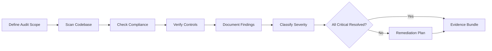

# Audit Combo

## Agents
- **security-auditor** (opus) -- comprehensive audit, compliance checks, evidence trail

## Skill Pack
- prime-safety (god-skill, always first)
- security (compliance frameworks, audit procedures, vulnerability analysis)

## Execution Flow

## Evidence Required
- audit_report.json (comprehensive findings with severity classification)
- compliance_check.json (framework compliance status)
- controls_verification.json (security controls tested and results)
- remediation_plan.md (action items for unresolved findings)
- scan_results.json (automated scanner output)
- env_snapshot.json (reproducibility)

## Notes
- Uses **opus** model tier -- audit decisions require deep reasoning
- Rung target **274177** requires stability across edge cases and stress testing
- Audit combo does not fix issues -- it produces findings and remediation plans
- Remediation is delegated to security-combo or bugfix-combo
