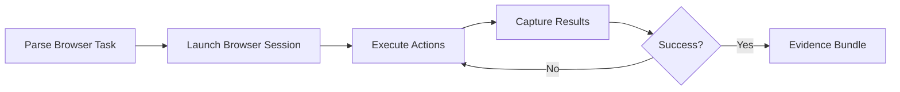

# Browser Combo

## Agents
- **twin-agent** (sonnet) -- automate browser interactions, scrape data, fill forms, capture screenshots

## Skill Pack
- prime-safety (god-skill, always first)
- prime-browser (browser automation expertise)

## Execution Flow

## Evidence Required
- browser_log.json (action sequence and results)
- screenshots/ (captured page states)
- extracted_data.json (scraped content if applicable)
- env_snapshot.json (reproducibility)

## Notes
- Browser sessions are isolated and ephemeral
- All navigation is scope-gated by recipe permissions
- Screenshots provide visual evidence of completion
