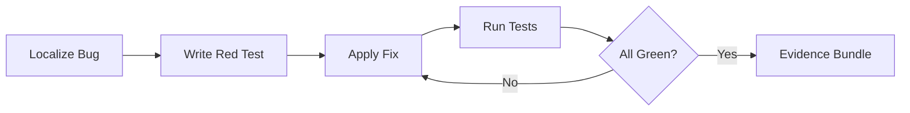

# Bugfix Combo

## Agents
- **coder** (sonnet) -- localize bug, write failing test, apply fix, run tests
- **skeptic** (sonnet) -- verify fix doesn't introduce regressions, check edge cases

## Skill Pack
- prime-safety (god-skill, always first)
- prime-coder (red/green gate, evidence bundle)

## Execution Flow

## Evidence Required
- test_results.json (red-to-green proof)
- PATCH_DIFF (the actual fix)
- env_snapshot.json (reproducibility)
