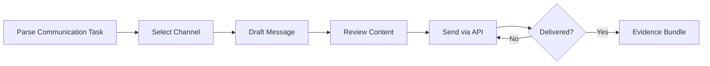

# Communicate Combo

## Agents
- **coder** (sonnet) -- build and send communications via APIs (email, Slack, Discord, webhooks)

## Skill Pack
- prime-safety (god-skill, always first)
- prime-coder (implementation)
- prime-api (API integration for communication services)

## Execution Flow

## Evidence Required
- message_draft.md (content before sending)
- delivery_receipt.json (API response confirming delivery)
- env_snapshot.json (reproducibility)

## Notes
- All outbound messages require explicit user approval before sending
- Email/Slack/Discord APIs must be pre-authenticated via OAuth3
- Message content is logged for audit trail
