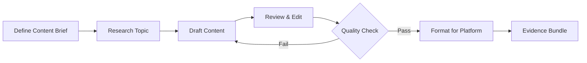

# Content Combo

## Agents
- **writer** (sonnet) -- draft long-form content, articles, documentation
- **social-media** (sonnet) -- adapt content for social platforms, create campaigns

## Skill Pack
- prime-safety (god-skill, always first)
- prime-docs (writing and documentation expertise)

## Execution Flow

## Evidence Required
- content_draft.md (written content)
- platform_versions/ (adapted versions per platform)
- style_check.json (tone, readability, SEO metrics)
- env_snapshot.json (reproducibility)

## Notes
- Content must match brand voice guidelines if provided
- Social media posts are limited to platform character limits
- All content is reviewed before publishing
