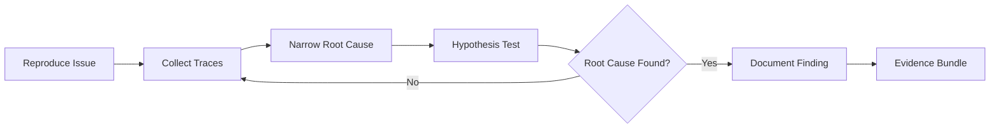

# Debug Combo

## Agents
- **coder** (sonnet) -- reproduce issue, trace root cause, propose fix

## Skill Pack
- prime-safety (god-skill, always first)
- prime-coder (evidence bundle, systematic diagnosis)

## Execution Flow

## Evidence Required
- reproduction_steps.json (how to reproduce the issue)
- trace_log.json (diagnostic traces and observations)
- root_cause.md (explanation of the root cause)
- PATCH_DIFF (fix, if applied)
- env_snapshot.json (reproducibility)

## Notes
- Debug combo focuses on diagnosis, not necessarily fixing
- The fix may be delegated to bugfix-combo after root cause is identified
- Reproduction steps are mandatory -- no diagnosis without reproduction
