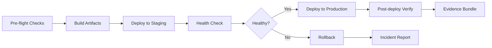

# Deploy Combo

## Agents
- **coder** (sonnet) -- prepare deployment, run pre-flight checks, execute rollout

## Skill Pack
- prime-safety (god-skill, always first)
- devops (deployment procedures, rollback protocols)

## Execution Flow

## Evidence Required
- deploy_log.json (deployment steps and outcomes)
- health_check.json (pre and post-deploy health status)
- rollback_plan.md (documented rollback procedure)
- env_snapshot.json (reproducibility)
