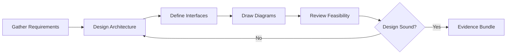

# Design Combo

## Agents
- **planner** (sonnet) -- design system architecture, define interfaces, produce diagrams

## Skill Pack
- prime-safety (god-skill, always first)
- prime-coder (interface specifications, evidence bundle)

## Execution Flow

## Evidence Required
- design.md (architecture document with diagrams)
- interfaces.json (API or module interface specifications)
- feasibility_check.json (resource and complexity assessment)
- env_snapshot.json (reproducibility)

## Notes
- Design combo produces artifacts, not code
- Output feeds into feature-combo or refactor-combo for implementation
- Diagrams use mermaid format for version-control friendliness
