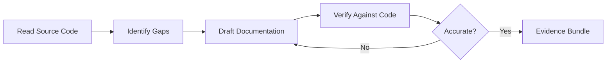

# Docs Combo

## Agents
- **writer** (haiku) -- write clear documentation, verify accuracy against code

## Skill Pack
- prime-safety (god-skill, always first)

## Execution Flow

## Evidence Required
- PATCH_DIFF (documentation changes)
- accuracy_check.json (cross-reference of docs against actual code behavior)
- env_snapshot.json (reproducibility)

## Notes
- Uses **haiku** model tier -- documentation does not require heavy reasoning
- Writer agent focuses on clarity, completeness, and accuracy
- No test gate required, but accuracy verification against source is mandatory
