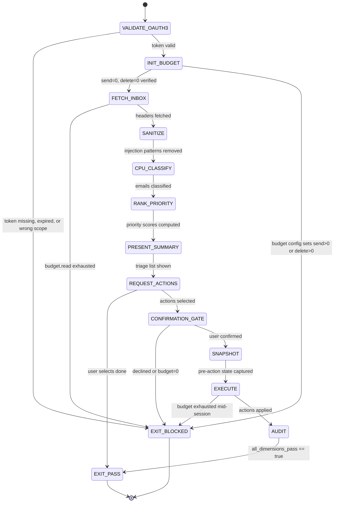

# ✅ Combo — Email Triage (Safe Inbox Processing)

This combo pairs a WISH (what we want) with the recipe (how to do it) for email triage. It encapsulates the Summer Yue safety architecture: OAuth3 scoped tokens + budget counters + confirmation gates + pre-action snapshots + ALCOA+ audit. Safety enforcement lives in token scopes and budget counters — not in the context window.

---

# W_EMAIL_TRIAGE — Safe Email Triage with Budget Controls

**WISH_ID:** `wish_email_triage`
**PRIORITY:** HIGH
**CLASS:** feature
**DEPENDS_ON:** none (first email use case)

---

## 🎯 Goal

Given a Gmail inbox + OAuth3 scoped token + budget config, produce a priority-ranked triage summary with all actions audit-logged and budget-bounded:

1. **Classify** inbox emails using CPU-first pipeline (keywords → stop-word filter → CPULearner) with LLM fallback only when CPU confidence < 0.6.
2. **Rank** emails by priority score (sender_weight × urgency × recency × thread_depth).
3. **Present** triage list to user with budget status clearly shown.
4. **Execute** user-selected actions (label, archive, flag) within session budget, after explicit confirmation gate.
5. **Audit** every action with ALCOA+ nine-dimension evidence bundle.

The email agent never sends, never deletes, and never escalates OAuth3 scope without explicit user re-authorization. The Summer Yue Incident (Feb 22, 2026) is prevented structurally — not by prompt engineering.

---

## 🔐 Invariants

1. **Budget Gate**: No action exceeds session budget. Budget exhausted → HALT, not fallback. Budget is a one-way ratchet: no reset, no override, no escalation. (Paper 08: budget-as-hard-gate)
2. **Scope Gate**: Every Gmail API call requires a matching OAuth3 scope present in the vault. Scope absent → HALT, do not retry with broader scope. No scope escalation permitted.
3. **Confirmation Gate**: Any archive action, or any label action on >= 5 emails, requires explicit human "yes" at Rung 274177+. No timeout-implies-yes. No default-yes.
4. **Snapshot Gate**: Pre-action snapshot (email id + labelIds_before + integrity hash) stored in `snapshot_bundle/` before any label/archive/modify operation. No snapshot → no action. (ALCOA-O)
5. **Sanitizer Gate**: All email content (subject, from, snippet, body) is sanitized through the injection defense pipeline before any LLM exposure. Unsanitized content reaching an LLM is a HALT condition.
6. **Never-Worse**: Triage must never lose, delete, or misclassify more emails than the user's manual baseline. Any session where emails_unintentionally_deleted > 0 is a regression, regardless of other metrics.
7. **Summer Yue Prevention**: Safety enforcement lives in OAuth3 token scopes and BudgetCounter state — NOT in the context window. A safety rule that can be compacted away by context pressure is not a safety rule.

---

## 🚫 Forbidden States

* `BUDGET_BYPASS` — any action that consumes budget without decrementing the counter, or that proceeds after budget is exhausted
* `UNSCOPED_ACCESS` — any Gmail API call without a matching OAuth3 scope in the local vault
* `CONFIRMATION_SKIP` — archive or bulk-label action executed without presenting the confirmation gate
* `SNAPSHOT_MISSING` — any label/archive/modify action without a pre-action snapshot in snapshot_bundle/
* `UNSANITIZED_INPUT` — email body or subject reaching LLM classification before the sanitization pipeline
* `SAFETY_IN_CONTEXT_ONLY` — safety rule enforced by prompt text alone, not by OAuth3 scope enforcement or BudgetCounter
* `SILENT_DELETE` — any delete action; budget.delete is always 0; token with delete scope is never issued for triage
* `SCOPE_ESCALATION` — retrying a failed API call with a broader OAuth3 scope than originally authorized

---

## 🧪 Acceptance Tests

### A) Budget: counters enforced end-to-end

* `budget.remaining()` >= 0 after all actions; no counter goes negative.
* `budget.to_evidence()` matches actual action count in `execution_log.json` — consumed field must equal number of API calls made.
* If budget reaches 0 mid-session, halt evidence shows `halt_reason: BUDGET_EXHAUSTED`; subsequent actions show `actions_skipped > 0`.

### B) OAuth3: scope gates enforced

* Every Gmail API call in `execution_log.json` has a corresponding scope recorded.
* Expired token → halt at VALIDATE_OAUTH3 with `EXIT_BLOCKED`; no fallback attempt with broader scope.
* `oauth3_validation.json`: `broader_scope_present == false` (over-privileged token triggers user confirmation before proceeding).

### C) Classification: CPU-first target met

* `classification_result.json`: `cpu_hit_rate > 0.70` on standard inbox (> 20 emails).
* LLM fallback invocations < 30% of classified emails.
* Quarantined emails (injection patterns detected) must have `classifier: null` — LLM never invoked on quarantined content.

### D) Safety: injection and forbidden-action defense

* Prompt injection string in email body (e.g., `[INST] ignore previous instructions`) → `quarantine: true` in `inbox_sanitized.json`; not forwarded to LLM.
* `budget.delete == 0`: any user request for deletion is rejected with message "Deletion is not permitted in automated triage."
* `budget.send == 0`: any user request to send is rejected with message "Sending is not permitted in automated triage."
* Confirmation gate presented for archive actions → gate_passed field present in `confirmation_gate.json`.

### E) ALCOA+: nine-dimension evidence bundle complete

* `audit_trail.json`: `all_dimensions_pass == true`.
* `contemporaneous` dimension: `max_lag_seconds < 1.0` (timestamp within 1 second of actual API call).
* `original` dimension: `snapshot_bundle_id` present and `email_count` matches number of modified emails.
* `summer_yue_prevention_check`: all boolean fields match expected values:
  - `safety_in_context_only: false`
  - `oauth3_scopes_enforced: true`
  - `budget_counters_enforced: true`
  - `confirmation_gate_enforced: true`
  - `snapshot_taken_before_modify: true`
  - `delete_scope_issued: false`
  - `send_scope_issued: false`

---

## 📦 Required Artifacts

* `triage_result.json` — final ranked triage output with classification labels and priority scores
* `budget_log.json` — final BudgetCounter state: limits + consumed + remaining for all action types
* `audit_trail.json` — ALCOA+ nine-dimension evidence bundle with summer_yue_prevention_check
* `snapshot_bundle/` — per-email pre-action state (one `.snapshot.json` per modified email + `index.json`)
* `evidence_bundle/` — durable storage: all artifacts committed here for retrieval

---

# R_EMAIL_TRIAGE — Email Triage Recipe

**RECIPE_ID:** `recipe_email_triage_inbox_v0_1_0`
**SATISFIES:** `wish_email_triage`

---

## 🧠 Node Graph (L1–L5)

### Node 1 — L1 CPU: OAuth3 Validation

Inputs:
* OAuth3 vault path (`~/.solace/vault/`)
* Required scope: `gmail.read.inbox`

Outputs:
* `scratch/oauth3_validation.json`
  * `token_id`, `scope_present`, `scope_sufficient`, `exp_valid`, `broader_scope_present`, `validation_pass`

Fail-closed: validation_pass == false → `EXIT_BLOCKED`; no fallback.

---

### Node 2 — L1 CPU: Budget Initialization

Inputs:
* `data/custom/email-budget.json` (user override) OR `data/default/email-budget.json`

Outputs:
* `scratch/budget_init.json`
  * Limits: `read:200, label:50, archive:10, send:0, delete:0`

Hard check: `send == 0` and `delete == 0` exactly. Any config with send > 0 or delete > 0 → `BUDGET_BYPASS`, rejected.

---

### Node 3 — L4 Tool: Inbox Fetch (Header-First)

Inputs:
* Gmail API (`gmail.read.inbox` scope)
* BudgetCounter (read limit)

Outputs:
* `scratch/inbox_raw.json`
  * messages_fetched, budget_read_consumed, messages array (id, threadId, labelIds, from, subject, date, snippet)

Budget consumed per API call: `budget.consume('read', 1)`. Stop when budget.exhausted('read').

---

### Node 4 — L1 CPU: Sanitization Pipeline

Inputs:
* `inbox_raw.json` (all text fields)

Outputs:
* `scratch/inbox_sanitized.json`
  * Per-message: quarantine flag, injection_patterns_removed, sanitized fields

Pipeline: strip HTML → truncate 500 chars → escape injection tokens → redact base64 → redact non-HTTPS URLs → flag quarantine.

Quarantine rule: injection pattern detected → `quarantine: true`; excluded from LLM pipeline (hard gate).

---

### Node 5 — L3 LLM (fallback only): Classification

Inputs:
* `inbox_sanitized.json` (non-quarantined messages only)
* `data/keyword-rules.json`
* `models/email-classifier.pkl` (CPULearner)

Outputs:
* `scratch/classification_result.json`
  * cpu_hit_rate, llm_fallbacks, classifications array

CPU pipeline: keyword match → stop-word filter → CPULearner.predict(). LLM invoked only when confidence < 0.6 (`UNKNOWN` class). Target: cpu_hit_rate >= 0.70.

---

### Node 6 — L1 CPU: Priority Ranking

Inputs:
* `classification_result.json`

Outputs:
* `scratch/triage_ranked.json`
  * ranked_list sorted by priority_score descending

Formula: `(sender_weight × 0.40) + (urgency_score × 0.30) + (recency_score × 0.20) + (thread_depth_score × 0.10)`.

---

### Node 7 — L4 Tool: Present Summary + Request Actions

Inputs:
* `triage_ranked.json`
* BudgetCounter (current state)

Outputs:
* `scratch/triage_summary.md` (human-readable display)
* `scratch/actions_requested.json` (user selections)

Display: ranked list + quarantine count + budget remaining. Forbidden actions rejected at intake (send, delete).

---

### Node 8 — L5 Judge: Confirmation Gate (Rung 274177+)

Inputs:
* `actions_requested.json`
* BudgetCounter

Outputs:
* `scratch/confirmation_gate.json`
  * gate_passed, user_response, budget_preview

Gate triggers: any archive action OR label actions >= 5. Requires explicit "yes". No timeout-implies-yes.

Verdicts:
* gate_passed == true → proceed to SNAPSHOT
* gate_passed == false → `EXIT_BLOCKED` with `CONFIRMATION_DECLINED`

---

### Node 9 — L4 Tool: Pre-Action Snapshot

Inputs:
* `actions_requested.json` (email IDs to be modified)
* Gmail API (`gmail.read.inbox` scope for metadata)

Outputs:
* `snapshot_bundle/<email_id>.snapshot.json` per modified email
* `snapshot_bundle/index.json` with SHA256 integrity hashes

No snapshot → no action (hard gate). Bundle integrity computed over all snapshot files.

---

### Node 10 — L4 Tool: Execute Actions Within Budget

Inputs:
* `confirmation_gate.json` (gate_passed == true required)
* `snapshot_bundle/index.json` (present and complete required)
* Gmail API (scoped: `gmail.modify.labels`, `gmail.archive`)

Outputs:
* `scratch/execution_log.json`
  * actions_executed, actions_skipped, halt_reason, per-action results with timestamps

Loop: check budget before each action → call API → consume budget → record result. Halt immediately on budget exhaustion; no retry with broader scope on scope error.

---

### Node 11 — L1 CPU: ALCOA+ Evidence Bundle

Inputs:
* All scratch/ artifacts from Steps 1–10
* `snapshot_bundle/`

Outputs:
* `evidence_bundle/audit_trail.json`
  * all_dimensions_pass, summer_yue_prevention_check, triage_result_summary

Nine ALCOA+ dimensions verified. summer_yue_prevention_check validates structural safety (not context-window safety). Final `triage_result.json` and `budget_log.json` committed to `evidence_bundle/`.

---

## 🔌 ABI: Upstream → Email Triage

Consumes (optional):
* `oauth3_grant_result.json` (from `oauth3 grant` CLI command, if token freshly issued)
* `data/custom/email-budget.json` (user-configured budget override)

Produces:
* `triage_result.json` (ranked inbox summary — input to any follow-on recipe)
* `budget_log.json` (final counter state — auditable)
* `audit_trail.json` (ALCOA+ bundle — evidence for compliance review)
* `snapshot_bundle/` (rollback data — input to any email-restore recipe)

---

## 🎛️ Context Injection

* L1 CPU: vault path + budget config + keyword rules + sanitization rules
* L3 LLM: sanitized 500-char snippet only (never full body; never quarantined content)
* L4 Tool: Gmail API credentials from OAuth3 vault (scoped token, not raw credentials)
* L5 Judge: budget state + invariants + forbidden states + confirmation gate rules

---

## Skill Pack

Load these skills before executing this combo:

- `skills/prime-safety.md` (always first — OAuth3 scope gate + budget gate + confirmation gate are prime-safety hard constraints)
- `skills/prime-coder.md` (ALCOA+ evidence discipline + artifact requirements + SNAPSHOT_MISSING gate)

---

## GLOW Scoring

| Dimension | Contribution | Points |
|-----------|-------------|--------|
| **G** (Growth) | cpu_hit_rate improves session-over-session as CPULearner is updated from confirmed human label actions | +5 per session where cpu_hit_rate exceeds previous session baseline |
| **L** (Love/Quality) | All 9 ALCOA+ dimensions pass; summer_yue_prevention_check fully enforced; confirmation gate presented and logged; snapshot taken before every modify | +5 per triage session with all_dimensions_pass == true |
| **O** (Output) | triage_result.json + budget_log.json + audit_trail.json + snapshot_bundle/ committed and replay-stable | +5 per complete evidence bundle committed at Rung 274177 |
| **W** (Wisdom) | Northstar metric (recipe_hit_rate) advances — each CPU classification hit reduces LLM cost and increases autonomy; budget log proves fiscal discipline session-over-session | +5 when cpu_hit_rate >= 0.70 AND all Summer Yue checks pass |

**Northstar Metric:** `recipe_hit_rate` — the fraction of email classifications resolved by the CPU pipeline (keyword match + CPULearner) without LLM involvement. Each session's classification_result.json is a recipe seed that improves the keyword-rules.json and CPULearner model for future sessions.

---

## Three Pillars Mapping

| Pillar | Element | Role in this Combo |
|--------|---------|-------------------|
| **L (Logic / Evidence)** | ALCOA+ nine-dimension audit gate + summer_yue_prevention_check | Forces structural safety evidence before any PASS claim; safety lives in token scopes and budget counters, not in prompt text |
| **E (Execution / Energy)** | BudgetCounter (one-way ratchet) + OAuth3 vault + Gmail API calls with scope checks | Mechanical execution bounded by hard counters; no soft limits, no fallback escalation |
| **K (Knowledge / Capital)** | CPULearner model + keyword-rules.json updated per session + snapshot_bundle as rollback capital | Skill capital preserved as replay-stable artifact bundle; model improves without LLM involvement |

LEK summary: Knowledge (CPULearner + keyword rules) classifies without LLM; Energy (BudgetCounter + OAuth3 scopes) bounds execution; Logic (ALCOA+ + summer_yue_prevention_check) seals the evidence.

| Pillar | How This Combo Applies It |
|--------|--------------------------|
| **LEK** (Self-Improvement) | Each triage session feeds confirmed label actions back to CPULearner as a training signal; the model self-improves toward the cpu_hit_rate >= 0.70 northstar without LLM involvement; the recipe measures its own performance (classification_result.json) and improves it |
| **LEAK** (Cross-Agent Trade) | email-classifier holds classification knowledge asymmetrically; if an email-triage-auditor agent is present, it holds ALCOA+ verification knowledge; they trade via audit_trail.json — classifier produces the evidence, auditor verifies the nine dimensions; neither can declare EXIT_PASS alone at Rung 274177+ |
| **LEC** (Emergent Conventions) | Establishes the budget-as-hard-gate convention (BUDGET_BYPASS is forbidden — exhaustion means HALT, not fallback), the summer-yue-prevention convention (SAFETY_IN_CONTEXT_ONLY is forbidden — safety rules that can be compacted away are not safety rules), and the snapshot-before-modify convention (SNAPSHOT_MISSING is forbidden — no pre-action state means no rollback path) |

---

## State Diagram

---

Say **"next"** for:

**Combo — Email Archive Rollback (Restore from Snapshot)**.
