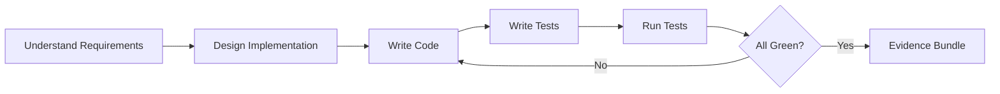

# Feature Combo

## Agents
- **coder** (sonnet) -- implement new feature, write tests, ensure coverage

## Skill Pack
- prime-safety (god-skill, always first)
- prime-coder (evidence bundle, test gate)

## Execution Flow

## Evidence Required
- test_results.json (all tests pass)
- PATCH_DIFF (new feature code)
- env_snapshot.json (reproducibility)
