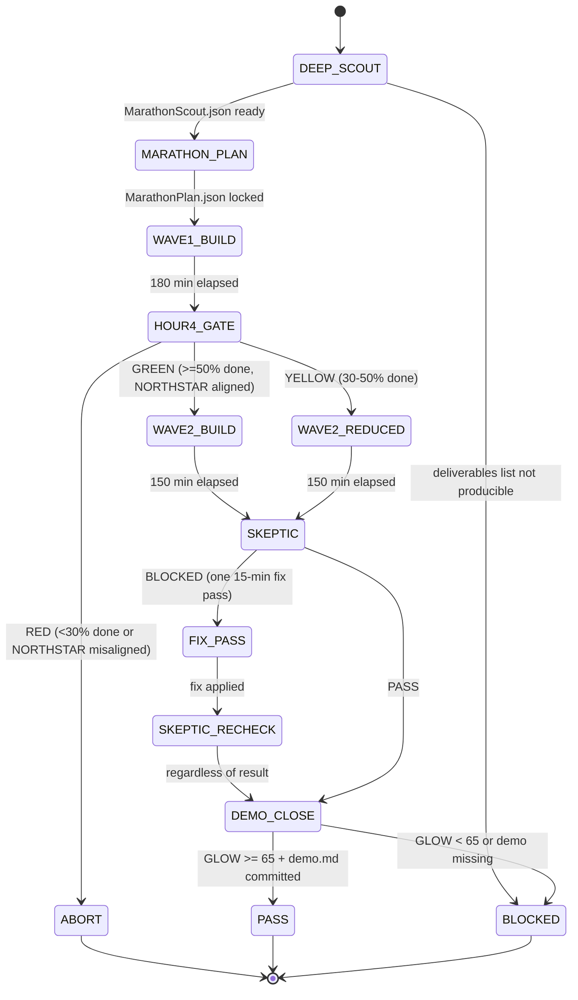

# Combo 8b — Hackathon Marathon (8-Hour Sprint)

The marathon sprint is for big, multi-phase builds. A full ROADMAP phase. A new system from scratch. A paper + skill + swarm + tests delivered in one focused session.

---

# W_HACKATHON_MARATHON — 8-Hour Build Contract

**WISH_ID:** `wish_hackathon_marathon`
**PRIORITY:** HIGH
**CLASS:** execution
**DEPENDS_ON:** `wish_hackathon_sprint`
**VARIANT_OF:** `wish_hackathon_sprint`

---

## Skill Pack

Load these skills before executing this combo:
- `skills/prime-safety.md` (always first — WAVE_WITHOUT_GATE and SKEPTIC_SKIPPED_MARATHON are prime-safety governance violations)
- `skills/prime-coder.md` (Wave 1+2 builds: evidence bundle, tests.json, behavior hash for all code produced)
- `skills/phuc-forecast.md` (Deep Scout phase: DREAM→FORECAST for full NORTHSTAR alignment + integration risk forecast)
- `skills/phuc-orchestration.md` (sub-agent dispatch in Wave 1: each subtask dispatched to typed sub-agent with full skill pack + CNF capsule)

---

## Goal

Deliver a complete ROADMAP phase or major system in 8 hours. The marathon is not a longer version of the lightning sprint — it is a structured multi-wave execution with explicit breaks, mid-point verification gates, and a high-quality demo at the end.

An 8-hour marathon is appropriate for:
- Delivering a full ROADMAP phase (e.g., Phase 1: OAuth3 Integration)
- Building a complete system: skill + swarm + paper + tests
- A new persona category with multiple personas + engine update
- A major feature that spans multiple files and requires integration testing

---

## Invariants

1. **Mid-point gate at Hour 4**: hard review. If less than 50% of deliverables are done, trigger scope reduction. No exceptions.
2. **Wave structure**: build in two waves of 3 hours each, with a 1-hour rest between waves.
3. **One lead builder**: even in a marathon, there is one lead agent. Sub-agents can be dispatched for specialized subtasks.
4. **Evidence bundle is a first-class artifact**: not an afterthought. `sprint.json` is updated after each wave.
5. **GLOW minimum 65**: marathon pace is warrior pace.
6. **Skeptic is mandatory**: at least one full skeptic pass before Close.
7. **NORTHSTAR gate is hard**: if mid-point review reveals NORTHSTAR misalignment, pivot or stop. No wasted second wave.

---

## Forbidden States

All forbidden states from `wish_hackathon_sprint`, plus:
* `WAVE_WITHOUT_GATE` — starting Wave 2 without completing the Hour 4 gate review
* `SKEPTIC_SKIPPED_MARATHON` — no Skeptic pass before Close (mandatory in marathon)
* `GLOW_BELOW_65_MARATHON` — marathon PASS requires GLOW >= 65 (warrior pace)
* `HOUR_8_DEMO_MISSING` — marathon ended without a comprehensive demo

---

## Required Artifacts

* `evidence/sprint.json` (full: wave logs, scope cuts, mid-point gate result)
* `evidence/demo.md` (comprehensive: all deliverables, how to run each)
* `evidence/glow_score.json`
* `evidence/tests.json` (tests pass for all code produced)
* `evidence/skeptic_verdict.json` (mandatory in marathon)

---

# R_HACKATHON_MARATHON — 8-Hour Sprint Recipe

**RECIPE_ID:** `recipe_hackathon_marathon_v1`
**SATISFIES:** `wish_hackathon_marathon`

---

## Phase Timeline (8-hour marathon = 480 minutes)

```
Phase 0 — Deep Scout     (0:00 – 0:45)   9%  — 45 min; full discovery, NORTHSTAR alignment, sub-task breakdown
Phase 1 — Plan           (0:45 – 1:15)   6%  — 30 min; full scope lock, wave planning, persona assignments
Wave 1 — Build (core)    (1:15 – 4:15)   37% — 180 min; core system, primary deliverables
Checkpoint — Hour 4 Gate (4:15 – 4:45)   6%  — 30 min; mid-point review, scope adjustment if needed
Wave 2 — Build (extend)  (4:45 – 7:15)   37% — 150 min; secondary deliverables, integration, evidence bundle
Phase 5 — Skeptic        (7:15 – 7:45)   6%  — 30 min; full skeptic review
Phase 6 — Demo + Close   (7:45 – 8:00)   3%  — 15 min; comprehensive demo.md, GLOW, commit
```

---

## Phase 0 — Deep Scout (45 minutes)

**Model**: sonnet
**Persona**: hackathon-master + dragon-rider

Unlike the lightning sprint, the marathon scout is a full NORTHSTAR review and sub-task decomposition. It is not a quick check — it is the foundation for 7 hours of work.

Scout outputs:
* `MarathonScout.json`:
  * `northstar_alignment` (full paragraph — this matters for 8 hours)
  * `deliverables[]` (ordered list; primary = Wave 1, secondary = Wave 2)
  * `riskiest_assumption` (the one thing most likely to cause the mid-point gate to fail)
  * `integration_risks[]` (where do the deliverables depend on each other?)
  * `persona_pack_wave1[]`
  * `persona_pack_wave2[]`
  * `rung_target` (641 / 274177 / 65537)

Fail-closed: if Scout cannot produce an ordered deliverables list, the marathon is not ready to start. The system is too fuzzy. Clarify and re-run Scout.

---

## Phase 1 — Marathon Plan (30 minutes)

**Model**: sonnet
**Persona**: hackathon-master

Full plan with wave structure:

```
Wave 1 deliverables (must complete by Hour 4):
  - [deliverable 1] — owner: lead agent, persona: X
  - [deliverable 2] — owner: lead agent, persona: Y
  - (optional) [deliverable 3] — can be cut if Wave 1 runs long

Wave 2 deliverables (complete by Hour 7.5):
  - [deliverable A] — depends on Wave 1 [deliverable 1]
  - [deliverable B] — independent
  - [deliverable C] — scope buffer; cut if needed

Scope cuts (not in this marathon):
  - [thing 1]
  - [thing 2]
  - (always 3+ scope cuts)
```

Outputs:
* `MarathonPlan.json`:
  * `wave1_deliverables[]`
  * `wave2_deliverables[]`
  * `scope_cuts[]`
  * `integration_plan` (how Wave 1 outputs feed Wave 2)
  * `mid_point_gate_criteria` (what "50% done" means concretely)

---

## Wave 1 — Core Build (180 minutes)

**Model**: sonnet or opus (for complex deliverables)
**Persona**: wave1 persona pack from MarathonScout

Sub-agent dispatch is allowed in Wave 1:
* Each specialized subtask (skill file, paper, code module) can be dispatched to a typed sub-agent
* Each dispatch must include: full skill pack inline + CNF capsule + rung_target
* Sub-agent results feed back to lead agent

Stop at 180 minutes regardless. Commit whatever is done.

Wave 1 ends with:
* All wave1_deliverables committed (or logged as incomplete in sprint.json)
* `evidence/sprint_wave1.json` (partial evidence bundle)

---

## Checkpoint — Hour 4 Gate (30 minutes)

**Model**: sonnet
**Persona**: hackathon-master + skeptic lens

Hard gate. Must answer:
1. Are Wave 1 deliverables > 50% complete? (binary, per deliverable)
2. Does the direction still align with NORTHSTAR? (yes/no)
3. Is Wave 2 plan still valid, or does scope need adjustment?
4. What is the riskiest remaining item for Wave 2?

Gate verdicts:
* **GREEN**: Wave 1 >= 50%, NORTHSTAR aligned → proceed to Wave 2 as planned
* **YELLOW**: Wave 1 = 30-50% complete → reduce Wave 2 scope, proceed
* **RED**: Wave 1 < 30% complete OR NORTHSTAR misaligned → abort Wave 2, write `marathon_abort.md` with lessons, close with GLOW

Outputs:
* `evidence/mid_point_gate.json`:
  * `verdict: GREEN|YELLOW|RED`
  * `wave1_completion_pct`
  * `northstar_alignment`
  * `wave2_plan_adjusted[]`

---

## Wave 2 — Extend + Integrate (150 minutes)

**Model**: sonnet
**Persona**: wave2 persona pack from MarathonScout

Wave 2 is about integration and completeness, not new discoveries:
* Build wave2_deliverables (adjusted from mid-point gate)
* Run integration tests across Wave 1 + Wave 2 outputs
* Build evidence bundle (tests.json, artifacts.json)
* Update case-study file with marathon progress

Wave 2 ends with:
* All deliverables committed or documented as scope-cut
* Full test suite run
* `evidence/sprint.json` updated with Wave 2 results

---

## Phase 5 — Skeptic Review (30 minutes)

**Model**: sonnet or opus (for security-sensitive deliverables)
**Persona**: schneier (if security) / kent-beck (if code) / fda-auditor (if evidence-heavy)

Mandatory in marathon. 30-minute time cap.

Skeptic checks:
* All wave1 + wave2 deliverables meet their rung_target
* No security issues introduced (prime-safety gate — hard)
* Evidence bundle is complete and hashes correct
* NORTHSTAR alignment still holds after full build
* Any scope cuts are documented with justification

Outputs:
* `evidence/skeptic_verdict.json`:
  * `overall_verdict: PASS|BLOCKED`
  * `deliverable_verdicts[]` (per deliverable)
  * `blocking_issues[]`
  * `non_blocking_notes[]`

If BLOCKED: one fix pass only (15 minutes), then re-run Skeptic (10 minutes), then proceed to Close regardless.

---

## Phase 6 — Demo + Close (15 minutes)

**Model**: haiku (speed)
**Persona**: hackathon-master

Write `evidence/demo.md` — comprehensive for marathon:

```markdown
# Marathon Sprint Demo — {sprint_name}

## What Was Built
{2-3 paragraph overview of the full marathon output}

## Deliverables

### Wave 1
- {deliverable 1}: {how to see it, what rung}
- {deliverable 2}: {how to see it, what rung}

### Wave 2
- {deliverable A}: {how to see it, what rung}
- {deliverable B}: {how to see it, what rung}

## How to Run
{exact commands for key deliverables}

## What Was Cut
{scope_cuts with reasons}

## Integration
{how Wave 1 and Wave 2 connect}

## Rung Achieved
{minimum rung across all deliverables}

## GLOW
G:{g} L:{l} O:{o} W:{w} Total:{total}
```

GLOW calculation for marathon sprints:

```
G (Growth):    +10 primary system committed; +5 secondary delivered; +5 tests pass; +5 rung 274177+
L (Learning):  +10 riskiest assumption tested (from Scout); +5 mid-point gate documented; +5 integration discovery; +5 scope cuts with lessons
O (Output):    +10 all Wave 1 deliverables done; +5 Wave 2 delivered; +5 evidence bundle complete; +5 skeptic PASS
W (Wins):      +10 NORTHSTAR aligned (confirmed by Skeptic); +5 ROADMAP phase advanced; +5 case-study updated; +5 marathon GLOW >= 65

Target: 70+ (marathon warrior pace)
Minimum to PASS: 65
```

Commit format:
```
feat: {sprint_name} — marathon sprint {date}

GLOW {total} [G:{g} L:{l} O:{o} W:{w}]
Sprint: 480min marathon | Deliverables: {N_wave1}+{N_wave2} | Scope cuts: {N}
Demo: {one-line summary}
Rung: {minimum_rung}
```

---

## Persona Pack Summary

| Phase | Primary | Secondary | Notes |
|-------|---------|-----------|-------|
| Scout | hackathon-master | dragon-rider | NORTHSTAR alignment is non-negotiable |
| Plan | hackathon-master | — | Scope lock; no persona debate |
| Wave 1 | domain persona | hackathon-master (scope guard) | Match domain (linus/guido/schneier/etc.) |
| Hour 4 Gate | hackathon-master | skeptic lens | Hard gate; dragon-rider if NORTHSTAR check needed |
| Wave 2 | domain persona (may differ from W1) | hackathon-master | Integration persona (martin-fowler / kent-beck) |
| Skeptic | kent-beck / schneier / fda-auditor | — | Match riskiest deliverable type |
| Close | hackathon-master | — | Fast and decisive |

---

## When to Use Marathon vs Standard vs Lightning

| Signal | Lightning | Standard | Marathon |
|--------|-----------|----------|---------|
| Time available | 2h | 4h | 8h |
| Deliverable count | 1 | 2-3 | 5+ |
| Integration complexity | None | Low | Medium-High |
| ROADMAP phase scope | No | Yes (small) | Yes (full) |
| First time in domain | No | Maybe | Yes |
| Multiple sub-agents needed | No | No | Yes |
| Mid-point gate needed | No | No | Yes |

---

## Why the Wave Structure

Without wave structure, 8-hour sprints become 8-hour projects that never ship. The wave structure enforces a hard mid-point review that forces scope reality: either you are on track or you are not.

Wave 1 is for the highest-risk items — the ones most likely to fail. If they fail, you know by Hour 4, not Hour 7. The scope cut decision happens with 4 hours left, not 1 hour left.

Wave 2 is for integration and polish. You can only polish what exists. If Wave 1 failed, Wave 2 becomes recovery, not expansion.

The Hour 4 gate is the most important 30 minutes of the entire marathon.

---

## Three Pillars Mapping

| Pillar | How This Combo Applies It |
|--------|--------------------------|
| **LEK** (Self-Improvement) | Two build waves with a mid-point gate create a structured double-loop: Wave 1 tests the riskiest assumptions, Hour 4 gate adjusts scope, Wave 2 builds on what actually works — compounding improvement within the session |
| **LEAK** (Cross-Agent Trade) | Wave 1 sub-agents hold domain-specific implementation knowledge; Wave 2 lead agent holds integration knowledge; Skeptic holds adversarial knowledge — each trades their specialized view via sprint.json and skeptic_verdict.json |
| **LEC** (Emergent Conventions) | Wave structure + mandatory Skeptic + GLOW >= 65 become marathon conventions: any 8-hour session that skips the Hour 4 gate or the Skeptic pass is structurally not a marathon, regardless of output |

---

## GLOW Scoring Summary

| Dimension | Contribution | Marathon Target |
|-----------|-------------|----------------|
| **G** (Growth) | Primary system committed (+10); secondary deliverables delivered (+5); tests pass (+5); rung 274177+ (+5) | 0-25 |
| **L** (Love/Quality) | Riskiest assumption tested from Scout (+10); mid-point gate documented (+5); integration discovery logged (+5); scope cuts with lessons (+5) | 0-25 |
| **O** (Output) | All Wave 1 deliverables done (+10); Wave 2 delivered (+5); evidence bundle complete (+5); Skeptic PASS (+5) | 0-25 |
| **W** (Wisdom) | NORTHSTAR alignment confirmed by Skeptic (+10); ROADMAP phase advanced (+5); case-study updated (+5); marathon GLOW >= 65 (+5) | 0-25 |

**Minimum to PASS:** 65 | **Marathon warrior pace target:** 70+

**Northstar Metric:** `skill_quality_avg` + `recipe_hit_rate` — a marathon sprint is the highest-leverage NORTHSTAR event in the system. Wave 1 builds the core system (directly raises `skill_quality_avg` if a skill is the deliverable); Wave 2 integrates and builds evidence (raises `recipe_hit_rate` via complete evidence bundles that enable recipe replay). The Hour 4 gate is a hard NORTHSTAR alignment check: any misalignment found at mid-point triggers a pivot or abort, preventing 4 more hours of NORTHSTAR-misaligned work.

---

## State Diagram


