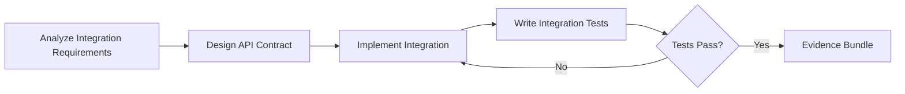

# Integrate Combo

## Agents
- **coder** (sonnet) -- implement API integrations, webhooks, and service connections

## Skill Pack
- prime-safety (god-skill, always first)
- prime-coder (coding agent with red/green gate)
- prime-api (API design expertise)

## Execution Flow

## Evidence Required
- integration_tests.py (passing test suite)
- api_contract.md (endpoint documentation)
- env_snapshot.json (reproducibility)

## Notes
- Integration work connects external services to the codebase
- All API calls must be authenticated and rate-limited
- Webhook handlers must be idempotent
