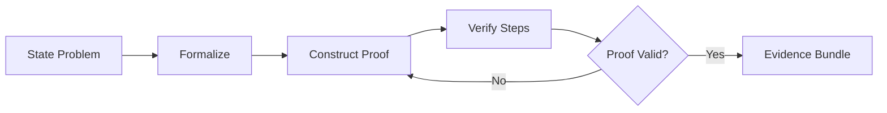

# Math Combo

## Agents
- **mathematician** (opus) -- construct proofs, verify theorems, solve equations, formal reasoning

## Skill Pack
- prime-safety (god-skill, always first)
- prime-math (mathematical proof and verification)

## Execution Flow

## Evidence Required
- proof.md (formal proof with all steps)
- verification.json (step-by-step validation)
- counterexample_search.md (attempted falsification)
- env_snapshot.json (reproducibility)

## Notes
- Uses opus model tier for deep reasoning capability
- Rung target 274177 (stability verification required)
- Proofs must include attempted counterexamples
- Numeric results must be exact (no floating point in verification paths)
