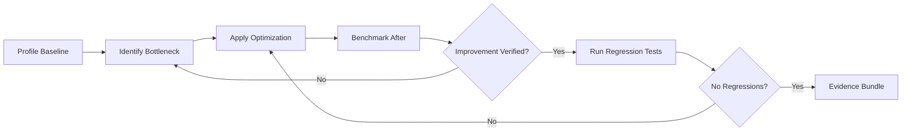

# Performance Combo

## Agents
- **coder** (sonnet) -- profile bottlenecks, optimize code, benchmark before and after

## Skill Pack
- prime-safety (god-skill, always first)
- prime-coder (evidence bundle, test gate)

## Execution Flow

## Evidence Required
- benchmark_before.json (baseline performance metrics)
- benchmark_after.json (optimized performance metrics)
- test_results.json (no regressions)
- PATCH_DIFF (optimization code)
- env_snapshot.json (reproducibility)
