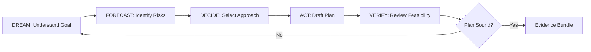

# Plan Combo

## Agents
- **planner** (sonnet) -- analyze requirements, design architecture, forecast risks, produce plan

## Skill Pack
- prime-safety (god-skill, always first)
- phuc-forecast (DREAM-FORECAST-DECIDE-ACT-VERIFY cycle)

## Execution Flow

## Evidence Required
- plan.md (architecture or roadmap document)
- risk_analysis.json (identified risks and mitigations)
- feasibility_check.json (resource and timeline assessment)
- env_snapshot.json (reproducibility)

## Notes
- Planning is iterative -- the DREAM-FORECAST-DECIDE-ACT-VERIFY cycle may repeat
- Plans must include concrete next steps, not just high-level vision
- Risk analysis is mandatory -- no plan ships without identified risks
