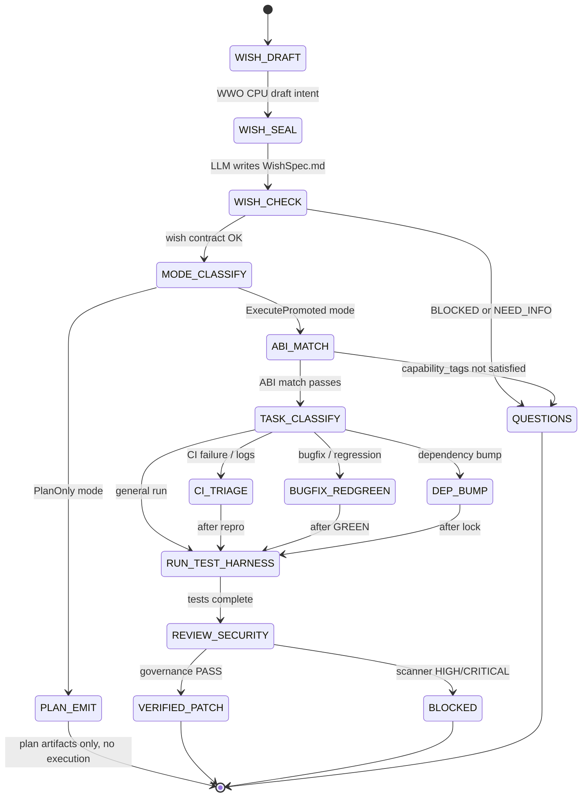

Below is a **single Prime Mermaid meta-recipe** that routes into your 6 combos automatically, plus a tight **Wish→Recipe ABI** contract that keeps WWO and RRO from leaking concerns.

---

## 1) Prime Mermaid Meta-Recipe: “DevLoop v0.1” (routes the 6 combos)

```mermaid
flowchart TD
  %% =========================================================
  %% PRIME RECIPE: DevLoop v0.1  (Meta Orchestrator)
  %% Purpose: deterministically route a dev request through:
  %%   (1) Plan→Execute split
  %%   (2) Run+Test Harness
  %%   (3) CI Triage
  %%   (4) Bugfix→PR (Red→Green)
  %%   (5) Review+Security veto
  %%   (6) Dependency bump (replay+rollback)
  %% =========================================================

  U[User Prompt] --> WWO_CPU[L1 CPU: WWO Draft\n(intent signature -> wish templates -> slots)\nOutput: WishDraftBundle.json]
  WWO_CPU --> WWO_LLM[L3 LLM: WWO Seal Wish\nwrite WishSpec.md + wish.lock.json\n(no execution yet)]
  WWO_LLM --> WISH_JUDGE[L5 Judge: Wish Contract Check\n(schema complete? contradictions? fail-closed)]
  WISH_JUDGE -->|BLOCKED/NEED_INFO| Q[OUTPUT: Questions.md + status=UNKNOWN]
  WISH_JUDGE -->|OK| MODE{Mode?\nPlanOnly vs ExecutePromoted}

  %% -------- Combo 1: Plan→Execute split ----------
  MODE -->|PlanOnly| PLAN_COMP[L1 CPU: Emit Plan\nPlan.json + Plan.md + optional Questions.md]
  PLAN_COMP --> DONE_PLAN[OUTPUT: Plan artifacts (no code)\nstop_reason=NEED_INFO or CLOSE]

  %% Execute requires explicit promotion artifact
  MODE -->|ExecutePromoted| EXEC_INTENT[L1 CPU: Validate ExecuteIntent.lock.json\n(no lock => fail-closed)]
  EXEC_INTENT -->|missing| Q
  EXEC_INTENT -->|present| CLASSIFY[L1 CPU: Classify Task Family\nci_triage? bugfix? dep_bump?]
  
  %% -------- Combo 3: CI Triage ----------
  CLASSIFY -->|CI_Failure_or_Logs| CI_TRIAGE[L2 CPU: Parse logs\ntriage_report.json\nextract failing tests+signatures]
  CI_TRIAGE --> ROUTE_AFTER_TRIAGE{Need repro? bugfix? dep bump?}

  %% -------- Combo 4: Bugfix→PR (Red→Green) ----------
  ROUTE_AFTER_TRIAGE -->|Bugfix/Regression| RED_REQ[L3 LLM: Write repro target\nrepro.py (or test) minimal]
  RED_REQ --> RUN_RED[L4 Tool: Run repro (must fail)\nwrite evidence/repro_red.log]
  RUN_RED -->|passes initially| NONREPRO[OUTPUT: BLOCKED\nstop_reason=NON_REPRODUCIBLE]
  RUN_RED -->|fails as expected| PATCH[L3 LLM: Propose minimal patch\nPATCH.diff + file justifications]
  PATCH --> RUN_GREEN[L4 Tool: Run repro (must pass)\nwrite evidence/repro_green.log]
  RUN_GREEN -->|fails| PATCH_LOOP[Loop Control:\nrevert/isolate delta\nmax_iters gate]
  PATCH_LOOP --> PATCH

  %% -------- Combo 2: Run + Test Harness ----------
  RUN_GREEN --> TEST_HARNESS[L4 Tool + L1 CPU: Run tests\nnormalize outputs\nemit tests.json/run_log.txt/artifacts.json]
  ROUTE_AFTER_TRIAGE -->|No repro needed (feature/run)| TEST_HARNESS
  CLASSIFY -->|General_Run| TEST_HARNESS

  %% -------- Combo 6: Dependency bump (replay+rollback) ----------
  CLASSIFY -->|Dependency_Bump| DEP_PREP[L1 CPU: Snapshot baseline\nrecord last GREEN hash]
  DEP_PREP --> DEP_APPLY[L3 LLM: Prepare dep patch\nlockfile updates]
  DEP_APPLY --> DEP_TEST[L4 Tool: Run tests via harness]
  DEP_TEST --> DEP_REPLAY[L4 Tool + L1 CPU: Golden Replay Sample\n2 replays -> behavior hash compare]
  DEP_REPLAY -->|regression| DEP_ROLLBACK[L3 LLM: Rollback patch\nROLLBACK.diff + rerun harness]
  DEP_ROLLBACK --> DEP_TEST
  DEP_REPLAY -->|ok| AFTER_TESTS[Continue]

  %% -------- Combo 5: Review + Security scan veto ----------
  TEST_HARNESS --> AFTER_TESTS[Continue]
  AFTER_TESTS --> REVIEW[L3 LLM: Code Review Report\nreview_report.json (diff risks, invariants)]
  REVIEW --> SEC_SCAN[L4 Tool: Security scan (semgrep/bandit pinned)\nsecurity_scan.json]
  SEC_SCAN -->|scanner_fail| SEC_BLOCK[OUTPUT: BLOCKED\nstop_reason=INVARIANT_VIOLATION or VERIFICATION_RUNG_FAILED]
  SEC_SCAN -->|pass| FINALIZE[L1 CPU: Produce PR Bundle\nPATCH.diff + MANIFEST + GATES + evidence index]

  FINALIZE --> OUT[OUTPUT: VERIFIED_PATCH\nstatus=PASS\nreplay commands + evidence pointers]
```

---

## 2) Wish→Recipe ABI (tiny interface, hard separations)

This ABI is intentionally minimal—so WWO (Wish side) can be upgraded without breaking RRO (Recipe side).

### 2.1 Wish provides (input to RecipeResolver)

```json
{
  "wish_id": "wish-...",
  "wish_kind": "plan_only|execute|bugfix|ci_triage|dependency_bump",
  "mode_flags": {
    "offline": true,
    "tools_enabled": true,
    "strict": true
  },
  "requirements": {
    "capability_tags": ["run_tests", "emit_patch", "security_scan"],
    "forbidden_actions": ["network_unless_allowed", "credential_access"]
  },
  "io_contract": {
    "inputs": ["repo_path", "prompt", "optional:ci_logs"],
    "outputs": ["patch_bundle", "evidence_bundle"],
    "state_delta_schema": "wish_state_delta_v1"
  },
  "acceptance_tests": [
    {"kind": "repro", "required": true, "path_hint": "repro.py"},
    {"kind": "pytest", "selector": "tests/...", "required": true}
  ],
  "proof_requirements": {
    "required_artifacts": [
      "evidence/run_log.txt",
      "evidence/tests.json",
      "evidence/artifacts.json"
    ],
    "normalization_policy": "stillwater_canon_json_v1",
    "replay_policy": "golden_replay_v1"
  }
}
```

### 2.2 Recipe provides (back to Wish runtime)

```json
{
  "recipe_id": "recipe-devloop-v0.1",
  "satisfies": {
    "capability_tags": ["plan_split", "run_tests", "ci_triage", "red_green", "security_scan", "dep_bump_replay"],
    "constraints_met": ["offline", "strict", "tools_enabled"]
  },
  "plan": {
    "steps": [
      {"id": "s1", "node": "L1", "action": "classify"},
      {"id": "s2", "node": "L4", "action": "run_tests"},
      {"id": "s3", "node": "L3", "action": "emit_patch"}
    ],
    "tool_permissions": ["python", "pytest", "semgrep|bandit"],
    "resource_caps": {"max_tool_calls": 80, "max_seconds_soft": 1800}
  },
  "artifacts": {
    "will_emit": [
      "PATCH.diff",
      "review_report.json",
      "security_scan.json",
      "evidence/tests.json",
      "evidence/artifacts.json"
    ]
  },
  "proof_hooks": {
    "replay": ["two_run_behavior_hash_compare"],
    "hashes": ["sha256:PATCH.diff", "sha256:evidence/tests.json"]
  }
}
```

### 2.3 ABI match rule (deterministic, fail-closed)

* `requirements.capability_tags ⊆ recipe.satisfies.capability_tags` else **BLOCKED**
* `proof_requirements.required_artifacts ⊆ recipe.artifacts.will_emit` else **BLOCKED**
* if `wish_kind=bugfix` then recipe **must** include a **red→green** rung or **BLOCKED**
* if `capability_tags` includes `security_scan` then scanner **failure vetoes** PASS

---

## 3) How this composes with your existing skills (who loads what)

**Per node type:**

* **L1 CPU** loads: `skill_shannon_compaction`, localization policy, deterministic routing tables
* **L3 LLM** loads: Wish/Recipe writing skills + schema enforcer constraints
* **L4 Tool** loads: Run/Test Harness + Proof/Normalization rules
* **L5 Judge** loads: Non-conflation, Contract Compliance, Rival-GPS, Security veto policy

If you want, next I can produce the **canon file layout** for this meta-recipe:

* `canon/prime-coder/recipes/devloop/recipe-devloop-v0.1.mmd`
* `canon/prime-coder/abi/wish_recipe_abi_v1.json`
* `canon/prime-coder/wishes/wish-plan-execute-split.md` … etc.

---

## Skill Pack

Load these skills before executing this combo:
- `skills/prime-safety.md` (always first — ABI match rule is fail-closed: missing capability_tags → BLOCKED)
- `skills/prime-coder.md` (verification gate, evidence discipline, replay hooks)
- `skills/phuc-orchestration.md` (task routing, dispatch matrix, CNF capsule rules)

---

## GLOW Scoring

| Dimension | Contribution | Points |
|-----------|-------------|--------|
| **G** (Growth) | Meta-recipe routes new combo types by adding capability_tags to the ABI — each new combo extends the routing graph without breaking existing wish/recipe pairs | +5 per new capability_tag added to ABI that enables routing a previously unroutable task class |
| **L** (Love/Quality) | ABI match rule enforced: requirements.capability_tags ⊆ recipe.satisfies.capability_tags; proof_requirements.required_artifacts ⊆ recipe.artifacts.will_emit | +5 per DevLoop run that routes correctly without BLOCKED on ABI mismatch |
| **O** (Output) | Verified PATCH bundle + governance verdict artifacts; DevLoop meta-recipe flowchart maintained with all 6 combos represented | +5 per complete verified patch routed through the meta-recipe |
| **W** (Wisdom) | Northstar metric (recipe_hit_rate) advances — the meta-recipe is the composition of all 6 combos into a single deterministic router that maximizes recipe reuse | +5 when a task is correctly routed without human intervention using the ABI classification |

**Northstar Metric:** `recipe_hit_rate` — the meta-recipe is the orchestration layer that maximizes hit rate. By routing tasks to the correct combo (bugfix, dep_bump, ci_triage, etc.) automatically via ABI capability_tags, it eliminates the planning overhead that causes recipe mismatches.

---

## Three Pillars Mapping

| Pillar | How This Combo Applies It |
|--------|--------------------------|
| **LEK** (Self-Improvement) | The meta-recipe is a self-improving router: each task classification (ci_triage, bugfix, dep_bump) feeds back into the ABI contract, and new capability tags can be added without breaking existing wish/recipe pairs |
| **LEAK** (Cross-Agent Trade) | WWO (Wish side) holds intent and acceptance-test knowledge; RRO (Recipe side) holds capability and tool-permission knowledge; they trade via the minimal ABI interface — neither side knows the other's implementation details |
| **LEC** (Emergent Conventions) | The Wish→Recipe ABI (capability_tags, required_artifacts, replay_policy) becomes a cross-combo convention: any new combo must declare its capability_tags and will_emit artifacts to participate in the DevLoop meta-orchestration |

---

## State Diagram


