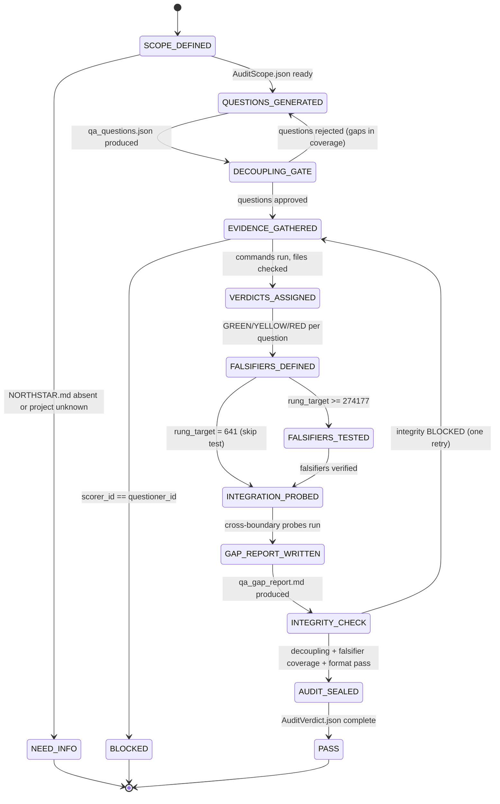

# Combo — QA Audit (Questioner → Scorer → Gap Report)

This combo enforces the decoupled verification protocol from `phuc-qa.md`. A separate agent generates questions that a separate agent answers — preventing self-confirmation bias and producing an honest scorecard.

---

# W_QA_AUDIT — Decoupled QA Audit With Gap Report

**WISH_ID:** `wish_qa_audit`
**PRIORITY:** HIGH
**CLASS:** qa
**DEPENDS_ON:** none (can run standalone; integrates with `wish_bugfix_pr_red_green` for remediation)

---

## Goal

Given a project or feature scope, produce a verified scorecard showing:

1. **Questions** — the hardest possible questions about the project's claimed state (generated by qa-questioner).
2. **Verdicts** — GREEN/YELLOW/RED per question, scored against actual repo state (by a different agent: qa-scorer).
3. **Falsifiers** — what would make every GREEN claim RED.
4. **Gap report** — a human-readable remediation map for every YELLOW and RED.

The fundamental constraint: the agent that generates questions MUST NOT be the agent that scores them. This is the structural decoupling that prevents false GREEN verdicts.

---

## Invariants

1. **Decoupling gate (hard)**: qa-questioner agent_id must differ from qa-scorer agent_id. If they match → EXIT_BLOCKED.
2. **Falsifier gate (hard)**: No GREEN verdict without a defined falsifier. If GREEN and no falsifier → EXIT_BLOCKED.
3. **Evidence gate (hard)**: All verdicts require evidence citations. Prose confidence is YELLOW at best.
4. **Integration probe gate**: Any claim about cross-project integration must be probed with a real command, not documentation.
5. **Rung is honest**: Rung achieved = MIN(evidence quality across all questions). 20 GREEN verdicts on prose + 1 real command = rung 641, not 274177.

---

## Forbidden States

- `SELF_CONFIRMED_GREEN`: Same agent generates and scores questions
- `GREEN_WITHOUT_FALSIFIER`: GREEN verdict with no falsifier defined
- `MOCK_AS_ONLY_EVIDENCE`: Mock output used as sole evidence for GREEN
- `PROSE_AS_PROOF`: Documentation cited as evidence without executable verification
- `INTEGRATION_CLAIMED_WITHOUT_PROBE`: Cross-project integration scored GREEN without a real probe
- `RUNG_INFLATION`: Claiming rung 274177 when evidence is only rung 641 quality

---

## Acceptance Tests

### A) Decoupling verified

- `qa_questions.json` has a `generated_by` field
- `qa_scorecard.json` has a `scored_by` field
- `generated_by != scored_by` (exit code 0 on a diff check)

### B) Falsifier coverage

- Every GREEN verdict in `qa_scorecard.json` has a matching entry in `qa_falsifiers.json`
- Every `qa_falsifiers.json` entry has a non-null `falsifier_test` field

### C) Gap report completeness

- `qa_gap_report.md` has all six required sections
- Every YELLOW has a `remediation path` (exact command that would promote to GREEN)
- Every RED has a `root cause` entry

### D) Scorecard parseable

- `qa_scorecard.json` is valid JSON with required keys
- `summary.GREEN_count + summary.YELLOW_count + summary.RED_count == summary.total_questions`

---

## Required Artifacts

- `qa_questions.json` (from qa-questioner)
- `qa_scorecard.json` (from qa-scorer)
- `qa_falsifiers.json` (from qa-scorer)
- `qa_integration_probes.json` (from qa-scorer; may be empty if no integration probes in scope)
- `qa_gap_report.md` (from qa-scorer)

---

# R_QA_AUDIT — QA Audit Recipe

**RECIPE_ID:** `recipe_qa_audit_v1`
**SATISFIES:** `wish_qa_audit`

---

## Node Graph (L1–L5)

### Node 1 — L1 CPU: Scope Intake + Capsule Build

Inputs:

- project name (e.g., `stillwater`, `solace-browser`, `paudio`)
- optional: specific feature or phase to audit (e.g., `OAuth3 Phase 1`)
- optional: prior qa_scorecard.json (for drift comparison)
- NORTHSTAR.md content
- recent git log + case study + ROADMAP phase

Outputs:

- `AuditScope.json`:
  - `project`
  - `feature` (if scoped)
  - `northstar_metric_being_protected`
  - `known_claims` (list of claims from ROADMAP/case-study)
  - `known_integration_boundaries` (from ecosystem architecture)
  - `rung_target`
  - `prior_scorecard_ref` (if drift comparison requested)

Fail-closed if project is unknown or NORTHSTAR.md is absent → `NEED_INFO`.

---

### Node 2 — L3 LLM: qa-questioner (Adversarial Question Generation)

Agent: `qa-questioner` (see `swarms/qa-questioner.md`)
Skill pack: `prime-safety + phuc-qa`
Model: sonnet

Inputs (CNF capsule):

- `AuditScope.json`
- NORTHSTAR.md content
- project state summary (case study + recent commits + ROADMAP phase)

Outputs:

- `qa_questions.json` (numbered, GLOW-tagged, evidence-typed)

Rules:
- Must generate at least 2 questions per GLOW dimension (min 8 total)
- Must generate at least 1 integration_probe question per known ecosystem boundary in scope
- Must NOT answer any question
- Hands off qa_questions.json and stops

---

### Node 3 — L5 Judge: Decoupling Gate

Checks:

- `qa_questions.json` has `generated_by` field (non-null)
- `generated_by` is not null or empty
- At least 2 questions per GLOW dimension present
- All questions have `expected_evidence_type` field

Verdicts:

- APPROVE → proceed to Node 4
- REJECT → return to Node 2 with specific gap list

Outputs:

- `QuestionGateVerdict.json`

---

### Node 4 — L3 LLM: qa-scorer (Evidence Forensics)

Agent: `qa-scorer` (see `swarms/qa-scorer.md`)
Skill pack: `prime-safety + phuc-qa + prime-coder`
Model: sonnet

Inputs (CNF capsule):

- `qa_questions.json` (verbatim, not summarized)
- `QUESTIONER_AGENT_ID` (from generated_by field)
- NORTHSTAR.md content
- project repo access (to run commands and read files)
- `rung_target`

First action: verify own agent_id != QUESTIONER_AGENT_ID. If equal → EXIT_BLOCKED immediately.

Scoring process (per question):
1. Read the question
2. Run the command or find the file path that would answer it
3. Assign GREEN/YELLOW/RED based solely on what the command returns
4. For GREEN: define falsifier + run falsifier test (if rung_target >= 274177)
5. For integration_probe questions: run real cross-boundary probe

Outputs:

- `qa_scorecard.json`
- `qa_falsifiers.json`
- `qa_integration_probes.json`
- `qa_gap_report.md`

---

### Node 5 — L1 CPU: Scorecard Integrity Check

Checks (deterministic, CPU-only, no LLM):

- `generated_by != scored_by` (string comparison)
- `GREEN_count + YELLOW_count + RED_count == total_questions`
- Every GREEN question_id has a matching entry in `qa_falsifiers.json`
- Every `qa_falsifiers.json` entry has non-null `falsifier` and `falsifier_test` fields
- At rung_target >= 274177: no falsifier_status == UNTESTED in qa_falsifiers.json
- `qa_gap_report.md` contains all six required section headers

Outputs:

- `ScorecardIntegrityReport.json`:
  - `decoupling_verified: true|false`
  - `falsifier_coverage: complete|gaps_found`
  - `gap_report_complete: true|false`
  - `integrity_verdict: PASS|BLOCKED`
  - `integrity_stop_reason` (if BLOCKED)

If BLOCKED → return to Node 4 with specific gap list. One retry allowed.

---

### Node 6 — L5 Judge: Final Audit Seal

Hard requirements:

- `ScorecardIntegrityReport.integrity_verdict == PASS`
- `qa_gap_report.md` present and non-empty
- Rung target met per phuc-qa Verification Ladder
- No forbidden states were entered (from Node 4 log)

Outputs:

- `AuditVerdict.json`:
  - `status: PASS|BLOCKED|NEED_INFO`
  - `stop_reason`
  - `rung_achieved`
  - `GREEN_count`
  - `YELLOW_count`
  - `RED_count`
  - `remediation_priority` (list of YELLOW/RED items ordered by NORTHSTAR impact)
  - `next_combo` (suggested: `recipe_bugfix_pr_red_green` for any RED items)

---

## ABI: QA Audit → Bugfix PR

The QA Audit produces REDs. Each RED is a valid input to the Bugfix PR combo.

Consumes from QA Audit:
- `qa_scorecard.json` (RED verdicts → bug reports)
- `qa_gap_report.md` (root cause → bugfix scope)

Produces for Bugfix PR:
- `BugSpec.json` (one per RED verdict)
- `LocalizationReport.json` (from evidence citations in scorecard)

---

## Context Injection

- Node 1 (CPU): NORTHSTAR + case study + git log + scope
- Node 2 (qa-questioner): AuditScope.json + NORTHSTAR; no prior scorecard (isolation required)
- Node 4 (qa-scorer): qa_questions.json verbatim + QUESTIONER_AGENT_ID + repo access; no questioner reasoning
- Node 5 (CPU): scorecard JSON files only; no LLM
- Node 6 (Judge): AuditVerdict + ScorecardIntegrityReport + policy snippets (no giant canon dump)

---

## State Machine

```
SCOPE_DEFINED
    ↓
QUESTIONS_GENERATED  (qa-questioner — stops here)
    ↓
DECOUPLING_GATE
    ↓
EVIDENCE_GATHERED    (qa-scorer — reads questions, runs commands)
    ↓
VERDICTS_ASSIGNED    (GREEN/YELLOW/RED per question)
    ↓
FALSIFIERS_DEFINED   (GREEN claims get falsifiers)
    ↓
FALSIFIERS_TESTED    (required for rung 274177+)
    ↓
INTEGRATION_PROBED   (cross-boundary probes run)
    ↓
GAP_REPORT_WRITTEN
    ↓
INTEGRITY_CHECK      (CPU: decoupling + coverage + format)
    ↓
AUDIT_SEALED
```

No other transitions allowed. Any state entered out of order is a FORBIDDEN_STATE.

---

## Why This Combo Matters

Self-confirmation bias is the primary failure mode of AI-assisted QA. An agent asked "does this work?" will tend to confirm that it does — especially if it is the same agent that built it or reviewed it before.

The decoupled protocol forces a structural separation:
- The questioner has no stake in the answers — it only wants the hardest questions
- The scorer has no stake in the questions — it only reports what the evidence shows
- The CPU integrity check has no stake in either — it only checks the math

The result is a scorecard that can be trusted because the bias has been removed by structure, not by willpower.

---

## Rung Quick Reference

| Rung | Questioner Requirement | Scorer Requirement |
|------|----------------------|-------------------|
| 641  | ≥2 questions per GLOW dimension | Verdicts with evidence citations; falsifiers defined for GREENs |
| 274177 | ≥1 integration probe per ecosystem boundary | All GREEN falsifiers tested; integration probes run with real services |
| 65537 | Questions adversarially reviewed before handoff | Independent re-run by separate scorer; no mocks in integration probes |

---

## Skill Pack

Load these skills before executing this combo:
- `skills/prime-safety.md` (always first — SELF_CONFIRMED_GREEN is a prime-safety violation; decoupling is a safety constraint)
- `skills/phuc-qa.md` (question generation, scoring, falsifier discipline, integration probe protocol)
- `skills/prime-coder.md` (evidence gate: verdicts require executable evidence, not prose)

For integration boundary probes (rung 274177+):
- `skills/phuc-orchestration.md` (dispatching qa-questioner and qa-scorer as separate agents)

---

## GLOW Scoring

| Dimension | Contribution | Points |
|-----------|-------------|--------|
| **G** (Growth) | Gap report becomes input for next audit — GREEN/YELLOW/RED counts improve over time as REDs are fixed via Bugfix PR and re-audited; measurable quality trajectory | +6 per audit where RED_count decreases vs prior audit on same project |
| **L** (Love/Quality) | Decoupling gate enforced (generated_by != scored_by); every GREEN has falsifier tested (rung 274177+); integration probes run with real commands | +6 per audit where ScorecardIntegrityReport.integrity_verdict = PASS |
| **O** (Output) | qa_questions.json + qa_scorecard.json + qa_falsifiers.json + qa_gap_report.md all committed; AuditVerdict.json complete | +6 per complete audit bundle |
| **W** (Wisdom) | Northstar metric (projects_running_at_rung_65537) advances — a project with GREEN verdicts, tested falsifiers, and integration probes is demonstrating rung 274177+ confidence | +6 when audit achieves rung_achieved >= 274177 with all GREENs falsifier-tested |

**Northstar Metric:** `projects_running_at_rung_65537` — QA audit is the mechanism that distinguishes claimed rung from achieved rung. A project that can demonstrate decoupled QA with falsifier-tested GREEN verdicts and real integration probes is on the path to 65537. The gap report is the roadmap from current state to production confidence.

---

## FSM: QA Audit State Machine (Strengthened)

```
States: SCOPE_INTAKE | QUESTIONS_GENERATED | DECOUPLING_GATE |
        EVIDENCE_GATHERED | VERDICTS_ASSIGNED | FALSIFIERS_DEFINED |
        FALSIFIERS_TESTED | INTEGRATION_PROBED | GAP_REPORT_WRITTEN |
        INTEGRITY_CHECK | AUDIT_SEALED | PASS | BLOCKED | NEED_INFO

Transitions:
  [*] → SCOPE_INTAKE: project + NORTHSTAR.md provided
  SCOPE_INTAKE → NEED_INFO: NORTHSTAR.md absent or project unknown
  SCOPE_INTAKE → QUESTIONS_GENERATED: AuditScope.json ready
  QUESTIONS_GENERATED → DECOUPLING_GATE: qa_questions.json with generated_by field
  DECOUPLING_GATE → QUESTIONS_GENERATED: questions rejected (< 2 per GLOW dimension)
  DECOUPLING_GATE → EVIDENCE_GATHERED: questions approved
  EVIDENCE_GATHERED → BLOCKED: scorer_id == questioner_id (EXIT_BLOCKED immediately)
  EVIDENCE_GATHERED → VERDICTS_ASSIGNED: commands run, files checked per question
  VERDICTS_ASSIGNED → FALSIFIERS_DEFINED: GREEN/YELLOW/RED assigned with evidence citations
  FALSIFIERS_DEFINED → FALSIFIERS_TESTED: rung_target >= 274177 (required)
  FALSIFIERS_DEFINED → INTEGRATION_PROBED: rung_target = 641 (falsifier test optional)
  FALSIFIERS_TESTED → INTEGRATION_PROBED: all GREENs have falsifier_status != UNTESTED
  INTEGRATION_PROBED → GAP_REPORT_WRITTEN: cross-boundary probes run (empty if no boundaries)
  GAP_REPORT_WRITTEN → INTEGRITY_CHECK: qa_gap_report.md with all 6 section headers
  INTEGRITY_CHECK → EVIDENCE_GATHERED: integrity BLOCKED (one retry)
  INTEGRITY_CHECK → AUDIT_SEALED: decoupling + falsifier coverage + format pass
  AUDIT_SEALED → PASS: AuditVerdict.json complete with rung_achieved

  Forbidden state transitions (hard):
  VERDICTS_ASSIGNED → BLOCKED: GREEN verdict with no falsifier defined (GREEN_WITHOUT_FALSIFIER)
  EVIDENCE_GATHERED → BLOCKED: mock output as sole evidence (MOCK_AS_ONLY_EVIDENCE)
  AUDIT_SEALED → BLOCKED: claiming rung 274177 when evidence is only rung 641 quality (RUNG_INFLATION)

Exit conditions:
  PASS: AuditVerdict.json status=PASS, decoupling_verified=true, falsifier_coverage=complete
  BLOCKED: scorer==questioner; GREEN without falsifier; rung inflation attempt
  NEED_INFO: NORTHSTAR.md absent; project unknown to scope intake
```

---

## Three Pillars Mapping

| Pillar | How This Combo Applies It |
|--------|--------------------------|
| **LEK** (Self-Improvement) | Each audit cycle produces a gap report that becomes the input for the next audit — GREEN/YELLOW/RED counts improve over time as REDs are fixed (via Bugfix PR combo) and re-audited, creating a measurable quality trajectory |
| **LEAK** (Cross-Agent Trade) | Questioner agent holds adversarial-question knowledge (what would expose failure); Scorer agent holds evidence-forensics knowledge (what commands actually prove claims); they trade via qa_questions.json only — the scorer never sees the questioner's reasoning |
| **LEC** (Emergent Conventions) | Decoupled questioner/scorer becomes a project-wide convention: self-confirmation bias is not a willpower problem but a structural one, and the convention enforces separation at the agent_id level |

---

## State Diagram


