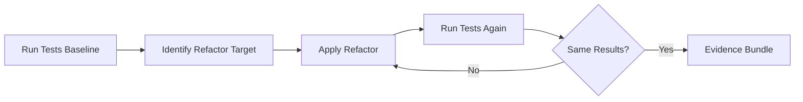

# Refactor Combo

## Agents
- **coder** (sonnet) -- restructure code, verify behavior preserved, run tests

## Skill Pack
- prime-safety (god-skill, always first)
- prime-coder (evidence bundle, test gate)

## Execution Flow

## Evidence Required
- test_results_before.json (baseline test results)
- test_results_after.json (post-refactor test results -- must match)
- PATCH_DIFF (refactoring changes)
- env_snapshot.json (reproducibility)

## Notes
- Key principle: refactoring must not change behavior
- Tests before and after must produce identical results
- If no tests exist, write characterization tests first
