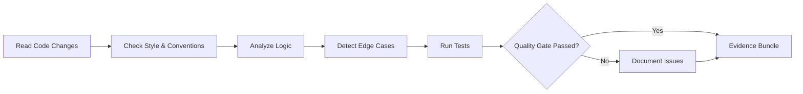

# Review Combo

## Agents
- **skeptic** (sonnet) -- review code quality, detect edge cases, verify correctness

## Skill Pack
- prime-safety (god-skill, always first)
- prime-coder (quality gates, evidence bundle)

## Execution Flow

## Evidence Required
- review_findings.json (issues found, categorized by severity)
- edge_cases.json (identified edge cases and their coverage)
- test_results.json (test pass/fail status)
- env_snapshot.json (reproducibility)

## Notes
- Skeptic agent is adversarial by design -- it looks for problems
- Review findings include severity classification: critical, warning, info
- Edge case detection is mandatory -- every review must check boundary conditions
