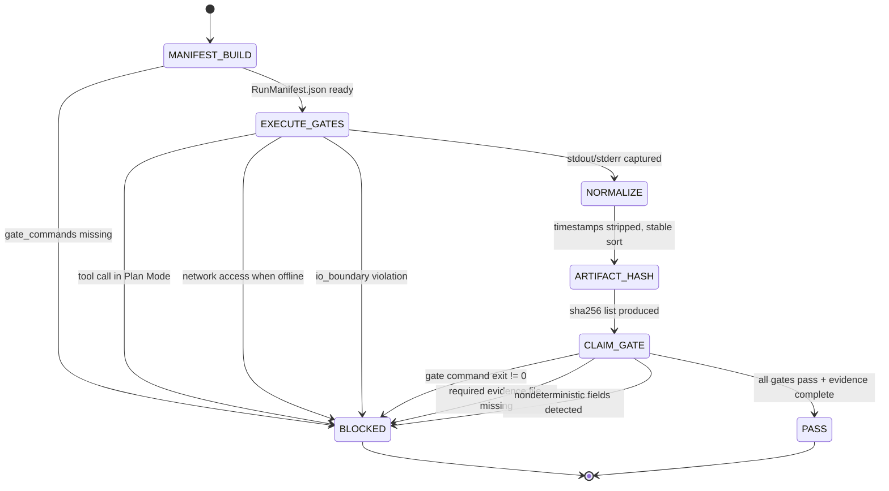

# ✅ Combo 2 — Run + Test Harness (Deterministic Execution Backbone)

This is the “it actually works” loop: **execute code + run tests + emit replayable evidence** under strict IO boundaries.

---

# W_RUN_TEST_HARNESS — Deterministic Run + Test Contract

**WISH_ID:** `wish_run_test_harness`
**PRIORITY:** CRITICAL
**CLASS:** execution
**DEPENDS_ON:** `wish_plan_execute_split` (Combo 1)

---

## 🎯 Goal

Given a sealed Execute-mode wish that proposes code changes, the system must:

1. run a deterministic test plan,
2. capture logs and exit codes,
3. produce machine-parseable evidence artifacts,
4. support replay (same commands, same paths),
5. fail closed on missing commands, missing workspace, or non-deterministic outputs.

---

## 🔐 Invariants

1. **No tests, no pass**: any claim of PASS requires at least one executed verifier command.
2. Every run emits:

   * `evidence/plan.json`
   * `evidence/run_log.txt`
   * `evidence/tests.json`
   * `evidence/artifacts.json`
3. Tool calls are bounded by:

   * `io_boundary` (workspace-only)
   * `offline` flag (no web if offline)
   * deterministic env rules (sorted env, pinned python)
4. Output normalization:

   * strip timestamps / durations unless explicitly required
   * stable ordering of listed tests and files
5. If tools are disabled → return `BLOCKED` (no pretending).

---

## 🚫 Forbidden States

* `PASS_WITHOUT_TEST_EXECUTION`
* `RUN_OUTSIDE_IO_BOUNDARY`
* `NETWORK_ACCESS_WHEN_OFFLINE`
* `UNPINNED_TOOLCHAIN` (for claim-grade runs)
* `NONDETERMINISTIC_LOG_FIELDS_UNSCRUBBED`

---

## 🧪 Acceptance Tests

1. **Minimal test run**

   * Input: wish with `gate_commands=["pytest -q"]`
   * Output: tests.json includes command + exit_code + failing_before/passing_after fields (where applicable)

2. **Offline enforcement**

   * offline=true + any web tool usage → BLOCKED

3. **IO boundary**

   * attempts to touch `/etc`, `~/.ssh`, `solace_cli/` core (if protected) → BLOCKED

4. **Replay contract**

   * `GATES.json` produced with exact commands and expected signals

---

## 📦 Required Artifacts

* `GATES.json` (replay commands)
* `evidence/tests.json` (execution results)
* `evidence/run_log.txt` (stdout/stderr normalized)
* `evidence/artifacts.json` (sha256 list)

---

# R_RUN_TEST_HARNESS — Execute + Verify Recipe

**RECIPE_ID:** `recipe_run_test_harness_v1`
**SATISFIES:** `wish_run_test_harness`
**MODE:** Execute-only (must be blocked in Plan Mode)

---

## 🧠 Node Graph (L1–L5)

### Node 1 — L1 CPU: Build Run Manifest

Inputs:

* sealed wish (`wish.lock.json`)
* repo status (commit + dirty)
* mode flags (offline/strict/replay)
* tool registry

Outputs:

* `RunManifest.json`:

  * `gate_commands[]`
  * `io_boundary`
  * `env_policy`
  * `artifact_paths[]`
  * `timeout_caps`

Fail-closed if `gate_commands[]` missing.

---

### Node 2 — L4 Tool: Execute Gate Commands

Tool: `python` / shell runner (your L4 executor)
Rules:

* enforce `io_boundary`
* enforce offline mode (no network)
* capture:

  * stdout/stderr
  * exit code
  * command line
* write raw logs → `evidence/raw/*.log`

---

### Node 3 — L2 CPU: Normalize Outputs

Actions:

* strip timestamps / elapsed / PIDs
* normalize paths to repo-relative
* stable sort:

  * discovered tests
  * file lists
  * artifact entries

Outputs:

* `evidence/run_log.txt` (normalized)
* `evidence/tests.json` (normalized)

---

### Node 4 — L4 Tool: Artifact Hashing

Compute sha256 for:

* patch diff (if present)
* logs
* test outputs
* any produced binaries

Output:

* `evidence/artifacts.json`

---

### Node 5 — L5 Judge: Claim Gate

Rules:

* If any gate command failed (exit_code != 0) → status `BLOCKED` (or `NEED_INFO` if missing deps)
* If any required evidence file missing → `BLOCKED`
* If nondeterministic fields detected in normalized evidence → `BLOCKED`
* If run attempted in Plan Mode → `ERROR_MODE_VIOLATION`

Outputs:

* `ExecutionVerdict.json` with:

  * `status: PASS|BLOCKED|NEED_INFO`
  * `stop_reason`
  * `evidence_summary`
  * `replay_commands`

---

## 🔁 Replay Support

Emit `GATES.json`:

```json
{
  "io_boundary": "repo/",
  "offline": true,
  "commands": [
    {"cmd": "pytest -q", "expect_exit": 0}
  ]
}
```

---

## 🎛️ Context Injection for Nodes

* L1 CPU:

  * wish.lock.json
  * tool registry
  * io boundary policy
* L4 Tool:

  * RunManifest.json only
* L5 Judge:

  * ExecutionVerdict.json
  * tests.json
  * artifacts.json
  * mode flags + policy snippets (no giant canon dump)

---

## Skill Pack

Load these skills before executing this combo:
- `skills/prime-safety.md` (always first — io_boundary + offline enforcement are prime-safety rules)
- `skills/prime-coder.md` (PASS_WITHOUT_TEST_EXECUTION is a prime-coder forbidden state)

---

## GLOW Scoring

| Dimension | Contribution | Points |
|-----------|-------------|--------|
| **G** (Growth) | GATES.json produced — a replayable capsule that enables future runs to verify the same behavior without re-running the full test suite from scratch | +5 per GATES.json committed with >= 1 gate command |
| **L** (Love/Quality) | Claim Gate (Node 5): all gate commands exit 0; all required evidence files present; no nondeterministic log fields; io_boundary respected | +5 per ExecutionVerdict.json with status=PASS and all evidence present |
| **O** (Output) | GATES.json + evidence/tests.json + evidence/run_log.txt + evidence/artifacts.json committed | +5 per complete evidence bundle |
| **W** (Wisdom) | Northstar metric (recipe_hit_rate) advances — GATES.json replay commands are the foundation for all recipe verification; deterministic test harness enables trusted recipe replays | +5 when behavior_hash from second replay matches first |

**Northstar Metric:** `recipe_hit_rate` — the GATES.json + behavior hash is the test harness that validates recipe replays. Without deterministic test execution, recipe_hit_rate cannot be measured. This combo is the verification backbone for all other recipes and combos.

---

## Three Pillars Mapping

| Pillar | Element | Role in this Combo |
|--------|---------|-------------------|
| **L (Logic / Evidence)** | Claim Gate (Node 5): blocks PASS if any gate fails, evidence missing, or nondeterministic fields detected | No PASS without executable evidence; fail-closed truth |
| **E (Execution / Energy)** | Node 2 (Execute Gate Commands): bounded by io_boundary + offline flag + timeout caps | Controlled, deterministic energy — same commands, same paths, every replay |
| **K (Knowledge / Capital)** | GATES.json + evidence/tests.json + artifacts.json: replay capsule with sha256 hashes | Execution knowledge persisted as machine-parseable, replayable evidence |

LEK summary: Energy (execution) is bounded and deterministic; Logic (Claim Gate) verifies it; Knowledge (GATES.json) persists it for future replays.

| Pillar | How This Combo Applies It |
|--------|--------------------------|
| **LEK** (Self-Improvement) | Each run produces GATES.json — a replayable capsule. Future runs replay the same gates, comparing behavior hashes to detect regressions automatically |
| **LEAK** (Cross-Agent Trade) | Executor agent holds run-environment knowledge (io_boundary, offline flag, toolchain); Judge agent holds evidence-quality knowledge (what counts as PASS); they trade via ExecutionVerdict.json |
| **LEC** (Emergent Conventions) | Artifact hashing (sha256 in artifacts.json) and output normalization (strip timestamps) become project-wide conventions for what "reproducible evidence" means |

---

## State Diagram



---

## Why This Combo Is Critical

It turns “agent wrote code” into:

* **verifiable execution**
* **replayable evidence**
* **fail-closed truth**

Everything later (CI triage, bugfix PRs, dependency bumps) composes on top of this.

---

Say **“next”** and we’ll do:

**Combo 3 — CI Triage (logs → repro → fix)**.
