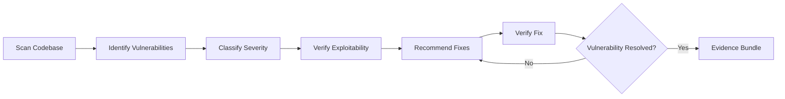

# Security Combo

## Agents
- **security-auditor** (opus) -- scan for vulnerabilities, verify exploits, recommend fixes

## Skill Pack
- prime-safety (god-skill, always first)
- security (vulnerability scanning, CVE analysis, exploit verification)

## Execution Flow

## Evidence Required
- scan_results.json (vulnerability scanner output)
- exploit_verification.json (proof of exploitability or non-exploitability)
- fix_verification.json (proof vulnerability is resolved)
- PATCH_DIFF (security fix)
- env_snapshot.json (reproducibility)

## Notes
- Uses **opus** model tier due to the critical nature of security decisions
- Rung target **65537** requires adversarial testing and security scanner evidence
- Never downgrade to a cheaper model for security work
