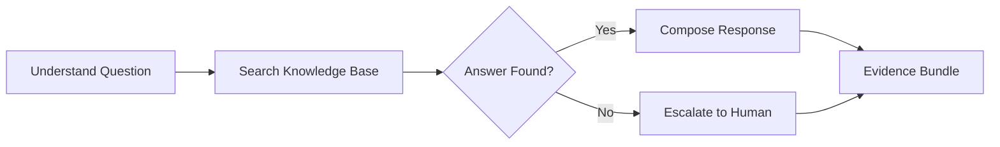

# Support Combo

## Agents
- **support** (haiku) -- answer questions, provide guidance, escalate when needed

## Skill Pack
- prime-safety (god-skill, always first)

## Execution Flow

## Evidence Required
- response.md (the support response)
- sources.json (knowledge base entries or docs referenced)
- escalation.json (if escalated: reason and recommended next steps)
- env_snapshot.json (reproducibility)

## Notes
- Uses **haiku** model tier -- support responses should be fast
- Escalation is preferred over guessing when the answer is uncertain
- Support agent never makes changes to code or configuration
