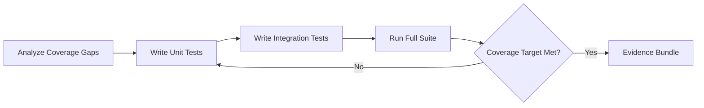

# Test Combo

## Agents
- **coder** (sonnet) -- write tests, analyze coverage gaps, ensure edge cases covered

## Skill Pack
- prime-safety (god-skill, always first)
- prime-coder (test gate, evidence bundle)

## Execution Flow

## Evidence Required
- test_results.json (all tests pass)
- coverage_report.json (coverage metrics before and after)
- PATCH_DIFF (new test code)
- env_snapshot.json (reproducibility)
