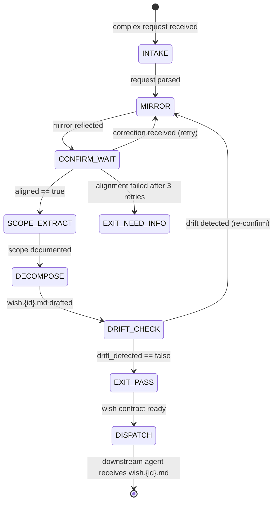

# Wish + Mirror Combo

This combo sequences EQ mirroring (intent confirmation) with prime-wishes decomposition. The mirror ensures the wish contract is drafted for the right goal. Without the mirror, the Wish Manager drafts a precise contract for the wrong problem. With it, the wish is anchored to the confirmed intent.

---

# W_WISH_WITH_MIRROR — Intent-Confirmed Wish Decomposition

**WISH_ID:** `wish_with_mirror`
**PRIORITY:** HIGH
**CLASS:** eq-combo
**DEPENDS_ON:** `wish_plan_execute_split`
**SEQUENCING:** eq-mirror → wish-decompose → dispatch

---

## Goal

Produce a wish contract that is guaranteed to represent the user's confirmed intent, not the agent's interpretation of it. The mirror is the confirmation gate; the wish contract is the execution specification.

The failure mode this combo prevents: building the right thing wrong. Without mirror confirmation, a wish contract that is technically correct may represent a misunderstood goal. The mirror closes this gap in one turn, not through post-delivery correction.

---

## Invariants

1. **Mirror always precedes wish draft:** No wish.{id}.md is produced without mirror_alignment.json showing aligned == true
2. **User vocabulary in wish statement:** The wish statement uses words from the confirmed mirror, not the agent's paraphrase
3. **Scope from mirror, not inference:** All in-scope and out-of-scope items trace to the confirmed mirror
4. **Drift check required:** mirror_wish_integrity.json must show drift_detected == false before dispatch

---

## Forbidden States

- `WISH_WITHOUT_MIRROR`: wish.{id}.md produced without prior mirror confirmation
- `VOCABULARY_SUBSTITUTION`: agent substitutes its own vocabulary in the wish statement where the user's vocabulary was available
- `SCOPE_INFERENCE`: in-scope items derived from inference, not from the confirmed mirror
- `MIRROR_SKIP_ON_SIMPLE_REQUEST`: skipping the mirror because the request seems obvious — obvious requests are the ones most likely to hide a misunderstanding
- `DRIFT_IGNORED`: mirror_wish_integrity.json shows drift_detected == true but wish was dispatched anyway
- `IMPLICIT_SCOPE`: wish contract has no explicit out-of-scope items

---

## Required Artifacts

- `mirror_draft.md` — the mirror text (user vocabulary, goal not method)
- `mirror_alignment.json` — alignment_state and aligned == true
- `scope_definition.json` — in-scope + out-of-scope (minimum 2 exclusions)
- `wish.{id}.md` — complete wish contract
- `mirror_wish_integrity.json` — drift_detected == false
- `state.mmd` — wish state machine
- `state.sha256` — sha256 of state.mmd

---

## Flow

```
1. INTAKE: complex or ambiguous user request arrives

2. MIRROR (Rapport Builder):
   - Reflect intent in user's vocabulary
   - End with confirmation request
   - Re-mirror if corrected (max 3 attempts)
   → mirror_draft.md produced
   → mirror_alignment.json: aligned == true required

3. SCOPE_EXTRACT (Rapport Builder + Wish Manager):
   - Extract in-scope from confirmed mirror
   - Identify minimum 2 out-of-scope exclusions
   - Flag implicit scope items for confirmation
   → scope_definition.json produced

4. DECOMPOSE (Wish Manager):
   - Draft wish.{id}.md using scope_definition.json
   - Use user's vocabulary in the wish statement
   - Produce state.mmd + state.sha256
   → wish.{id}.md produced

5. VERIFY (Wish Manager):
   - Check: wish statement ↔ mirror goal semantically equivalent?
   - Check: scope_consistent?
   → mirror_wish_integrity.json: drift_detected == false required

6. DISPATCH (Main session):
   - Wish contract confirmed → dispatch to Coder or Planner
   - All downstream agents receive wish.{id}.md as scope contract
```

---

## Skill Pack

Load these skills before executing this combo:
- `skills/prime-safety.md` (always first — scope inference is a prime-safety violation: scope must be confirmed, not assumed)
- `skills/eq-core.md` (mirror vocabulary matching + register detection)
- `skills/eq-mirror.md` (mirroring protocol + Thread Theory)
- `skills/prime-wishes.md` (wish contract format, postconditions, forbidden states)
- `skills/prime-mermaid.md` (state.mmd canonical format)

---

## GLOW Scoring

| Dimension | Contribution | Points |
|-----------|-------------|--------|
| **G** (Growth) | Mirror achieved alignment in one turn; wish_statement uses user's vocabulary | +8 per single-turn alignment with no vocabulary substitution |
| **L** (Love/Quality) | Drift check passes; out-of-scope has >= 2 items; mirror precedes wish | +8 per complete artifact set with drift_detected == false |
| **O** (Output) | wish.{id}.md + mirror_alignment.json + scope_definition.json + state.mmd + integrity check committed | +9 per complete artifact set at rung 274177 |
| **W** (Wisdom) | Coder completes wish with zero scope expansion (wish contract was precise enough) | +5 when downstream agent reports no scope_expansion during execution |

**Northstar Metric:** `recipe_hit_rate` — each confirmed wish contract is a replay-stable recipe. When a similar request arrives, the mirror + wish artifacts from this session provide the template for intent confirmation and scoping.

---

## Three Pillars Mapping

| Pillar | Element | Role in this Combo |
|--------|---------|-------------------|
| **L (Logic / Evidence)** | mirror_wish_integrity.json: drift_detected gate | Prevents scope drift from source (confirmed intent) to destination (wish contract) |
| **E (Execution / Energy)** | Wish decomposition: preconditions → postconditions → evidence criteria | Translates confirmed intent into executable specification |
| **K (Knowledge / Capital)** | Mirror vocabulary preservation + scope_definition.json | Locks the user's domain knowledge into the wish contract as confirmed scope |

| Pillar | How This Combo Applies It |
|--------|--------------------------|
| **LEK** (Self-Improvement) | Each mirror session that achieves single-turn alignment represents the highest-precision intent capture; mirror phrasing patterns that consistently achieve first-turn confirmation become the template for future mirrors in the same domain; the wish contract's vocabulary quality improves as mirror precision improves |
| **LEAK** (Cross-Agent Trade) | The Rapport Builder holds vocabulary-matching expertise; the Wish Manager holds wish-contract expertise; they trade via scope_definition.json — the Rapport Builder extracts the scope from the confirmed mirror in the user's language, the Wish Manager formalizes it into a wish contract with preconditions and postconditions; the Coder receives the wish contract and inherits both the confirmed intent and the precise scope without needing to re-confirm |
| **LEC** (Emergent Conventions) | Establishes the mirror-before-wish convention as a project-wide rule: no wish contract is drafted without prior mirror confirmation; the drift_detected == false gate becomes the EQ equivalent of the red-green test gate — the wish contract is not executed until intent integrity is verified; WISH_WITHOUT_MIRROR is as forbidden as PATCH_WITHOUT_REPRO |

---

## State Diagram



---

## Connection to recipe.eq-mirror-wish.md

This combo encapsulates `recipe.eq-mirror-wish.md` as the intent-confirm stage. The recipe provides the step-by-step execution; the combo provides the integration contract:
- Recipe = how to run the mirror and wish decomposition
- Combo = when to run it, how it connects to downstream agents, and what artifacts the combo produces for the rest of the session
