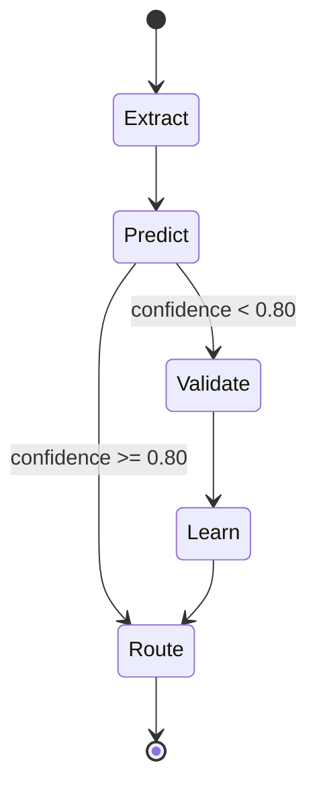

# Email Triage CPU Node

CPU-first triage label routing for inbox workflows.
Any label confidence below `0.80` should be escalated to validator.

## State Machine

## Labels

- `urgent`
- `action-required`
- `informational`
- `fyi`
- `spam`
- `newsletter`

