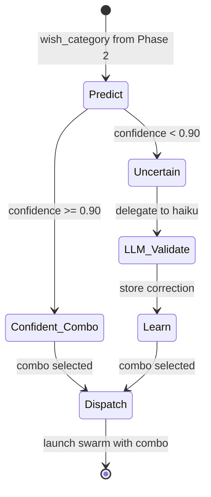

# Phase 3: Execution Twin

The Execution Twin receives a validated **wish category** from Phase 2 and maps it to a **combo** -- the specific agent configuration, skill pack, and execution flow that will handle the task.

This phase has the highest threshold (0.90) because execution decisions are costly: dispatching the wrong combo wastes agent time, tokens, and may produce incorrect results.

The mapping is largely deterministic (wish category maps 1:1 to a combo), but the CPU still learns because edge cases exist -- a "bugfix" wish in a security-critical context might need the `security-combo` instead of the standard `bugfix-combo`.

## State Machine



## Wish-to-Combo Mapping

Each wish category maps to a combo ID by convention: `{wish}-combo`. The combo file in `combos/` defines the full agent configuration.

| Wish Category | Combo ID | Agents | Model Tier | Rung Target |
|---------------|----------|--------|------------|-------------|
| bugfix | bugfix-combo | coder, skeptic | sonnet | 641 |
| feature | feature-combo | coder | sonnet | 641 |
| deploy | deploy-combo | coder | sonnet | 641 |
| test | test-combo | coder | sonnet | 641 |
| security | security-combo | security-auditor | opus | 65537 |
| performance | performance-combo | coder | sonnet | 641 |
| docs | docs-combo | writer | haiku | 641 |
| refactor | refactor-combo | coder | sonnet | 641 |
| plan | plan-combo | planner | sonnet | 641 |
| debug | debug-combo | coder | sonnet | 641 |
| review | review-combo | skeptic | sonnet | 641 |
| research | research-combo | scout | haiku | 641 |
| support | support-combo | support | haiku | 641 |
| design | design-combo | planner | sonnet | 641 |
| audit | audit-combo | security-auditor | opus | 274177 |
| integrate | integrate-combo | coder | sonnet | 641 |
| browser | browser-combo | twin-agent | sonnet | 641 |
| communicate | communicate-combo | coder | sonnet | 641 |
| data | data-combo | coder | sonnet | 641 |
| content | content-combo | writer, social-media | sonnet | 641 |
| math | math-combo | mathematician | opus | 274177 |

## Confidence Curve

Same formula, highest threshold (0.90):

```
confidence(keyword) = 1 - 1/(1 + 0.3 * count)
```

| Count | Confidence | Behavior at 0.90 threshold |
|-------|------------|---------------------------|
| 0 | 0.0000 | Unknown -- delegate to LLM |
| 10 | 0.7500 | Below threshold -- delegate |
| 14 | 0.8077 | Below threshold -- delegate |
| 25 | 0.8824 | Below threshold -- delegate |
| 30 | 0.9000 | At threshold -- CPU dispatches |
| 35 | 0.9130 | Above threshold -- CPU dispatches |
| 50 | 0.9375 | High confidence -- CPU dispatches |

Note: Phase 3 requires ~30 observations before independent dispatch. This is by design -- you want many confirmed examples before the CPU autonomously selects execution combos.

## Learning Protocol

1. **Predict**: Given the wish category from Phase 2, look up the corresponding combo in learned patterns.
2. **Gate**: If confidence >= 0.90, dispatch the combo directly. Otherwise, delegate to Haiku validator.
3. **Learn**: When the LLM validator confirms or corrects the combo selection, reinforce the wish-to-combo mapping.
4. **Persist**: Append learned patterns to `learned_combos.jsonl` and optionally sync to cloud.
5. **Merge**: On startup, load seeds from `seeds/execution-seeds.jsonl`, then overlay from `learned_combos.jsonl`.

## Seed Data

The seeds file (`seeds/execution-seeds.jsonl`) provides a Day-1 baseline of ~5 pre-learned wish-to-combo mappings. The seed set is intentionally smaller than Phase 1 and Phase 2 because Phase 3's high threshold (0.90) means seeds alone will not cross the confidence gate -- the CPU will always validate with the LLM initially and learn from real dispatches.
