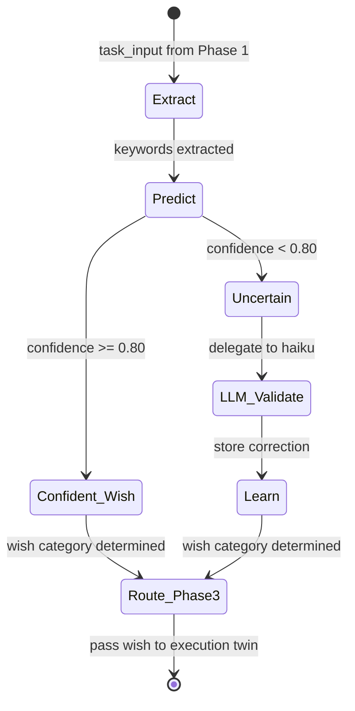

# Phase 2: Intent Twin

The Intent Twin receives messages that Phase 1 classified as **task** (not small talk). Its job is to map the user's intent to a specific **wish category** -- the type of work they want done.

When the CPU is confident (above 0.80 threshold), it routes directly to Phase 3. When uncertain, it delegates to a Haiku validator, learns from the correction, and routes to Phase 3 with the validated intent.

The higher threshold (0.80 vs Phase 1's 0.70) reflects the higher cost of misclassification: routing to the wrong wish wastes an entire agent dispatch.

## State Machine



## Keyword Rules

Keyword-to-intent mapping. Each keyword group maps to a wish category (label). When multiple keywords match, the highest-confidence keyword wins.

| Keyword Group | Label | Examples |
|---------------|-------|----------|
| fix, bug, error, crash, broken, issue, failing | bugfix | "fix the login bug", "error in payment" |
| add, create, build, new, feature, implement, develop | feature | "add dark mode", "create a new endpoint" |
| deploy, release, ship, publish, production, rollout | deploy | "deploy to production", "ship the release" |
| test, coverage, spec, unittest, integration, assert | test | "write tests for auth", "increase coverage" |
| security, vulnerability, audit, exploit, cve, attack | security | "security vulnerability in auth", "run audit" |
| performance, optimize, speed, slow, latency, memory | performance | "optimize the query", "too slow" |
| docs, documentation, readme, guide, tutorial, explain | docs | "update the README", "write API docs" |
| refactor, cleanup, restructure, simplify, technical-debt | refactor | "refactor the auth module", "clean up utils" |
| plan, design, architecture, roadmap, strategy, proposal | plan | "plan the v2 architecture", "design the API" |
| debug, diagnose, trace, investigate, root-cause, inspect | debug | "debug the memory leak", "trace the error" |
| review, pr, code-review, feedback, check, approve | review | "review my PR", "code review needed" |
| research, explore, investigate, compare, evaluate, study | research | "research OAuth libraries", "compare frameworks" |
| support, help, question, stuck, confused, how-to | support | "how do I configure X?", "stuck on setup" |
| integrate, connect, combine, merge, link, bridge | integrate | "integrate Stripe API", "connect to database" |
| browse, scrape, navigate, webpage, screenshot, form-fill | browser | "browse the website", "scrape the data" |
| email, message, notify, alert, slack, discord | communicate | "send an email", "notify the team" |
| data, analytics, pipeline, etl, dataset, query | data | "process the data", "build a pipeline" |
| content, article, blog, newsletter, social-media, copywrite | content | "create content", "write a blog post" |
| proof, theorem, calculate, equation, formula, verify-math | math | "prove the theorem", "calculate the result" |

## Confidence Curve

Same formula as Phase 1, but the threshold is higher (0.80):

```
confidence(keyword) = 1 - 1/(1 + 0.3 * count)
```

| Count | Confidence | Behavior at 0.80 threshold |
|-------|------------|---------------------------|
| 0 | 0.0000 | Unknown -- delegate to LLM |
| 5 | 0.6000 | Below threshold -- delegate |
| 8 | 0.7059 | Below threshold -- delegate |
| 10 | 0.7500 | Below threshold -- delegate |
| 12 | 0.7826 | Approaching -- delegate |
| 14 | 0.8077 | Above 0.80 -- CPU routes directly |
| 25 | 0.8824 | Confident -- CPU routes directly |
| 50 | 0.9375 | Very high -- essentially learned |

Note: Phase 2 requires ~14 observations before the CPU can handle a keyword independently (vs ~8 for Phase 1). This is intentional -- intent classification errors are more costly than small-talk misclassification.

## Learning Protocol

1. **Extract**: Pull keywords from the task message using stop-word filtering.
2. **Predict**: Look up each keyword in learned intent patterns. Return the highest-confidence match.
3. **Gate**: If confidence >= 0.80, CPU routes to Phase 3 directly. Otherwise, delegate to Haiku validator.
4. **Learn**: When the LLM validator returns a wish category, reinforce all extracted keywords with that label.
5. **Persist**: Append learned patterns to `learned_intents.jsonl` and optionally sync to cloud.
6. **Merge**: On startup, load seeds from `seeds/intent-seeds.jsonl`, then overlay from `learned_intents.jsonl`.

## Seed Data

The seeds file (`seeds/intent-seeds.jsonl`) provides a Day-1 baseline of ~10 pre-learned keyword-to-intent mappings. These give the CPU a head start so common keywords like "fix", "bug", "deploy" are recognized from the first session.
